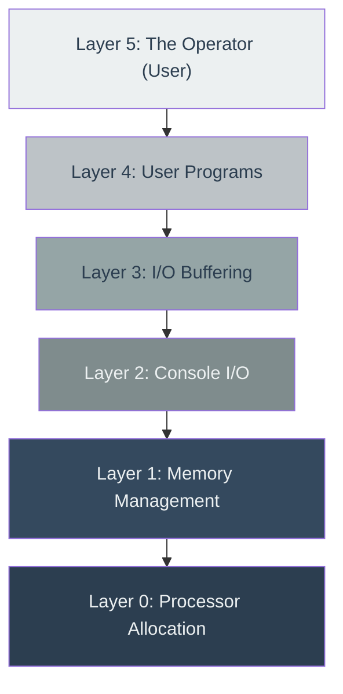
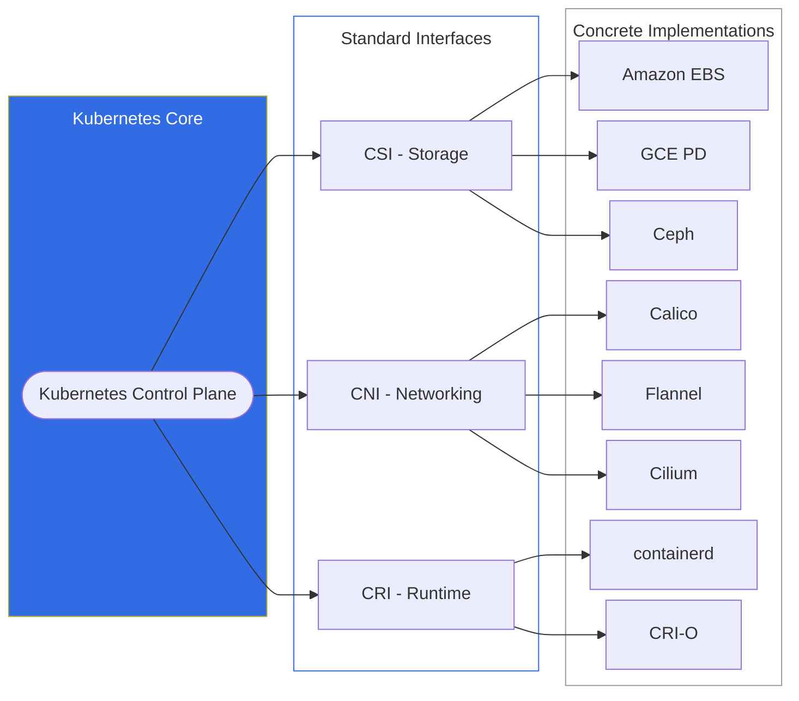
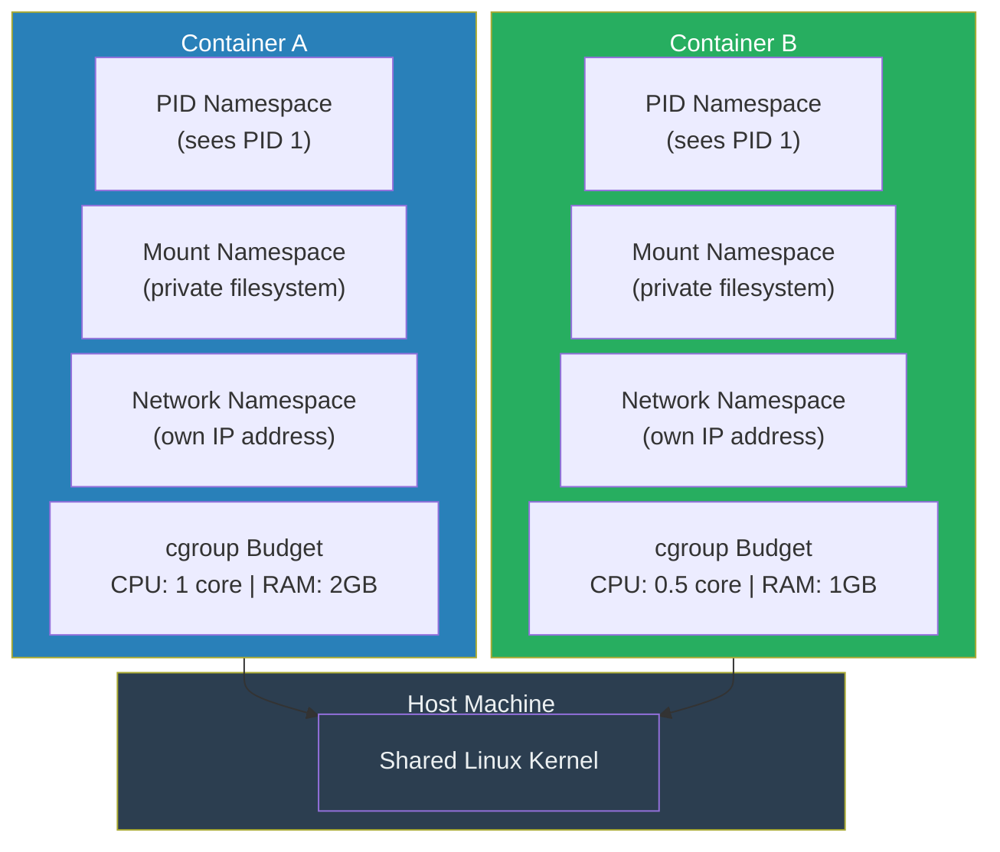
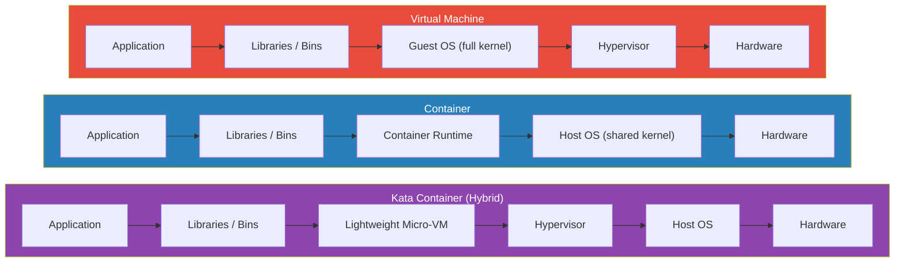

# Chapter 1 (Expanded): The Building Blocks of a Modern System

To truly understand Kubernetes, we can't just start with the technology of today. We need to travel back to the 1960s and 70s, a time when the foundational ideas that make Kubernetes possible were first born. These aren't just dusty old concepts; they are the bedrock upon which all modern computing is built. Let's explore the three most important ones: the discipline of layers, the invention of the process, and the rules of virtualization.

---

### 1. The Idea of Layers: Building Reliable Software Like a Cake

In the early days of computing, writing software was chaotic. Programmers wrote what was often called **"spaghetti code"**—a giant, tangled mess where any part of the program could affect any other part. Debugging this was a nightmare. A small bug could send you on a wild goose chase through thousands of lines of unrelated code. It was clear that a more disciplined approach was needed to build complex, reliable systems.

In 1968, a brilliant Dutch computer scientist named **Edsger W. Dijkstra** introduced the solution: **layered architecture**.

His idea was simple but profound: structure the operating system like a layer cake. Each layer has a specific job, and it can only communicate with the layer directly beneath it.

Working on a system called the "THE Multiprogramming System," Dijkstra and his team defined a strict hierarchy:

*   **Layer 0: Processor Allocation:** The most fundamental layer. Its job was to decide which program got to use the computer's brain (the CPU) and for how long.
*   **Layer 1: Memory Management:** This layer was responsible for allocating memory to programs.
*   **Layer 2: Console I/O:** Handled communication between the running programs and the system operator.
*   **Layer 3: I/O Buffering:** Managed the flow of information to devices like printers and tape drives.
*   **Layer 4: User Programs:** Where the actual applications that users ran would live.
*   **Layer 5: The Operator:** The user.

**Figure 1.1:** Dijkstra's THE Multiprogramming System layer stack. Each layer depends only on the layer directly below it — the arrow represents unidirectional dependency.

The golden rule was **unidirectional dependency**. Layer 4 could ask for services from Layer 3, but it had no idea that Layer 2, 1, or 0 even existed. This structure brought enormous benefits:

*   **Testability:** You could test Layer 0 until you were 100% sure it was perfect. Then, while testing Layer 1, you could completely trust that Layer 0 was working correctly. This made it possible to prove, step-by-step, that the entire system was correct.
*   **Modularity:** Each layer could be worked on and understood independently, without needing to understand the entire system's complexity.

#### **How Kubernetes Uses Layers**

This 50-year-old idea is at the very heart of Kubernetes's flexibility. Kubernetes uses a set of interfaces (contracts) that function as layers, separating the *what* from the *how*.

**Figure 1.2:** Kubernetes interface layers. The control plane communicates through standard interfaces (CSI, CNI, CRI), which decouple it from concrete implementations — separating the *what* from the *how*.

*   **Container Storage Interface (CSI):** When an application in Kubernetes needs to store data, it just asks for "a piece of storage." It doesn't know or care if that storage is a super-fast SSD on the server, a network drive, or a cloud volume from Amazon or Google. The CSI layer handles the details.
*   **Container Network Interface (CNI):** Every workload (Pod) in Kubernetes needs an IP address to communicate. Kubernetes doesn't handle this directly. It passes the job to the CNI layer. This allows different networking solutions (like Calico, Flannel, or Cilium) to plug into Kubernetes seamlessly.
*   **Container Runtime Interface (CRI):** Kubernetes is often called a "container orchestrator," but it doesn't actually run containers itself. It tells the CRI layer, "Please start a container with this image." The CRI layer then uses a **container runtime** (like `containerd` or `CRI-O`) to do the actual work.

Because of this layered design, Kubernetes is incredibly adaptable. You can swap out the storage, networking, or runtime components without changing Kubernetes itself.

---

### 2. The Idea of the Process: Giving Programs Their Own Worlds

In 1974, the **Unix** operating system introduced concepts that were so powerful, we still use them every day. The most important was the **process**—a program in motion, given its own private space to run, isolated from other processes.

This idea of isolation has evolved over the years. An early, primitive form of containerization was a Unix command called `chroot`, which stands for "change root." It allowed a user to lock a process inside a specific directory, creating a "jail." The process inside the jail couldn't see or access any files outside of its designated folder. It was a good start, but it wasn't truly secure.

Modern Linux containers take this idea to a whole new level using two powerful technologies:

1.  **Namespaces:** This is the magic that creates a container's "private world." A namespace wraps a process in a layer of isolation, making it believe it has the entire machine to itself. There are several types:
    *   **PID Namespace:** The process inside the container sees itself as Process ID #1, the most important process on any Linux system. It's completely unaware that on the actual machine, its real ID might be #34,502.
    *   **Mount Namespace:** The container gets its own private file system. It can't see the host machine's files.
    *   **Network Namespace:** The container gets its own virtual network card and IP address, separate from the host.

2.  **Control Groups (cgroups):** This is the resource management side of containers. While namespaces give a container its own world, `cgroups` ensures it doesn't get too greedy. It's like putting a process on a budget. You can tell a container, "You are only allowed to use 1 CPU core and 2GB of RAM." This prevents a single buggy or malicious container from crashing the entire server by consuming all its resources.

**Figure 1.3:** Container anatomy. Each container gets isolated namespaces (PID, Mount, Network) and a cgroup resource budget, while sharing the host's Linux kernel.

So, a **container** is essentially a standard Linux process that has been given its own private, virtualized world using **namespaces**, and put on a resource budget using **cgroups**.

This is why Kubernetes can start containers in milliseconds—because it's not booting a whole new operating system; it's just creating a new, isolated process.

---

### 3. The Idea of Virtualization: Defining the "Pretend Computer"

In the same year that Unix was formally introduced, two computer scientists, **Gerald Popek and Robert Goldberg**, published a paper that created the official definition of a **Virtual Machine (VM)**. A VM is a complete, simulated computer running as software on a physical host machine.

They laid out three strict rules that a true VM must follow:

1.  **Equivalence (It behaves identically):** A program running inside a VM should produce the exact same results as if it were running on real hardware. The program shouldn't be able to tell that it's in a simulation.
2.  **Efficiency (It runs fast):** The vast majority of the program's instructions must run directly on the host CPU. If the VM had to slowly translate every single instruction, it would be a "simulator," not a hypervisor, and would be too slow for practical use.
3.  **Resource Control (It's safely sandboxed):** The VM must be completely trapped in its sandbox. It must have no way to access any memory or resources that it wasn't explicitly given by the host.

#### **Containers vs. Virtual Machines**

When you look at these rules, you realize that standard Linux containers are *not* true virtual machines. They break the first rule, **Equivalence**.

A container shares the kernel (the core "brain") of its host operating system. This means you can't run a Windows container on a Linux machine, because the Windows application would try to make requests that the Linux kernel doesn't understand. The container's environment is not equivalent to bare-metal hardware.

However, by breaking this rule, containers gain a massive advantage: **Efficiency**. Because there is no simulation or translation layer, a program running in a container runs at almost the exact same speed as a program running on the host machine directly.

For years, this has been the fundamental trade-off:
*   **VMs:** Slower and heavier, but offer very strong security and isolation.
*   **Containers:** Blazingly fast and lightweight, but have weaker isolation because they share the host kernel.

**Figure 1.4:** Side-by-side comparison of VMs, Containers, and Kata Containers. VMs include a full guest OS and hypervisor; containers share the host kernel for speed; Kata Containers combine both — wrapping containers in a lightweight micro-VM for strong isolation with near-container performance.

Excitingly, this distinction is now blurring. Modern technologies like **Kata Containers** are combining the best of both worlds. They wrap a standard container inside a highly optimized, lightweight VM. This provides the strong, hardware-enforced security of a VM while keeping much of the speed and flexibility of a container. And Kubernetes, true to its layered design, is evolving to manage both traditional containers and these new "sandboxed containers" seamlessly.

---
## References

*   Dijkstra, E. W. (1968). The Structure of the 'THE'-Multiprogramming System. *Communications of the ACM, 11(5)*, 341-346.
*   Popek, G. J., & Goldberg, R. P. (1974). Formal Requirements for Virtualizable Third Generation Architectures. *Communications of the ACM, 17(7)*, 412-421.
*   [Introduction to Container Technology and Its Basic Principles](https://www.alibabacloud.com/blog/601759)