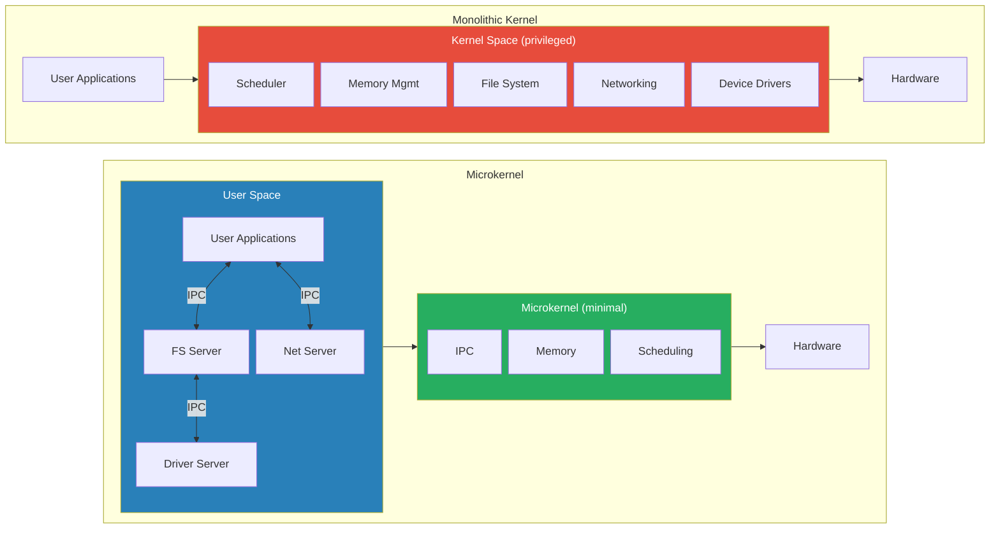
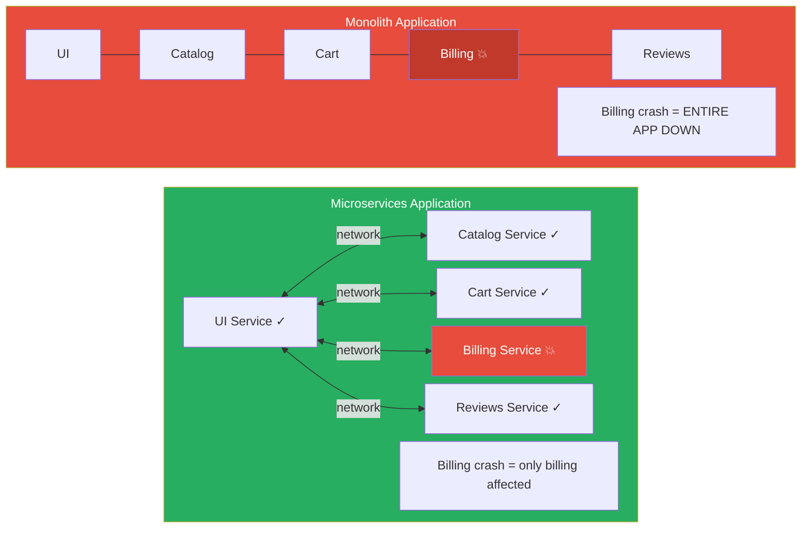
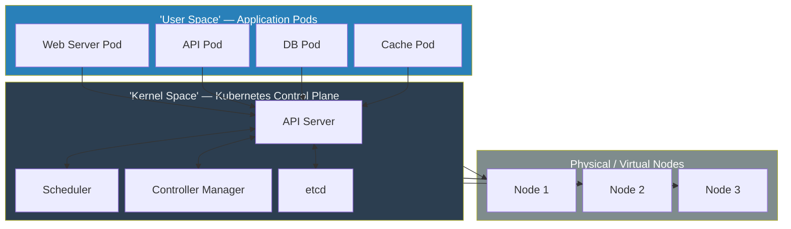

# Chapter 2 (Expanded): The "Micro" Revolution

The ideas of layers and processes from the 60s and 70s gave us a solid foundation for computing. But by the 1980s and 90s, systems built on these ideas were starting to get... bloated. Operating systems were becoming huge, complex beasts. This led to a counter-movement, a new philosophy of "less is more" that would directly pave the way for the microservice architecture that Kubernetes manages today.

---

### 1. The Problem with Monoliths

The dominant design for operating systems like Unix was **monolithic**. This means that almost all of the system's important code was bundled together into one large, privileged program called the **kernel**. The kernel handled everything: scheduling programs, managing memory, accessing files, networking, and controlling hardware devices.

While powerful, this design had two major drawbacks that became more painful as systems grew more complex:

1.  **Poor Reliability:** Because everything ran together in the same privileged space (often called "kernel space"), a bug in one small, non-essential component could bring down the entire system. Imagine your computer getting the "Blue Screen of Death" simply because your printer driver had a bug. The faulty driver could write over critical memory belonging to the core operating system, causing a total system crash, or "kernel panic."

2.  **Low Flexibility:** In a monolithic system, all the components are tightly interwoven. You couldn't easily swap out one piece for another. If you wanted to upgrade the networking system or fix a bug in the file system, you often had to recompile the entire kernel and reboot the machine. This made development slow and updates risky.

---

### 2. The Microkernel Philosophy: Less is More

In the mid-1990s, a German computer scientist named **Jochen Liedtke** championed a radical solution to the monolith problem: the **microkernel**.

He argued that the kernel had become a dumping ground for code that didn't need to be so privileged or powerful. His solution was based on the **"minimality principle"**: a concept is only allowed inside the microkernel if it's *absolutely impossible* for the system to function without it being there.

Under this philosophy, a microkernel does only three essential things:
1.  Manages **address spaces** (gives each program its own private memory).
2.  Manages **inter-process communication (IPC)** (allows programs to talk to each other).
3.  Manages **unique identifiers** (gives every program a name).

Everything else—device drivers, file systems, network stacks, user interfaces—is pushed out of the kernel and runs as a normal, unprivileged program in "user space." These programs are often called "servers."

This design brilliantly solved the problems of the monolith:

*   **Reliability:** In a microkernel system, that buggy printer driver is just another user-space program. If it crashes, it doesn't affect the core kernel. The system can simply restart the driver process, and the rest of the operating system (your network, your other applications) continues to run smoothly.
*   **Flexibility:** Since system services are just regular programs, you can stop, start, update, or replace them on the fly without ever rebooting the machine. You could, for example, switch from one networking stack to another by simply stopping one process and starting another.

**Figure 2.1:** Monolithic kernel vs. microkernel. In the monolith, all services share privileged kernel space — one crash can bring everything down. In the microkernel, only minimal functions remain in kernel space; everything else runs as isolated user-space servers communicating via IPC.

Of course, the microkernel approach had its critics. The main argument against it was **performance**. In a monolith, when the application needs to write a file, it makes a single, fast "system call" to the kernel. In a microkernel, the application has to send a message (an IPC call) to the file system server, which might then send a message to the disk driver server. Critics argued this message-passing would be too slow. Liedtke's great achievement with his **L4 microkernel** was to prove them wrong. He engineered the IPC mechanism to be so incredibly fast that the performance penalty was almost negligible, proving that modularity and reliability didn't have to come at the cost of speed.

---

### 3. From Microkernels to Microservices: A Familiar Story

This entire debate from the 1990s about how to build an operating system is a perfect mirror of the modern debate about how to build a large application. The arguments for breaking up a monolithic OS are the *exact same* arguments for breaking up a monolithic application into **microservices**.

Consider a typical e-commerce website built as a **monolith**. The code for the product catalog, the user shopping cart, the billing system, and the customer reviews are all bundled into one giant application.

What happens when the billing module has a memory leak? It starts consuming more and more of the server's RAM until it uses it all up, crashing the entire application. Your customers can't even browse the product catalog anymore because a bug in the billing code took the whole site down.

The **microservices** approach solves this by applying the microkernel philosophy to application architecture. You break the application into small, independent services:
*   An `inventory-service`
*   A `billing-service`
*   A `reviews-service`
*   A `user-interface-service`

Each service runs in its own process, completely isolated from the others. They communicate with each other over the network. Now, if the `billing-service` crashes, the other services remain online.

**Figure 2.2:** Monolith vs. microservices. In the monolith, a billing crash kills the entire application. In microservices, only the billing service is affected — all other services remain online. Customers can still browse products and read reviews; they just might not be able to complete a purchase until the service restarts.

---

### 4. Kubernetes: The Distributed Microkernel for the Cloud

This brings us to the key insight: **Kubernetes is the logical conclusion of the microkernel philosophy, applied across an entire data center.** It functions as a distributed operating system kernel for the cloud.

*   **The Kubernetes Control Plane is the "Kernel Space":** The core components of Kubernetes—the API Server, Scheduler, and Controller Manager—act as the distributed microkernel. They handle the minimal, essential tasks. They don't run your application's code. They simply manage the lifecycle of your application: scheduling it onto machines, keeping it running, and helping its pieces communicate.

*   **Your Application Pods are the "User Space":** Your actual applications—your web servers, databases, and microservices—run as isolated "user-space processes" called **Pods**. A Pod is completely oblivious to the hardware it's running on. It just knows that it has been given a certain amount of CPU and memory and an IP address, and it communicates with other Pods through the network channels that the Kubernetes "kernel" provides.

**Figure 2.3:** Kubernetes as a distributed microkernel. Application Pods run in "user space," the control plane acts as the minimal "kernel space" (scheduling, state, communication), and physical nodes provide the underlying hardware.

Jochen Liedtke's vision of a robust, flexible, and resilient system built from small, communicating, and independently restartable components has been fully realized, not on a single computer chip, but at the massive scale of the cloud. The "servers" of the microkernel era are the "microservices" of today, and Kubernetes is the minimal, powerful kernel that binds them all together.

---
## References

*   Liedtke, J. (1995). On µ-Kernel Construction. *ACM SIGOPS Operating Systems Review, 29(5)*, 237-250.
*   [The Microservices Resource Guide](https://martinfowler.com/microservices/) by Martin Fowler.