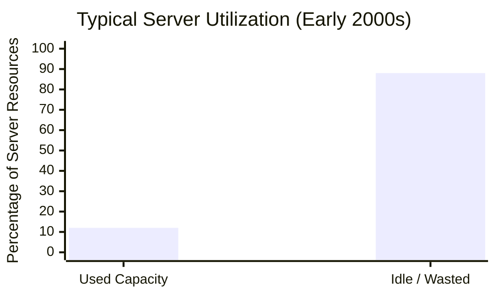
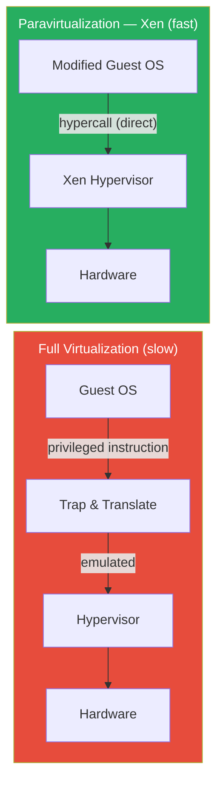
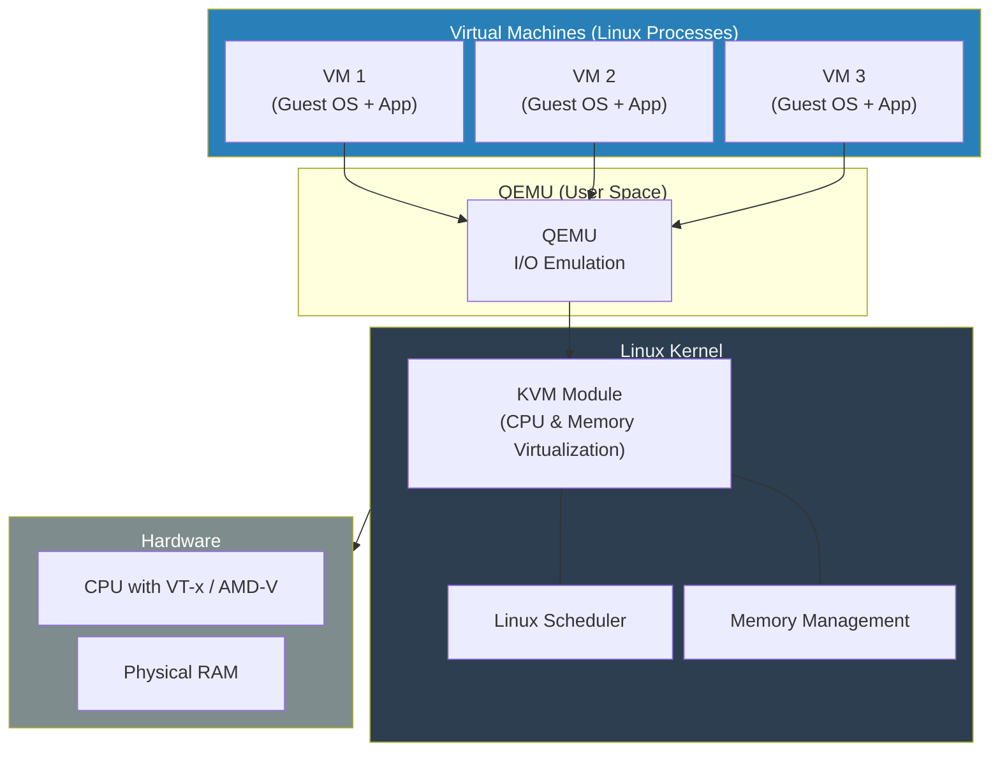
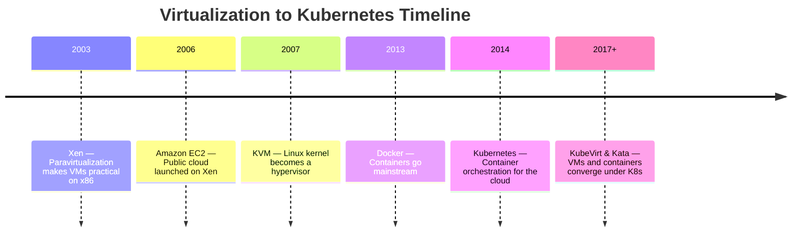

# Chapter 3 (Expanded): The Virtual Machine Takes Over

The microkernel debate of the 1990s gave us the philosophical blueprint for microservices, but another, more practical revolution was needed before Kubernetes could exist. In the early 2000s, data centers had a big problem: their servers were powerful, but they were mostly asleep. This chapter is about the breakthrough that woke them up and, in doing so, paved the way for the cloud.

---

### 1. The Problem of the Empty Server

Imagine owning a 50-passenger bus but only ever using it to drive yourself to work. This was the situation in most data centers in the early 2000s. Companies would buy a powerful server to run a single application, like a database or a web server. Even at peak times, the application might only use 10-15% of the server's CPU power. The rest of that expensive hardware sat idle, wasting electricity and taking up space.

**Figure 3.1:** The server utilization problem. Most data center servers in the early 2000s used only 10–15% of their capacity, leaving the vast majority of expensive hardware idle.

Why? Because you couldn't safely run multiple applications on the same server. Their libraries might conflict, or one application might have a memory leak and crash the entire machine, taking the other applications down with it.

The obvious solution was **virtualization**—slicing up one physical server into multiple, isolated "virtual" servers. The problem was that the world's most popular server hardware, the x86 architecture from Intel and AMD, was notoriously difficult to virtualize. It simply wasn't designed with the strict rules of Popek and Goldberg (from Chapter 1) in mind. A new approach was needed.

---

### 2. Xen and the Art of Cooperation (Paravirtualization)

The first major breakthrough came from a team of researchers at Cambridge University in their 2003 paper, "Xen and the Art of Virtualization."

Before Xen, the main approach was **Full Virtualization**. This involved trying to trick a guest operating system (like Windows or Linux) into thinking it was running on real hardware. The hypervisor (the virtualization software) had to intercept every privileged command the guest OS issued and translate it. On x86 hardware, this was incredibly complex and, most importantly, very slow.

The Xen team had a brilliantly pragmatic idea: **instead of tricking the OS, let's modify it to make it cooperate.**

This approach was named **Paravirtualization**. The guest OS kernel was changed slightly to make it "virtualization-aware." It *knew* it was a guest running inside a virtual machine. Instead of issuing hardware commands that would be slow and difficult for the hypervisor to handle, the modified OS would make a direct, efficient function call to the Xen hypervisor, saying, "Hey, I need you to do this privileged task for me." These calls were named **hypercalls**, analogous to the "system calls" a regular program makes to its operating system.

**Figure 3.2:** Full virtualization vs. paravirtualization. Full virtualization must trap and translate every privileged instruction (slow). Xen's paravirtualization uses direct hypercalls from a modified guest OS, achieving near-native speed.

The impact was enormous. Paravirtualization made it possible to run multiple operating systems on a single, standard x86 server with very little performance overhead. This wasn't just an academic exercise; it was the technology that enabled the birth of the public cloud. Amazon Web Services built its groundbreaking **Elastic Compute Cloud (EC2)** service on top of Xen. For the first time, developers could "rent" a virtual server by the hour via a simple API call. Computing power was becoming a utility, like electricity from a socket.

---

### 3. KVM and the Genius of Integration (Hardware Virtualization)

While Xen was changing the world with its clever software tricks, hardware manufacturers were catching up. Intel and AMD finally released new processors with hardware extensions for virtualization (named **Intel VT-x** and **AMD-V**). These new chips fixed the architectural flaws that made virtualization so hard, building the necessary functions directly into the silicon.

This hardware support opened the door for the next great leap, introduced in 2007 by Avi Kivity in his paper, "kvm: the Linux Virtual Machine Monitor."

Kivity's insight was beautiful in its simplicity: **Why build a hypervisor as a separate, complex piece of software when Linux is already a mature, stable, and incredibly feature-rich operating system?**

Instead of building a hypervisor that ran *underneath* the OS, KVM is a module that plugs *into* the Linux kernel, turning the kernel itself into a hypervisor. With KVM, a full virtual machine—running its own complete copy of Windows or another Linux OS—is treated by the host system as just another Linux **process**.

This meant the Linux kernel could use its already world-class scheduler to assign CPU time to VMs. It could use its existing memory management to allocate RAM. You could use standard Linux tools to monitor and manage VMs. For I/O and device emulation, KVM was paired with a user-space program called **QEMU**, but the core CPU and memory virtualization was now handled directly by the kernel at lightning speed, thanks to the new hardware assists.

**Figure 3.3:** KVM architecture. VMs run as standard Linux processes. QEMU handles I/O emulation in user space, while the KVM module plugs into the Linux kernel for CPU and memory virtualization, leveraging hardware assists (VT-x/AMD-V).

The significance of KVM cannot be overstated. Suddenly, every server running Linux was also a high-performance hypervisor, right out of the box. Virtualization was no longer a specialized, expensive product; it was a standard, free feature of the world's most popular data center operating system.

---

### 4. Why This Matters for Kubernetes

The hypervisor revolution, led by Xen and KVM, set the stage for Kubernetes.

First, it created the **economic and technical prerequisite**. Kubernetes is a system that manages application lifecycles by requesting and releasing computing resources on demand. The cloud, built on top of this new virtualization technology, provided the perfect environment where "compute" was a generic commodity that could be provisioned through an API.

Second, the deep integration of KVM into Linux created a seamless path forward. Since Kubernetes is designed to run on Linux, it has native access to the powerful hypervisor living inside its own host operating system. This tight bond allows for the creation of amazing new technologies like:

*   **KubeVirt:** A project that allows you to run full, traditional Virtual Machines right alongside your containers, and manage them all using the same Kubernetes commands and tools.
*   **Kata Containers:** A technology that provides stronger isolation for your containers by running them inside their own lightweight, hardware-virtualized micro-VM.

**Figure 3.4:** Key milestones from virtualization to Kubernetes. Each breakthrough built on the previous, culminating in a unified platform that manages both containers and VMs.

This means that with Kubernetes, you are no longer forced to choose between running old, legacy applications on VMs or new, cloud-native applications in containers. You can run them side-by-side on the same platform, managed by the same powerful, unified control plane.

---
## References

*   Barham, P., et al. (2003). Xen and the Art of Virtualization. *Proceedings of the nineteenth ACM symposium on Operating systems principles*, 164-177.
*   Kivity, A., et al. (2007). kvm: the Linux Virtual Machine Monitor. *Proceedings of the Linux Symposium*, 225-230.