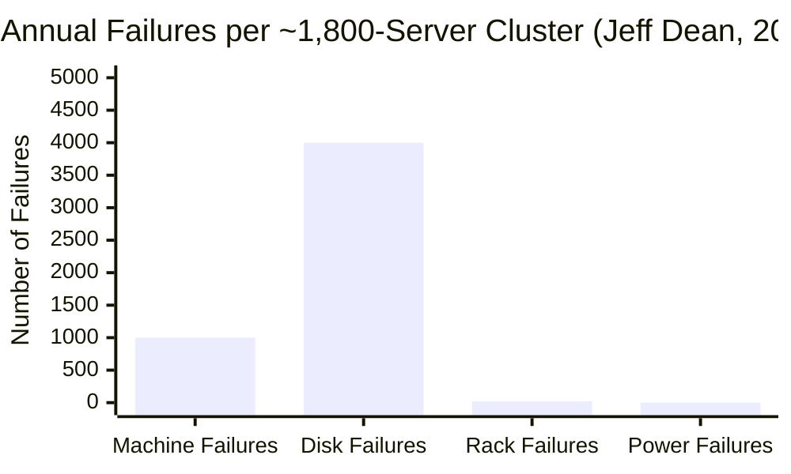
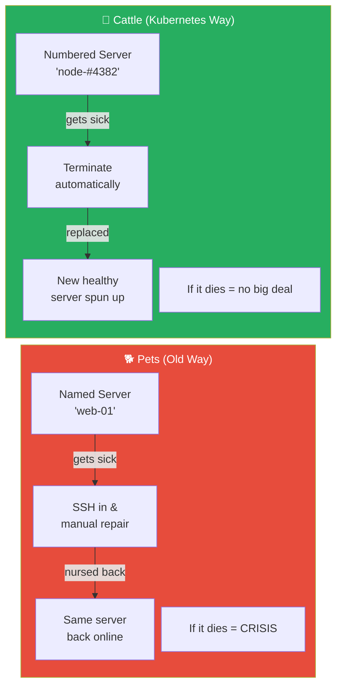
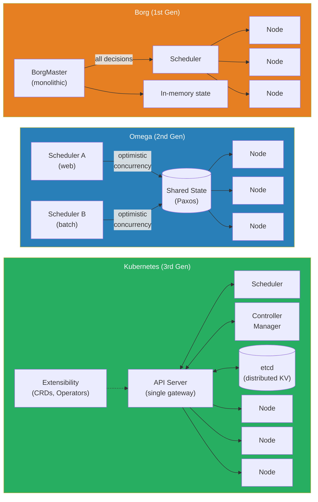

# Chapter 4 (Expanded): The Hard Truth About Hardware

The 2000s were a time of incredible growth for internet companies, especially Google. But as they built data centers at a scale no one had ever seen before, they collided with a brutal reality—a reality that would fundamentally change how we think about software and directly lead to the creation of Kubernetes. The old rules of building reliable systems were about to be broken.

---

### 1. "Failure is Not an Anomaly; It is the Nominal State"

In 2008, Google engineer Jeff Dean gave a presentation that pulled back the curtain on the inner workings of Google's infrastructure. The numbers he shared were staggering and sent a shockwave through the industry. He revealed that for a typical cluster of around 1,800 servers, the failure rates in their first year of operation were not just common; they were constant:

*   **Individual Machine Failures:** Around **1,000** machines would crash, hang, or lose network connectivity. That's several machines failing *every single day*.
*   **Hard Drive Failures:** **Thousands** of disk failures were a certainty.
*   **Rack Failures:** About **20 times a year**, an entire rack of 40-80 machines would vanish from the network instantly due to a failure in its top-level switch or power supply.
*   **Power Distribution Failures:** At least **once a year**, a major power distribution unit would fail, taking **500 to 1,000 machines** offline simultaneously.

**Figure 4.1:** Jeff Dean's failure statistics for a typical Google cluster. Hardware failure is not an exception — it is the constant, nominal state at scale. (Note: a single power failure can affect 500–1,000 machines simultaneously.)

This data shattered the traditional industry approach to reliability. For decades, the goal was to achieve "High Availability" by buying expensive, 'gold-plated', and supposedly ultra-reliable hardware. The thinking was: if you spend enough money on the hardware, it won't fail.

Google's data proved this was a losing battle at scale. Even with 99.9% reliable hardware, when you have hundreds of thousands of components, the sheer number of them means something is *always* broken.

This led to a profound philosophical shift: **stop trying to prevent hardware failure and instead build intelligent software that expects, tolerates, and automatically recovers from it.**

This is the origin of the famous **"pets vs. cattle"** analogy:
*   **Pets:** Are servers you give unique names, like `web-01` or `db-master`. You carefully tend to them, patch them, and when they get "sick" (e.g., a failing component), you spend time and effort nursing them back to health. If a pet dies, it's a crisis.
*   **Cattle:** Are anonymous, numbered servers in a herd. When one gets sick, you don't try to fix it. You simply remove it from the herd and replace it with a new, healthy one. The loss of one is statistically irrelevant to the health of the herd.

**Figure 4.2:** Pets vs. cattle. The "pets" model treats servers as unique, irreplaceable assets requiring manual care. The "cattle" model treats servers as interchangeable — sick ones are terminated and automatically replaced.

Kubernetes was designed from the ground up to be a system for managing cattle, not pets. This is the single most important "why" behind its existence.

---

### 2. Learning to Herd the Cattle: Borg and Omega

To manage this new philosophy at a massive scale, Google had to invent a new kind of software—the "cluster orchestrator." Their journey involved two major internal systems that were the direct predecessors to Kubernetes.

#### **Borg: The All-Powerful Monolith**

Borg was Google's first-generation cluster manager. It was a single, unified system that managed both long-running services (like Gmail and Search) and short-lived batch jobs. Its primary goal was efficiency—by packing applications from different teams onto the same servers, it could achieve incredibly high hardware utilization.

However, Borg was designed as a **monolith**. It had a single, all-powerful master process called the "BorgMaster." This one program held the state of the entire cluster in its memory and made every single scheduling decision. This architecture had significant drawbacks:
*   **It was a bottleneck:** As Google's clusters grew to tens of thousands of machines, the BorgMaster struggled to keep up.
*   **It was a single point of failure:** A bug in the BorgMaster's complex scheduling logic could crash the entire control plane for the cluster.
*   **It was difficult to change:** Because it was so critical and complex, developers were hesitant to add new features, slowing down the pace of innovation.

#### **Omega: A Smarter, Shared-State Architecture**

Omega was designed as the successor to Borg, aiming to fix its core architectural flaws. Its key innovation was the concept of **Shared State**.

Instead of keeping all the cluster's state inside the master's brain, Omega moved it to an independent, highly reliable distributed database (a transaction log based on the Paxos algorithm). This central log held the "truth" about the state of every machine and every job in the cluster.

This unlocked a powerful new capability: **multiple, parallel schedulers**. Different teams could now run their own specialized schedulers that all worked from the same shared state.
*   The web search team could run a scheduler optimized for low-latency services.
*   The MapReduce team could run a scheduler optimized for high-throughput batch jobs.

They all operated in parallel using a principle called **optimistic concurrency**. If two schedulers happened to try to claim the same machine at the same time, they would both submit their desired change to the shared state store. The store would accept the first one and reject the second. The "losing" scheduler would simply see the updated state, realize the machine was no longer available, and try again elsewhere. This made the system vastly more scalable and flexible than Borg.

#### **The Kubernetes Synthesis: The Best of All Worlds**

Kubernetes was created by Google engineers who had worked on both Borg and Omega. It represents the culmination of over a decade of lessons learned from running containerized workloads at an unimaginable scale.

*   From Omega, Kubernetes inherited the crucial **Shared State** model. In Kubernetes, this role is filled by `etcd`, a consistent, distributed key-value store that holds the "truth" for the cluster.
*   However, Kubernetes also learned from Omega's weaknesses. In Omega, trusted components could write directly to the state store. Kubernetes introduced a critical improvement: a central **API Server**.

In Kubernetes, *nothing* is allowed to touch `etcd` directly except for the API Server. Every single component—the scheduler, the node agents, the user—must read and write state by talking to this single, consistent, versioned REST API.

**Figure 4.3:** Evolution from Borg to Omega to Kubernetes. Borg used a monolithic master; Omega introduced shared state with parallel schedulers; Kubernetes added a central API Server gateway, etcd for distributed state, and full extensibility.

This API-centric design is Kubernetes's superpower. It provides a single point for authentication, validation, and policy enforcement. It makes the system incredibly extensible and is the reason a rich ecosystem of tools has been built around it. Anyone can write a custom controller that talks to the Kubernetes API, and it can extend the cluster's behavior just as if it were a built-in component. It was the perfect synthesis of Borg's goals and Omega's architecture, refined for the open-source world.

---
## References

*   [Building Software Systems at Google and Lessons Learned](https://perspectives.mvdirona.com/2008/06/jeff-dean-on-google-infrastructure/) (Based on Jeff Dean's 2008 presentation).
*   Verma, A., et al. (2015). Large-scale cluster management at Google with Borg. *Proceedings of the Tenth European Conference on Computer Systems*, 1-17.