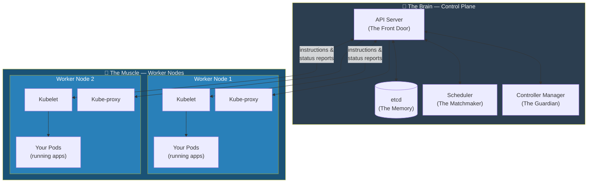
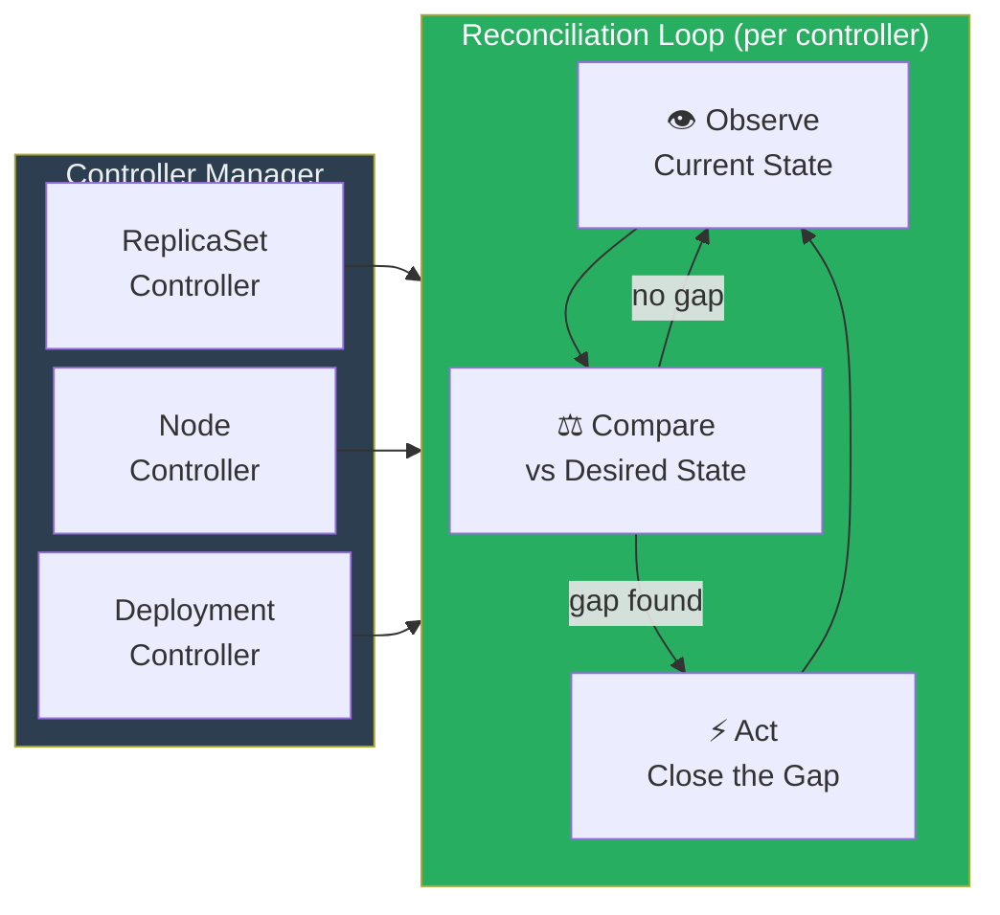
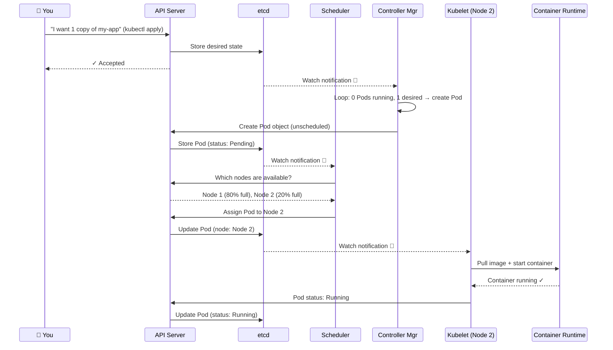
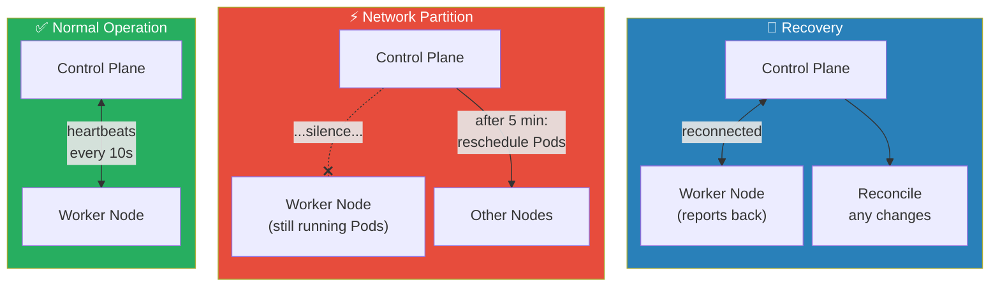

# Chapter 5: The Cluster Architecture — Brain and Muscle

In the previous four chapters, we traced the intellectual lineage of Kubernetes: the layered discipline of Dijkstra, the isolation of Unix processes, the virtualization breakthroughs of Xen and KVM, and the hard-won lessons from Google's massive data centers. We now have all the context we need to understand *why* Kubernetes was built the way it was.

In this chapter, we put it all together and meet the machine itself. We are going to look at the **anatomy of a Kubernetes cluster** — which components exist, what each one does, and how they cooperate to keep your applications alive, even when the underlying hardware is falling apart around them.

---

> **In Plain English: What is a "Cluster"?**
> The word "cluster" just means "a group of computers that are managed together as a single unit." When you use Kubernetes, you don't think about individual machines — you think about the cluster as one big, powerful computer that you can give instructions to. Kubernetes handles the details of which physical machine actually does the work.

---

### 1. The Two Roles: Brain and Muscle

Every Kubernetes cluster is divided into two distinct types of machines, each playing a completely different role.

**The Brain — The Control Plane**

This is the cluster's headquarters. The Control Plane doesn't actually run your applications. Instead, it watches over the entire cluster, makes all the important decisions, and continuously works to make sure the cluster's real state matches the state you declared you wanted. It answers questions like:
- "Which machine should this new container run on?"
- "One of our application copies just crashed — what should we do?"
- "What does the user want the cluster to look like right now?"

**The Muscle — Worker Nodes**

These are the machines that actually do the work. Worker Nodes receive instructions from the Control Plane and execute them: pulling container images, starting containers, reporting back on their health. They are the "hands" of the operation. A cluster can have anywhere from one to thousands of Worker Nodes.

**Figure 5.1:** The Brain and Muscle of a Kubernetes cluster. The Control Plane (Brain) makes all decisions. Worker Nodes (Muscle) carry them out. They communicate constantly through the API Server.

---

### 2. Inside the Brain: The Control Plane Components

The Control Plane is not one single program — it's a set of cooperating processes that each have a specific, well-defined job. This is the microkernel philosophy from Chapter 2 in action.

#### **The API Server — The Front Door of the Cluster**

> **In Plain English:** Imagine a luxury hotel with a single, very professional front desk. Every guest (you, the developer), every department (the scheduler, the controllers), and every delivery (a node reporting its health) must go through this front desk. No one is allowed to sneak in through the back. That front desk is the API Server.

The **API Server** is the only entry point for all communication with the cluster. When you run a `kubectl` command (Kubernetes's command-line tool), you are sending a request to the API Server. When a Worker Node sends a health update, it sends it to the API Server. When the Scheduler wants to find a good machine for a new container, it asks the API Server.

This centralization is what makes Kubernetes secure, auditable, and extensible. Every request is subject to the same authentication, validation, and access control rules.

#### **etcd — The Cluster's Long-Term Memory**

> **In Plain English:** If the API Server is the hotel's front desk, then **etcd** is the hotel's master ledger — the single book that contains the definitive record of every guest reservation, every room assignment, and every staff instruction. It is the ground truth. Everything else in the cluster is derived from what's written in this ledger.

**etcd** (pronounced "et-see-dee") is a highly reliable distributed database. It stores the entire desired state of the cluster:
- What applications you want to run, and how many copies.
- Which nodes exist and their current status.
- All the configuration data for every component.

Critically, *only the API Server is allowed to read from and write to etcd directly.* No other component touches the database. This ensures that etcd's data is always consistent and trustworthy.

#### **The Scheduler — The Matchmaker**

> **In Plain English:** You have a new employee starting (a new container that needs to run). You have several offices (Worker Nodes) with different amounts of free space, different equipment, and different rules about who can work there. The **Scheduler** is the HR manager who looks at the new employee's requirements and all the available offices, and decides: "You go to Office 3."

The **Scheduler** watches for new containers (grouped in "Pods") that have been declared but haven't been assigned to a machine yet. It then evaluates every available Worker Node against a set of requirements:
- Does this node have enough free CPU and memory?
- Has the user requested that this container avoid certain nodes (e.g., all containers in "Zone A" so the application survives a zone failure)?
- Is the node in a healthy condition?

Once it finds the best match, it writes its decision back to the API Server ("Pod X should run on Node 2"), and its job for that Pod is done.

#### **The Controller Manager — The Guardian**

> **In Plain English:** A **controller** is like a security guard making rounds through a building. It doesn't just stand in one spot — it constantly walks around, checking that every door is locked, every light is as it should be, every room is the right temperature. If it finds anything wrong, it fixes it.

The **Controller Manager** is a single process that runs many individual controllers, each responsible for one aspect of the cluster:

- **The ReplicaSet Controller:** Checks that the correct number of copies (replicas) of each application is running. If you said "I want 3 copies," and one crashes, this controller notices the count is 2 and creates a new one.
- **The Node Controller:** Monitors the health of each Worker Node. If a node goes silent (perhaps the server lost power), this controller marks it as unavailable and triggers the rescheduling of all Pods that were running on it.
- **The Deployment Controller:** Manages rolling updates — when you want to update your application to a new version, this controller replaces old copies with new ones gradually, ensuring no downtime.

Each controller runs the same fundamental **reconciliation loop** that we introduced in Chapter 5: Observe → Compare → Act.

**Figure 5.2:** Every controller inside the Controller Manager runs the same reconciliation loop — observe, compare, act. Each just watches a different part of the cluster state.

---

### 3. Inside the Muscle: Worker Node Components

Every Worker Node runs two essential agents that allow it to receive and execute instructions from the Control Plane.

#### **The Kubelet — The Node's Foreman**

> **In Plain English:** The **Kubelet** is the on-site foreman at a construction site. The Control Plane (the architects and project managers back at headquarters) sends blueprints and instructions. The Kubelet is the person on the ground who reads those instructions, talks to the workers, makes sure the right walls are being built, and calls headquarters to report progress (or problems).

The **Kubelet** is an agent that runs on every Worker Node. Its responsibilities are:

1. **Watch for assignments:** It continuously watches the API Server for any Pods that the Scheduler has assigned to *its* node.
2. **Start containers:** When it receives an assignment, it instructs the local **Container Runtime** (like `containerd`, via the CRI interface from Chapter 1) to pull the container image and start the container.
3. **Monitor health:** It watches the containers it's responsible for, running health checks and reporting their status back to the API Server continuously.
4. **Report problems:** If a container crashes, the Kubelet detects this immediately and reports it, triggering the Controller Manager's reconciliation loop.

Without the Kubelet, the Control Plane's declarations would be nothing but text in a database. The Kubelet is what makes them real on physical hardware.

#### **Kube-proxy — The Network Rules Agent**

> **In Plain English:** Imagine your application has 3 copies running across 3 different machines, each with a different IP address. How does a user's web browser know which one to talk to? The **Kube-proxy** is the traffic cop on each node — it maintains a set of network rules that make sure requests reach the right Pod, no matter which machine it's on or how many copies are running.

The **Kube-proxy** runs on every Worker Node and manages networking rules. When you create a Kubernetes `Service` (a stable, virtual IP address — think of it as a consistent phone number for your application), kube-proxy programs the network rules on its node to forward traffic for that virtual IP to one of the currently-healthy backing Pods.

This means if Pod A crashes and Kubernetes starts Pod D on a different machine, the kube-proxy updates its rules automatically, and the `Service`'s phone number still works. The users of your application never notice.

---

### 4. A Day in the Life of a Pod

To see how all these components work together, let's trace the complete journey of a single Pod — from the moment you declare you want it to the moment it's happily running. This is the single most important flow in all of Kubernetes.

**Figure 5.3:** The complete lifecycle of a Pod from declaration to running. Six components cooperate through the API Server, each playing its part in the chain: you declare intent, the Controller Manager creates the Pod object, the Scheduler assigns it to a node, and the Kubelet on that node brings it to life.

Let's walk through each step:

1. **You** run `kubectl apply` with a YAML file that says "I want 1 replica of `my-app`." This hits the **API Server**, which validates and stores your intent in **etcd**.
2. The **Controller Manager** (specifically the ReplicaSet Controller) was watching. It sees: "Desired: 1. Running: 0. Gap exists." It creates a Pod object and sends it to the API Server. The Pod is now stored in etcd with status `Pending`.
3. The **Scheduler** was also watching. It sees an unscheduled Pod, evaluates all nodes, picks the best one (Node 2), and writes that assignment back to the API Server.
4. The **Kubelet** on Node 2 was watching for Pods assigned to its node. It sees the new assignment, calls the local **Container Runtime** to start the container, waits for confirmation, then reports back to the API Server: "Pod is now `Running`."
5. The API Server updates etcd. The desired state and the observed state now match. The controllers go quiet — until something changes.

This cascade of watch notifications and reconciliation loops — all passing through the single API Server — is the heartbeat of every Kubernetes cluster.

---

### 5. How Brain and Muscle Stay Connected

You might wonder: what happens if the network between a Worker Node and the Control Plane is temporarily cut? This is where the **cattle philosophy from Chapter 4** shows its strength.

- The **Kubelet** keeps trying to reconnect and report its status. The containers it was already running continue to run — they don't immediately stop just because they lost contact with headquarters.
- The **Node Controller** in the Control Plane monitors the last heartbeat time from every node. If a node goes silent for too long (typically 5 minutes), it marks the node as `NotReady` and begins rescheduling the Pods that were on it to other healthy nodes.
- When the network comes back, the Kubelet reconnects, and the Control Plane reconciles whatever happened during the outage.

This is resilience by design — the system assumes the connection will be flaky and builds graceful behavior for exactly that scenario.

**Figure 5.4:** Network partition handling. Worker Nodes continue running their existing Pods during a partition. The Control Plane reschedules after a timeout. On reconnection, both sides reconcile — no manual intervention needed.

---

## References

*   [Kubernetes Components — Kubernetes Documentation](https://kubernetes.io/docs/concepts/overview/components/)
*   [Understanding Kubernetes Architecture with Diagrams](https://phoenixnap.com/kb/understanding-kubernetes-architecture-diagrams)
*   Verma, A., et al. (2015). Large-scale cluster management at Google with Borg. *Proceedings of the Tenth European Conference on Computer Systems*, 1–17.
