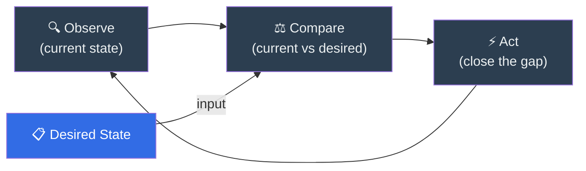
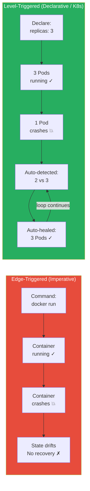
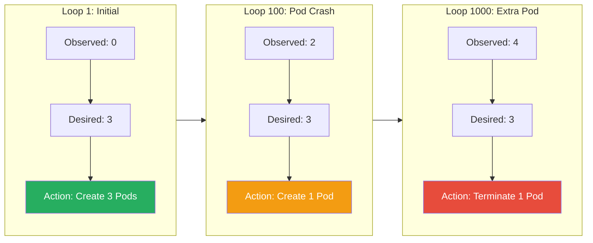
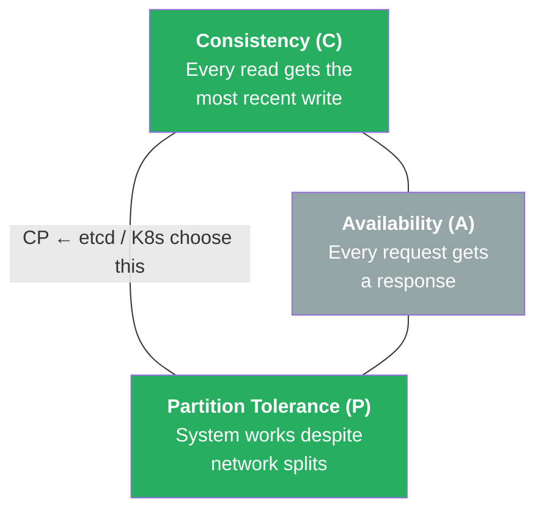
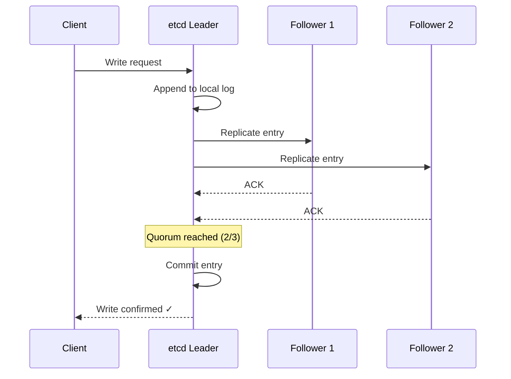

# Chapter 5 (Expanded): The Conductor Takes the Stage

When Kubernetes was released in 2014, it stood on the shoulders of giants, incorporating 50 years of lessons from computer science history. But its own unique genius—the thing that makes Kubernetes *feel* like magic—lies in how it manages the cluster day-to-day. It's not just about starting containers; it's about creating a living, breathing, self-healing system. This magic is built on two core concepts: the **Control Loop** and the cluster's brain, **etcd**.

---

### 1. The Genius of the Control Loop

The easiest way to understand how Kubernetes thinks is to look at the thermostat in your house. You don't tell the thermostat, "Turn the heat on now." You simply set a **desired state**: "I want this room to be 70 degrees."

The thermostat then enters an infinite loop:
1.  **Observe:** It checks the current temperature of the room (the **observed state**).
2.  **Compare:** It compares the current state to your desired state.
3.  **Act:** If there's a difference, it takes action to correct it (turning the heat or A/C on). If there's no difference, it does nothing.



**Figure 5.1:** The Kubernetes control loop. Controllers continuously observe the current state, compare it to the desired state, and take action to reconcile any difference — then repeat forever.

This simple feedback loop is the core principle behind Kubernetes. It's what makes the system declarative and self-healing. To appreciate how powerful this is, let's compare it to the older way of doing things.

#### **The Old Way: Edge-Triggered (Imperative)**

Traditional system management tools were often **imperative** and **edge-triggered**. This is like a doorbell. You press it once (an "edge" or an event), and it rings once.

In this model, you give the system a direct command:
`docker run my-web-server`

The system executes your command and then its job is finished. It has reacted to the "edge" of your command. But what happens if that container crashes five minutes later? The system doesn't know or care. Its state has now **drifted** from what you intended, and it won't do anything about it until you give it another command. This is a brittle and manual way to manage a complex application.

#### **The Kubernetes Way: Level-Triggered (Declarative)**

Kubernetes operates on a **declarative**, **level-triggered** model. This is like the thermostat's sensor. As long as the temperature is below 70 degrees (the "level"), the condition is active, and the heat stays on.

You don't give Kubernetes commands. Instead, you give it a **manifest** (usually a YAML file) that *declares* the state you want.

`replicas: 3`
`image: my-web-server`

You are telling Kubernetes, "My desired state is to have 3 replicas of my web server running."



**Figure 5.2:** Edge-triggered (imperative) vs. level-triggered (declarative). Imperative systems execute a command once and forget — if the process crashes, no recovery occurs. Kubernetes's declarative model continuously monitors and auto-heals.

The core of Kubernetes is a set of processes called **controllers**. Each controller is responsible for a specific part of the system (e.g., there's a controller for managing replicas, another for managing nodes). Each controller runs an infinite **reconciliation loop**:

1.  **Observe** the current state (e.g., "How many 'my-web-server' Pods exist right now?").
2.  **Compare** it to the desired state stored in the cluster's database.
3.  **Act** to close the gap between observation and desire.

This loop is always running.
*   *Loop 1:* The controller sees 0 replicas and you want 3. It creates 3.
*   *Loop 100:* A server glitches and one replica dies. The controller now sees 2, but you still want 3. It creates 1 more.
*   *Loop 1000:* An admin accidentally starts an extra replica manually. The controller now sees 4, but you only want 3. It terminates one.



**Figure 5.3:** Reconciliation loop iterations. The controller continuously drives the observed state toward the desired state — creating Pods when there are too few, terminating when there are too many.

This is what makes Kubernetes **self-healing**. It is constantly working to make reality match your declaration. This powerful concept is borrowed from industrial **Control Theory**, a field of engineering that uses feedback loops to keep complex systems (like airplanes and chemical plants) stable. The Kubernetes controllers are always working to drive the "error" between the desired and observed state to zero.

---

### 2. Etcd: The Cluster's Single Source of Truth

For a declarative system to work, it needs one—and only one—unquestionably true source of information for the desired state. In Kubernetes, this is **etcd**.

Etcd is a consistent and highly-available distributed key-value store. Think of it as the central nervous system or "brain" of the entire cluster. It stores everything: the declarations you provide, the status of every Pod, the health of every node, and all the configuration data. It is the only stateful component in the otherwise stateless Kubernetes control plane.

The choice of etcd was deliberate because of how it answers a fundamental question in distributed systems known as the **CAP Theorem**.

#### **The CAP Theorem and Why Consistency Matters**

The CAP Theorem states that in a distributed database, you can only have two of the following three guarantees:
*   **Consistency (C):** Every read from the database returns the most recent, correct data.
*   **Availability (A):** The database will always respond to a request (though it might be with slightly stale data).
*   **Partition Tolerance (P):** The system can survive a network failure (a "partition") where groups of servers are temporarily unable to communicate with each other.



**Figure 5.4:** The CAP Theorem triangle. In a distributed system, you can only guarantee two of three properties. Kubernetes and etcd choose **Consistency + Partition Tolerance (CP)** — they would rather become briefly unavailable than serve stale or conflicting data.

Since network partitions are an unavoidable fact of life in any real-world distributed system, the real choice is between **Consistency** and **Availability** (CP vs. AP).

Kubernetes and etcd are a **CP system**. They choose **Consistency over Availability**.

Why? Imagine a scenario where the network splits. If Kubernetes chose Availability, one scheduler on one side of the split might try to start a Pod on Node A, while another scheduler on the other side starts the same Pod on Node B. Both would think they succeeded. This "split-brain" situation would lead to chaos and data corruption.

To prevent this, etcd guarantees consistency above all else. It uses the **Raft Consensus Algorithm** to ensure data integrity.
1.  The etcd servers in the cluster elect a single **leader**.
2.  All writes must go to this leader.
3.  A write is only considered successful after the leader has replicated it to a **majority** (a "quorum") of the servers.



**Figure 5.5:** Raft consensus in etcd. A write is only confirmed after the leader replicates it to a majority (quorum) of followers, ensuring no data is lost even if a node fails.

If a network partition occurs and a quorum cannot be formed, the etcd cluster will temporarily refuse to accept any new writes. It would rather become briefly unavailable than risk accepting conflicting information that would corrupt the state of the cluster.

Finally, etcd provides a crucial **watch** feature. The Kubernetes controllers don't waste time constantly asking etcd, "Anything new? Anything new?" Instead, they place a "watch" on the parts of the database they care about. The moment a value changes (e.g., a user updates a desired state), etcd proactively notifies the relevant controller. ```mermaid
sequenceDiagram
    participant User
    participant API as API Server
    participant etcd
    participant Ctrl as Controller

    User->>API: Apply desired state (YAML)
    API->>etcd: Store desired state
    etcd-->>Ctrl: Watch notification 🔔
    Ctrl->>Ctrl: Compare desired vs observed
    Ctrl->>API: Take action (create/update/delete)
    API->>etcd: Update observed state
    Note over Ctrl: Loop continues...
```

**Figure 5.6:** The etcd watch and controller flow. When a user submits a desired state, it is stored in etcd. The watch mechanism notifies the relevant controller, which compares, acts, and updates state — completing the reconciliation loop.

This notification is the "tap on the shoulder" that kicks off the controller's reconciliation loop, making the entire system incredibly efficient and reactive.

---
## References

*   [How etcd works with and without Kubernetes](https://learnkube.com/etcd-kubernetes)
*   [Consistency Models: Strong vs Eventual in Kubernetes](https://hokstadconsulting.com/blog/consistency-models-strong-vs-eventual-in-kubernetes)
*   Brewer, E. (2000). Towards Robust Distributed Systems. *Proceedings of the Nineteenth Annual ACM Symposium on Principles of Distributed Computing*, 7.