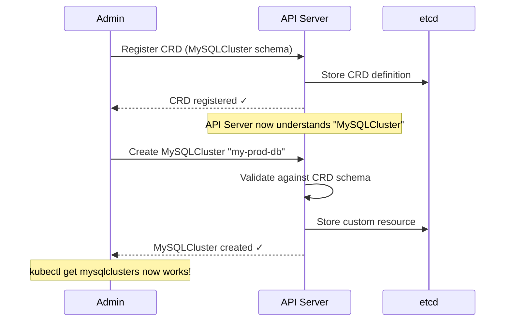
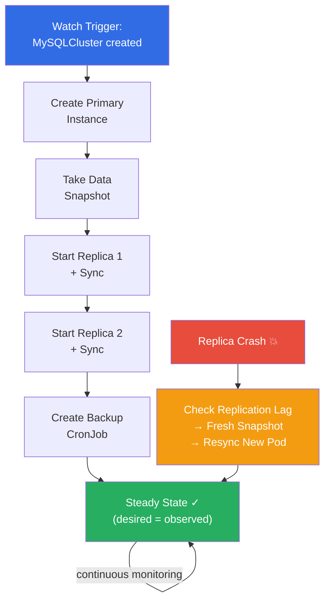
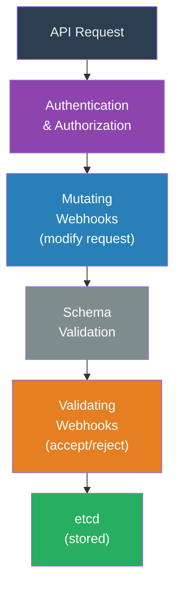
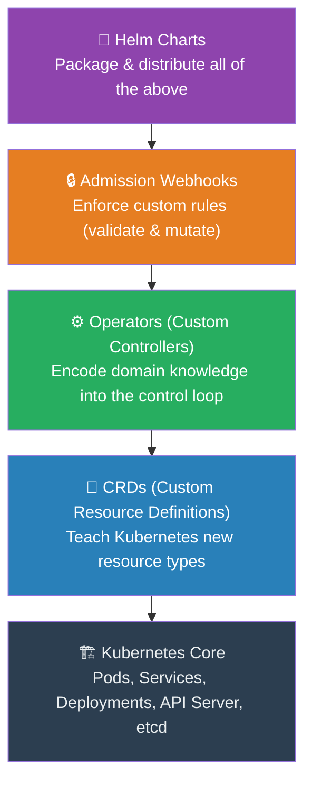

# Chapter 6 (Expanded): Teaching Kubernetes New Tricks — Operators and the Extensible Platform

In Chapter 5, we saw how Kubernetes uses the control loop to keep your applications running: you declare a desired state, and controllers work tirelessly to make reality match. In Chapter 4, we learned that the API Server is the single gateway through which every interaction with the cluster must pass. These are powerful ideas. But they raise a natural question: what happens when Kubernetes doesn't know *how* to manage something?

Kubernetes knows how to keep three copies of a web server running. But it doesn't know how to run a database. It doesn't know how to manage a message queue, provision a TLS certificate, or orchestrate a machine learning pipeline. These tasks require specialized, domain-specific knowledge that no general-purpose system could ship with out of the box.

The answer to this problem is Kubernetes's most important innovation: **extensibility**. Kubernetes was designed not just to be a platform, but to be a **platform for building platforms**. This chapter is the story of how.

---

### 1. The Problem: Domain Knowledge That Kubernetes Doesn't Have

Let's make this concrete with a database example. Imagine you need to run a production MySQL cluster with one primary server and two read replicas.

A human database administrator (a "DBA") knows the exact sequence of steps required:
1.  Start the primary instance first and wait for it to be fully ready.
2.  Take a snapshot of the primary's data.
3.  Start Replica 1, point it at the primary, and load the snapshot so it can catch up.
4.  Only then, start Replica 2 and repeat the process.
5.  Configure daily backups of the primary's data.
6.  If the primary ever goes down, promote one of the replicas to become the new primary, reconfigure the other replica to follow the new primary, and alert the on-call engineer.

None of this is generic container orchestration. This is deep, operational expertise—the kind of knowledge that takes years for a human to learn. Kubernetes's built-in controllers don't know any of it. If you simply told Kubernetes "run 3 MySQL Pods," it would start all three simultaneously with no coordination, no replication, and no backup strategy. The result would be a mess, not a database cluster.

This is the old world of **Pets** from Chapter 4. Databases, message queues, and other stateful systems were traditionally treated as precious, hand-managed pets. A DBA would SSH into the server, run commands by hand, and keep a runbook of procedures. It worked, but it was slow, error-prone, and didn't scale. Every time you needed a new database cluster, you needed that same human expert to repeat those same manual steps.

The question became: *what if we could encode that human expert's knowledge into software and run it inside the Kubernetes control loop?*

---

### 2. Custom Resource Definitions (CRDs): Teaching Kubernetes New Words

Before we can teach Kubernetes new behavior, we first need to teach it new **vocabulary**.

Kubernetes ships with a set of built-in resource types that it understands: Pods, Services, Deployments, ConfigMaps, and so on. These are the "words" in its language. When you run `kubectl get pods`, you're asking Kubernetes about a resource type it was born knowing about.

**Custom Resource Definitions (CRDs)** let you define entirely new resource types. A CRD is essentially a schema—a blueprint—that tells the API Server, "There's a new kind of thing you need to know about. Here's what its fields look like."

For example, you could create a CRD called `MySQLCluster`. Once you register this CRD with the API Server, Kubernetes suddenly "knows" about MySQL clusters as a first-class concept. You can now interact with them using the exact same tools and commands you use for built-in resources:

*   `kubectl get mysqlclusters` — lists all your MySQL clusters.
*   `kubectl describe mysqlcluster my-production-db` — shows you the details.
*   `kubectl delete mysqlcluster my-staging-db` — removes one.

The CRD doesn't do anything by itself—it just extends the API Server's vocabulary. But this is a crucial first step. Think back to Chapter 2's microkernel philosophy. If Kubernetes is a distributed operating system, CRDs are like installing new **device drivers**. They teach the OS about new hardware (or in this case, new concepts) that it didn't know about when it was first installed. The API Server from Chapter 4, which we described as the front door of the building, now has a new type of visitor it can recognize and process.



**Figure 6.1:** CRD registration flow. An admin first registers the CRD schema, teaching the API Server a new resource type. Then custom resources of that type can be created, validated, and stored — just like built-in resources.

---

### 3. The Operator Pattern: Encoding Human Knowledge Into Software

A CRD gives Kubernetes new vocabulary. But vocabulary without understanding is useless. You need something that knows what to *do* with these new words. This is where the **Operator** pattern comes in.

An Operator is the combination of a **CRD** and a **Custom Controller**.

The Custom Controller is a piece of software that uses the exact same **reconciliation loop** from Chapter 5—Observe, Compare, Act—but for your custom resource instead of a built-in one.

Here's how it works in practice. You write a YAML manifest:

```yaml
apiVersion: databases.example.com/v1
kind: MySQLCluster
metadata:
  name: my-production-db
spec:
  replicas: 3
  backupSchedule: "daily"
```

You apply this to the cluster, and it gets stored in etcd as your **desired state**. The MySQL Operator's controller is watching for `MySQLCluster` resources, and etcd's watch feature (from Chapter 5) taps it on the shoulder: "Hey, someone wants a new MySQL cluster."

The controller's reconciliation loop now kicks in, but unlike a generic Kubernetes controller, it carries *domain-specific knowledge*. It knows the correct procedure:

1.  **First loop:** "I see 0 Pods, but the user wants 3 replicas. I'll start by creating the primary instance first."
2.  **Second loop:** "The primary is now healthy. Time to take a data snapshot and start Replica 1."
3.  **Third loop:** "Replica 1 is synced and healthy. Now I'll start Replica 2."
4.  **Fourth loop:** "All 3 replicas are running and in sync. The backup schedule says 'daily,' so I'll create a CronJob for nightly backups."
5.  **Every subsequent loop:** "All 3 replicas are healthy, replication lag is within acceptable bounds, and backups are succeeding. Desired state matches observed state. Nothing to do."

Now imagine a replica crashes. A generic Kubernetes controller would blindly restart a new Pod and hope for the best. But the Operator's controller is smarter. It knows to:
*   Check the replication lag of the remaining replica.
*   Initialize the new replacement Pod with a fresh data snapshot from the primary.
*   Wait for the new replica to fully sync before marking the cluster as healthy again.



**Figure 6.2:** Operator reconciliation loop for a MySQL cluster. The operator follows domain-specific steps (primary first, then replicas, then backups). On a crash, it performs intelligent recovery — resyncing data rather than blindly restarting.

**This is the key insight:** an Operator captures the expertise of a human operator and runs it as software inside the control loop—24/7, tirelessly, at machine speed. The DBA's years of experience are now codified in a controller that never sleeps, never forgets a step, and can manage hundreds of database clusters simultaneously.

Remember the thermostat analogy from Chapter 5? A basic thermostat understands only temperature. An Operator is like a smart home system that understands temperature, humidity, air quality, the time of day, and seasonal weather patterns. It uses all of that knowledge to keep your home comfortable in ways a simple thermostat never could.

---

### 4. The Ecosystem: A Platform for Building Platforms

The Operator pattern didn't just solve one team's database problem. It unlocked an entire ecosystem.

Once the community realized that anyone could extend Kubernetes with domain-specific knowledge, an explosion of Operators appeared for virtually every kind of infrastructure:

*   **The Prometheus Operator** manages the popular Prometheus monitoring system. Instead of hand-configuring monitoring targets and alert rules, you declare them as custom resources, and the Operator wires everything together.
*   **cert-manager** automates TLS certificate provisioning and renewal. You declare that your website needs an HTTPS certificate, and the Operator talks to certificate authorities like Let's Encrypt, obtains the certificate, installs it, and automatically renews it before it expires.
*   **The etcd Operator** manages etcd clusters—the very database that Kubernetes itself depends on. There's something wonderfully recursive about this: Kubernetes uses an Operator to manage the system that stores Kubernetes's own state.

The tooling grew to match. Frameworks like **Operator SDK** and **Kubebuilder** made it far easier to build new Operators by providing scaffolding, code generators, and best practices. **OperatorHub** became a public marketplace where teams could share and discover Operators, much like an app store.

This is why companies like Red Hat built entire products (like OpenShift) on top of Kubernetes. They recognized that Kubernetes wasn't just a container runtime—it was an **extensible, API-driven platform**. You could model any piece of infrastructure as a custom resource and manage it through the control loop.

Connect this back to Chapter 2. Just as Liedtke's microkernel let you plug in new "user-space servers" for file systems, network stacks, and device drivers, Kubernetes lets you plug in new Operators for databases, message queues, ML pipelines, and anything else your organization needs. The microkernel philosophy, born in a 1990s research lab, has been realized at planetary scale.

---

### 5. Admission Webhooks: The Gatekeepers

CRDs extend *what* Kubernetes knows. Operators extend *how* it acts. But there's a third dimension of extensibility: extending *what rules it enforces*. This is the job of **Admission Webhooks**.

In Chapter 4, we described the API Server as the front door of the building—the single point through which every request must pass. Admission Webhooks are the **security guards** stationed at that front door. Before any request (create a Pod, update a Deployment, apply a CRD) is accepted and stored in etcd, it passes through a chain of admission controllers.

Kubernetes lets you insert your own custom logic into this chain via two types of webhooks:

**Validating Webhooks** act as ID checkers. They inspect an incoming request and decide whether to allow or reject it. They cannot change the request; they can only say "yes" or "no."

*   *Example:* You write a validating webhook that rejects any Pod that doesn't specify CPU and memory resource limits. This prevents developers from accidentally deploying a container that could consume all the resources on a node and starve other applications—a scenario called the "noisy neighbor" problem.
*   *Example:* A security team deploys a webhook that rejects any container image that hasn't been pulled from the company's approved private registry, preventing untrusted code from running in the cluster.

**Mutating Webhooks** act as badge issuers. They intercept an incoming request and automatically modify it before it proceeds. The user may not even realize the modification happened.

*   *Example:* The popular service mesh **Istio** uses a mutating webhook to automatically inject a "sidecar" proxy container into every new Pod. A developer deploys their application with one container, but by the time the Pod is actually created, it has two—the original application and the Istio proxy that handles networking, security, and observability. The developer never had to change a single line of their YAML.
*   *Example:* A platform team deploys a webhook that automatically adds standard labels (like `team: payments` or `environment: production`) to every resource, ensuring consistent metadata across the entire cluster without relying on individual developers to remember.

Together, Validating and Mutating Webhooks complete the extensibility picture. If we extend the "front door" analogy from Chapter 4: CRDs teach the building about new types of visitors. Operators know how to escort those visitors to where they need to go. And Admission Webhooks are the security guards who check IDs (validate) and hand out visitor badges (mutate) before anyone steps inside.



**Figure 6.3:** The admission webhook pipeline. Every API request passes through authentication, mutating webhooks (which can modify the request), schema validation, and validating webhooks (which can reject it) before being persisted to etcd.

---

### 6. Helm: Packaging and Sharing the Knowledge

Operators, CRDs, and Admission Webhooks are powerful tools for extending Kubernetes. But in practice, deploying a complex system like a monitoring stack or a database Operator involves dozens of interconnected YAML manifests: the CRD definitions, the Operator's Deployment, ServiceAccounts, RBAC permissions, ConfigMaps, webhook configurations, and more. Managing all of these files by hand is tedious and error-prone.

This is the problem that **Helm** solves. Helm is the **package manager for Kubernetes**.

If Kubernetes is a distributed operating system (as we established in Chapter 2), then Helm is its "app store" or package manager—analogous to `apt` on Debian Linux or `brew` on macOS. A **Helm Chart** is the equivalent of an installer package. It bundles all the YAML manifests, default configuration values, and dependency information needed to deploy a complete application into the cluster.

Here's why Helm matters:

*   **One-command installs:** Instead of manually applying dozens of YAML files in the right order, you can deploy an entire Prometheus monitoring stack—complete with its Operator, CRDs, Grafana dashboards, and alert rules—with a single command: `helm install prometheus prometheus-community/kube-prometheus-stack`.
*   **Configuration without code changes:** Helm Charts use a templating system with a `values.yaml` file. You can customize a deployment (change the number of replicas, enable specific features, set resource limits) by overriding values, without modifying the chart's templates directly.
*   **Upgrades and rollbacks:** Helm tracks the history of every deployment. If an upgrade introduces a problem, you can roll back to a previous working version with `helm rollback`. This solves the practical, day-to-day problem of "how do I update my Operator without breaking everything."
*   **Sharing and discovery:** Public chart repositories like **Artifact Hub** serve as a central marketplace where teams and vendors publish their Helm Charts. Need a Redis cluster? A Kafka deployment? An ingress controller? There's almost certainly a community-maintained chart ready to install.

Connect this back to the microkernel theme from Chapter 2. Just as Linux package managers (`apt`, `yum`) let you install new user-space programs—network servers, file system drivers, desktop applications—into a microkernel-style OS, Helm lets you install new capabilities into the Kubernetes platform. The combination of CRDs, Operators, and Helm Charts means that anyone can package up a piece of domain expertise and distribute it to the entire Kubernetes community. The platform doesn't just grow through core development; it grows through its ecosystem.

---

### The Full Picture

Let's step back and see how all the pieces fit together.

1.  **CRDs** extend the API Server's vocabulary, teaching Kubernetes about new concepts like `MySQLCluster` or `Certificate`.
2.  **Operators** (Custom Controllers) extend the control loop, encoding domain-specific knowledge about *how* to manage those new concepts.
3.  **Admission Webhooks** extend the API Server's enforcement, adding custom validation and mutation rules that act as gatekeepers for the entire cluster.
4.  **Helm** packages all of the above into distributable, versionable, configurable bundles that can be shared across the ecosystem.



**Figure 6.4:** The full Kubernetes extensibility stack. Each layer builds on the one below — CRDs extend vocabulary, Operators extend behavior, Admission Webhooks extend enforcement, and Helm packages everything for distribution.

This layered extensibility is what transformed Kubernetes from a container orchestrator into something far more significant: a universal control plane. It's the reason Kubernetes won the orchestration wars—not because it did everything itself, but because it made it possible for everyone else to extend it with their own expertise.

---
## References

*   Dobies, J., & Wood, J. (2020). *Kubernetes Operators: Automating the Container Orchestration Platform*. O'Reilly Media.
*   [The Operator Pattern — Kubernetes Documentation](https://kubernetes.io/docs/concepts/extend-kubernetes/operator/)
*   [Custom Resources — Kubernetes Documentation](https://kubernetes.io/docs/concepts/extend-kubernetes/api-extension/custom-resources/)
*   [Dynamic Admission Control — Kubernetes Documentation](https://kubernetes.io/docs/reference/access-authn-authz/extensible-admission-controllers/)
*   [Helm Documentation](https://helm.sh/docs/)
*   [OperatorHub.io](https://operatorhub.io/)
