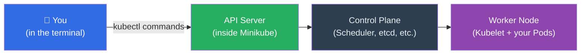

# Chapter 6: Getting Hands-On — Your First Kubernetes Cluster

The previous five chapters have built a rich mental model of what Kubernetes is and why it works the way it does. Now it's time to get our hands dirty. In this chapter, we will set up a real, working Kubernetes cluster on your own computer and run your very first application on it.

Don't worry if you've never used a terminal or command line before. We will walk through every step, explain every command, and show you exactly what to expect to see on your screen.

---

> **In Plain English: What is a terminal?**
> A **terminal** (also called a "command line" or "shell") is a text-based way to talk to your computer. Instead of clicking icons, you type instructions. On a Mac, you open it by pressing `Cmd + Space` and searching for "Terminal." On Windows, search for "PowerShell." On Linux, look for "Terminal" in your applications. Throughout this chapter, lines that start with `$` are commands you type. The `$` itself is just a symbol — don't type it.

---

### 1. The Tools We Need

To run Kubernetes on your laptop, we need two things:

**Minikube** — A program that creates a mini, single-machine Kubernetes cluster on your computer. It's the perfect tool for learning and development. Think of it as a complete Kubernetes cluster in a bottle — everything you've read about in the previous chapters, running right on your machine.

**kubectl** — Pronounced "kyoob-control" or "kyoob-cuttle." This is the **command-line tool for talking to any Kubernetes cluster** — including your local Minikube one. It's how you, the human, communicate with the API Server we learned about in Chapter 5.



**Figure 6.1:** How kubectl connects you to the cluster. Every command you type goes through kubectl → API Server → the rest of the cluster.

---

### 2. Installing the Tools

#### Step 1: Install kubectl

**On macOS** (using Homebrew — a popular Mac package manager):
```bash
$ brew install kubectl
```

**On Windows** (using Chocolatey — a Windows package manager):
```bash
$ choco install kubernetes-cli
```

**On Linux (Ubuntu/Debian)**:
```bash
$ sudo apt-get update && sudo apt-get install -y kubectl
```

To verify the installation worked, type:
```bash
$ kubectl version --client
```

You should see output like this (version numbers may differ):
```
Client Version: v1.29.0
Kustomize Version: v5.0.4-0.20230601165947-6ce0bf390ce3
```

If you see a version number, `kubectl` is installed. ✅

#### Step 2: Install Minikube

**On macOS:**
```bash
$ brew install minikube
```

**On Windows:**
```bash
$ choco install minikube
```

**On Linux:**
```bash
$ curl -LO https://storage.googleapis.com/minikube/releases/latest/minikube-linux-amd64
$ sudo install minikube-linux-amd64 /usr/local/bin/minikube
```

> **Note:** Minikube needs a way to run virtual machines or containers on your computer. The easiest option is to have **Docker Desktop** installed (free at [docker.com](https://www.docker.com/products/docker-desktop/)). Minikube will use it automatically.

---

### 3. Starting Your First Cluster

With both tools installed, starting a cluster is a single command:

```bash
$ minikube start
```

You'll see Minikube doing several things — this may take 2-3 minutes the first time as it downloads images:

```
😄  minikube v1.32.0 on Darwin 14.2
✨  Automatically selected the docker driver
📌  Using Docker Desktop driver with root privileges
👍  Starting control plane node minikube in cluster minikube
🚜  Pulling base image ...
💾  Downloading Kubernetes v1.28.3 preloaded images ...
🔥  Creating docker container (CPUs=2, Memory=2200MB) ...
🐳  Preparing Kubernetes v1.28.3 on Docker 24.0.7 ...
    ▪ Generating certificates and keys ...
    ▪ Booting up control plane ...
    ▪ Configuring RBAC rules ...
🔗  Configuring bridge CNI (Container Networking Interface) ...
🔎  Verifying Kubernetes components...
    ▪ Using image gcr.io/k8s-minikube/storage-provisioner:v5
🌟  Enabled addons: storage-provisioner, default-storageclass
🏄  Done! kubectl is now configured to use "minikube" cluster
```

When you see `Done!`, your cluster is running. Let's verify by asking Kubernetes about its nodes:

```bash
$ kubectl get nodes
```

Expected output:
```
NAME       STATUS   ROLES           AGE   VERSION
minikube   Ready    control-plane   45s   v1.28.3
```

> **Reading the output:** This table shows every node in your cluster. You have one — the `minikube` node, which is playing the role of both the Control Plane *and* a Worker Node (since it's a single-machine cluster). `STATUS: Ready` means it's healthy and ready to run Pods. ✅

---

### 4. Your First Pod

Now let's run an actual application. We'll deploy a simple web server called **nginx** (pronounced "engine-x") — one of the most popular web servers in the world.

There are two ways to create things in Kubernetes:
1. **Imperative** (direct command) — quick but doesn't save your intent anywhere
2. **Declarative** (YAML file) — the "Kubernetes way" we discussed in the chapters on the control loop

We'll do both so you understand the difference.

#### Method 1: The Quick Way (Imperative)

```bash
$ kubectl run my-first-pod --image=nginx
```

What this does:
- `kubectl run` — create a Pod
- `my-first-pod` — the name we're giving this Pod
- `--image=nginx` — use the `nginx` container image (downloaded automatically from Docker Hub)

Expected output:
```
pod/my-first-pod created
```

Let's check that it's running:
```bash
$ kubectl get pods
```

```
NAME           READY   STATUS    RESTARTS   AGE
my-first-pod   1/1     Running   0          18s
```

> **Reading the output:**
> - `READY: 1/1` — 1 out of 1 containers in this Pod are ready
> - `STATUS: Running` — the container is alive and running
> - `RESTARTS: 0` — it hasn't crashed yet (good!)
> - `AGE: 18s` — it's been running for 18 seconds

Now let's clean up this Pod before moving on:
```bash
$ kubectl delete pod my-first-pod
```
```
pod "my-first-pod" deleted
```

#### Method 2: The Kubernetes Way (Declarative YAML)

Create a new file called `my-first-pod.yaml` in any folder. You can use any text editor (Notepad, TextEdit, VS Code, etc.):

```yaml
apiVersion: v1          # Which version of the Kubernetes API to use
kind: Pod               # What type of object we're creating
metadata:
  name: my-nginx        # The name of this Pod
  labels:
    app: web            # A label — like a sticky tag we can use to find this Pod later
spec:
  containers:
  - name: nginx-container    # Name for this container inside the Pod
    image: nginx             # The container image to run
    ports:
    - containerPort: 80      # The port the nginx web server listens on inside the container
```

> **Reading the YAML:** Every Kubernetes object has four top-level sections:
> - `apiVersion` — which version of Kubernetes's API understands this object type
> - `kind` — what type of object this is (Pod, Deployment, Service, etc.)
> - `metadata` — basic info like name and labels
> - `spec` — the detailed specification of what you want

Now apply this file to the cluster:
```bash
$ kubectl apply -f my-first-pod.yaml
```
```
pod/my-nginx created
```

Check it's running:
```bash
$ kubectl get pods
```
```
NAME       READY   STATUS    RESTARTS   AGE
my-nginx   1/1     Running   0          12s
```

---

### 5. Inspecting Your Pod

`kubectl get pods` gives a quick summary. For the full story, use `describe`:

```bash
$ kubectl describe pod my-nginx
```

This produces a detailed report. Here are the most important sections:

```
Name:             my-nginx
Namespace:        default
Node:             minikube/192.168.49.2      ← which node it's on
Start Time:       Thu, 26 Feb 2026 16:00:00
Labels:           app=web
Status:           Running

Containers:
  nginx-container:
    Image:          nginx
    Port:           80/TCP
    State:          Running
      Started:      Thu, 26 Feb 2026 16:00:05
    Ready:          True
    Restart Count:  0

Events:                                        ← the Pod's lifecycle history
  Type    Reason     Age   From               Message
  ----    ------     ----  ----               -------
  Normal  Scheduled  45s   default-scheduler  Successfully assigned default/my-nginx to minikube
  Normal  Pulling    44s   kubelet            Pulling image "nginx"
  Normal  Pulled     40s   kubelet            Successfully pulled image "nginx"
  Normal  Created    40s   kubelet            Created container nginx-container
  Normal  Started    40s   kubelet            Started container nginx-container
```

> **The Events section is your best friend when debugging.** It shows the story of everything that happened to this Pod — the Scheduler assigning it, the Kubelet pulling the image, and the container starting. When something goes wrong, the Events section is usually the first place to look for clues.

You can also read the logs (the text output) of the running container:
```bash
$ kubectl logs my-nginx
```

For nginx, this shows the web server's access log. Since no one has visited it yet, you might just see the startup messages.

---

### 6. Talking to Your Pod

The nginx container is running, but right now it's isolated inside the cluster. To access it from your browser, we can use `kubectl port-forward` — a tunnel that temporarily connects a port on your machine to a port inside the Pod:

```bash
$ kubectl port-forward pod/my-nginx 8080:80
```

> **Reading this command:** "Forward my local port `8080` to port `80` inside the `my-nginx` pod."

You'll see:
```
Forwarding from 127.0.0.1:8080 -> 80
Forwarding from [::1]:8080 -> 80
```

Now open your web browser and go to `http://localhost:8080`. You should see the nginx welcome page:

```
Welcome to nginx!

If you see this page, the nginx web server is successfully
installed and working.
```

**You just ran a real web server on Kubernetes!** 🎉

Press `Ctrl + C` in the terminal to stop the port-forward when you're done.

---

### 7. Exploring the Cluster

Here are a few more `kubectl` commands that are useful for exploring your cluster:

**See everything running in the cluster:**
```bash
$ kubectl get all
```
```
NAME           READY   STATUS    RESTARTS   AGE
pod/my-nginx   1/1     Running   0          5m

NAME                 TYPE        CLUSTER-IP   EXTERNAL-IP   PORT(S)   AGE
service/kubernetes   ClusterIP   10.96.0.1    <none>        443/TCP   10m
```

**See the cluster's nodes and their resources:**
```bash
$ kubectl get nodes -o wide
```
```
NAME       STATUS   ROLES           AGE   VERSION   INTERNAL-IP    OS-IMAGE
minikube   Ready    control-plane   10m   v1.28.3   192.168.49.2   Ubuntu 22.04.3 LTS
```

**Watch Pods in real-time** (the output updates live — press `Ctrl + C` to stop):
```bash
$ kubectl get pods --watch
```

---

### 8. Cleaning Up

When you're done experimenting, delete the Pod:
```bash
$ kubectl delete pod my-nginx
```

Or delete everything defined in a file:
```bash
$ kubectl delete -f my-first-pod.yaml
```

To stop the Minikube cluster (saves state, doesn't delete anything):
```bash
$ minikube stop
```

To delete the cluster entirely and free up the disk space:
```bash
$ minikube delete
```

---

### What We've Accomplished

In this chapter, you went from zero to running a real Kubernetes cluster and deploying your first application. You used `kubectl` to create a Pod from a YAML file, inspect its lifecycle Events, read its logs, and access it from your browser. These are the fundamental hands-on skills that underpin everything else in Kubernetes.

In the next chapter, we'll go deeper into the Control Loop — the heartbeat mechanism that makes Kubernetes self-healing. Understanding it will make everything about the hands-on operations you just did click into a much deeper and satisfying place.

---
## References

*   [Minikube Documentation — Get Started](https://minikube.sigs.k8s.io/docs/start/)
*   [kubectl Quick Reference — Kubernetes Documentation](https://kubernetes.io/docs/reference/kubectl/quick-reference/)
*   [Pods — Kubernetes Documentation](https://kubernetes.io/docs/concepts/workloads/pods/)
