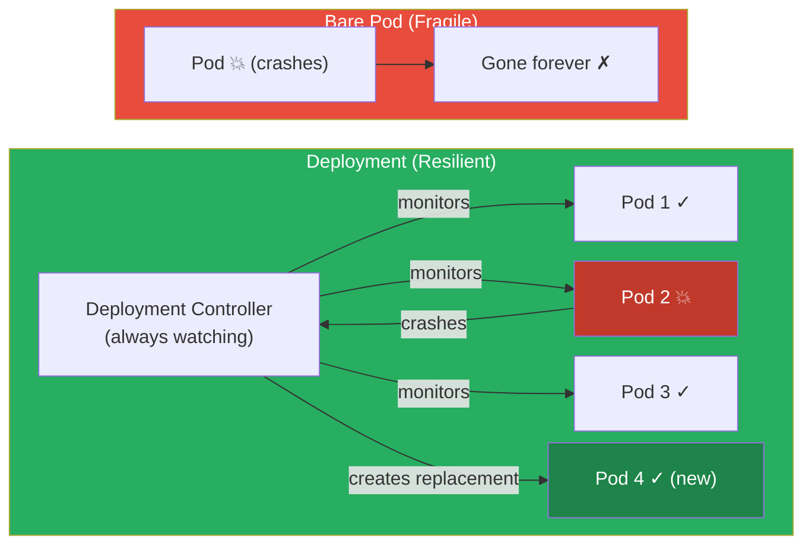
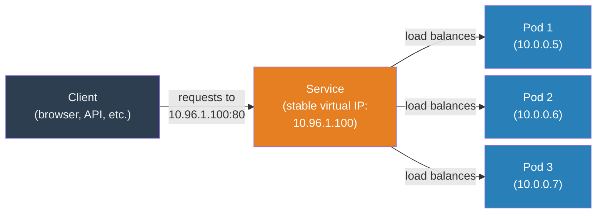
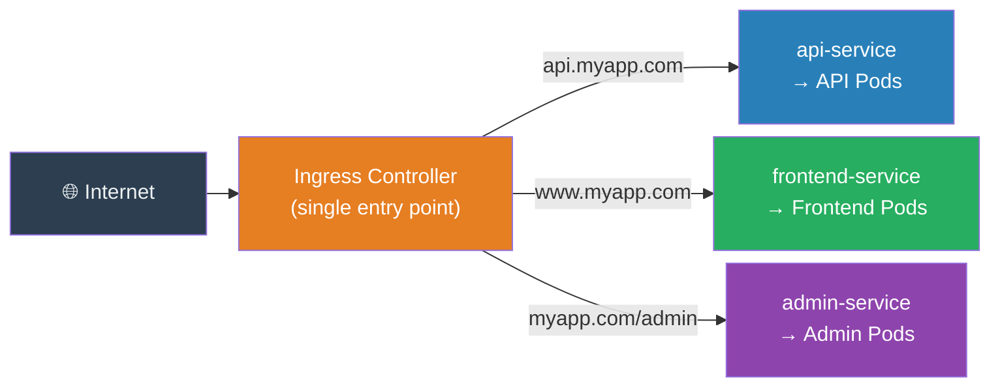
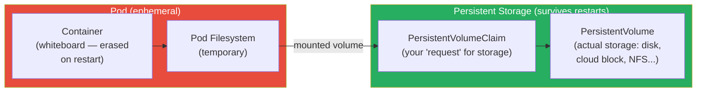
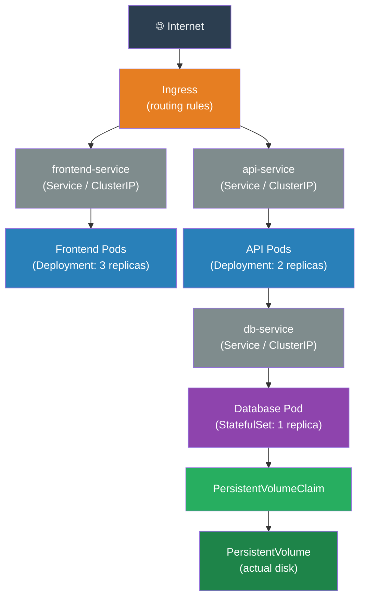

# Chapter 8: Deploying and Connecting — Real-World Kubernetes

In Chapter 6, we ran our first Pod. Bare Pods are a great way to learn, but in the real world, nobody runs bare Pods in production. This chapter introduces the four essential building blocks you'll use every day when deploying real applications:

1. **Deployments** — run your application reliably with automatic healing
2. **Services** — give your application a stable address
3. **Ingress** — route web traffic from the internet
4. **Storage** — persist data that survives container restarts

> **Start your cluster first!**
> ```bash
> $ minikube start
> ```

---

### 1. Deployments — Why Bare Pods Are Fragile

In Chapter 6, we ran a bare Pod directly. Let's see what happens if we kill it:

```bash
$ kubectl run fragile-pod --image=nginx
$ kubectl delete pod fragile-pod
```

It's gone. Permanently. Nothing restarted it.

This is the problem: **a bare Pod has no guardian.** If the machine it's on crashes, or if the container exits with an error, Kubernetes does not restart it. The Pod simply disappears.

A **Deployment** fixes this. A Deployment wraps your Pod in the reconciliation loop we studied in Chapter 7. You declare "I always want 3 copies of my application running," and the Deployment Controller — one of the controllers inside the Controller Manager — watches over it forever, replacing any replica that dies.



**Figure 8.1:** Bare Pod vs. Deployment. A bare Pod that crashes is gone. A Deployment's controller immediately notices the crash and creates a replacement, restoring the desired replica count.

#### Creating a Deployment

Create a file called `my-deployment.yaml`:

```yaml
apiVersion: apps/v1
kind: Deployment
metadata:
  name: my-web-app
spec:
  replicas: 3               # I always want 3 copies running
  selector:
    matchLabels:
      app: web              # This Deployment manages Pods with this label
  template:                 # The blueprint for each Pod
    metadata:
      labels:
        app: web            # Every Pod gets this label
    spec:
      containers:
      - name: nginx
        image: nginx:1.25   # Specific version — important for reproducibility
        ports:
        - containerPort: 80
        resources:
          requests:
            memory: "64Mi"  # Minimum memory needed (Mi = Mebibytes)
            cpu: "100m"     # Minimum CPU needed (m = millicores; 100m = 0.1 of a CPU core)
          limits:
            memory: "128Mi" # Maximum memory this container is allowed to use
            cpu: "200m"     # Maximum CPU
```

> **The `selector` and `labels` pattern:** The Deployment Controller needs to know *which Pods it is responsible for.* It uses labels for this — the `selector.matchLabels` tells it "manage all Pods with label `app: web`." This is a fundamental Kubernetes pattern: objects find each other through labels.

Apply it:
```bash
$ kubectl apply -f my-deployment.yaml
```
```
deployment.apps/my-web-app created
```

```bash
$ kubectl get pods
```
```
NAME                          READY   STATUS    RESTARTS   AGE
my-web-app-5f7b9c8d4-2xk9p    1/1     Running   0          12s
my-web-app-5f7b9c8d4-7hmnr    1/1     Running   0          12s
my-web-app-5f7b9c8d4-k4qt8    1/1     Running   0          12s
```

Three Pods, each with a unique auto-generated name. Now test the self-healing:

```bash
$ kubectl delete pod my-web-app-5f7b9c8d4-2xk9p   # Kill one
$ kubectl get pods                                  # Check immediately
```
```
NAME                          READY   STATUS              RESTARTS   AGE
my-web-app-5f7b9c8d4-7hmnr    1/1     Running             0          45s
my-web-app-5f7b9c8d4-k4qt8    1/1     Running             0          45s
my-web-app-5f7b9c8d4-p9wls    0/1     ContainerCreating   0          2s   ← new one!
```

A new Pod is already being created. The Deployment Controller noticed the count dropped to 2 and is restoring it to 3. **This is self-healing in action.**

#### Rolling Updates

A major advantage of Deployments is zero-downtime updates. Suppose you want to update your nginx to version 1.26:

```bash
$ kubectl set image deployment/my-web-app nginx=nginx:1.26
```

Watch the rollout happen:
```bash
$ kubectl rollout status deployment/my-web-app
```
```
Waiting for deployment "my-web-app" rollout to finish: 1 out of 3 new replicas have been updated...
Waiting for deployment "my-web-app" rollout to finish: 2 out of 3 new replicas have been updated...
Waiting for deployment "my-web-app" rollout to finish: 1 old replicas are pending termination...
deployment "my-web-app" successfully rolled out
```

Kubernetes replaces Pods one at a time — never taking all of them down simultaneously — so your users experience zero downtime. If something goes wrong, roll back instantly:

```bash
$ kubectl rollout undo deployment/my-web-app
```

---

### 2. Services — A Stable Address for Your Application

We have 3 Pods running, each with its own private IP address. But these IPs are temporary — every time a Pod is replaced, it gets a new IP. If another part of your application tries to connect to a specific Pod's IP, it will break the moment that Pod is replaced.

A **Service** solves this with a single, stable **virtual IP address** (called a ClusterIP) that never changes, no matter how many times the underlying Pods are replaced.

> **In Plain English:** Think of a food delivery service. You call one number — the service's number. The call center (the Service) decides which kitchen (which Pod) actually gets your order. If Kitchen B closes, the call center seamlessly routes your next order to Kitchen C. The phone number never changes.



**Figure 8.2:** A Service provides one stable address that load-balances across all backing Pods. When pods are replaced and get new IPs, the Service automatically updates its routing.

#### Service Types

Kubernetes has three main Service types — think of them as different levels of "how public" the address is:

| Type | Who can reach it | Use case |
|---|---|---|
| **ClusterIP** | Only other Pods inside the cluster | Internal microservice communication |
| **NodePort** | Anyone who can reach any node's IP | Development / testing |
| **LoadBalancer** | The public internet | Production, cloud deployments |

#### Creating a ClusterIP Service

Create `my-service.yaml`:

```yaml
apiVersion: v1
kind: Service
metadata:
  name: my-web-service
spec:
  selector:
    app: web            # Route traffic to Pods with this label (matches our Deployment)
  ports:
  - protocol: TCP
    port: 80            # The port the Service listens on
    targetPort: 80      # The port on the Pod to forward to
  type: ClusterIP       # Only reachable from inside the cluster
```

```bash
$ kubectl apply -f my-service.yaml
$ kubectl get service my-web-service
```
```
NAME             TYPE        CLUSTER-IP     EXTERNAL-IP   PORT(S)   AGE
my-web-service   ClusterIP   10.96.1.100    <none>        80/TCP    8s
```

The `10.96.1.100` IP is now the stable address for your application. Any Pod in the cluster can reach your web app at `http://my-web-service` (Kubernetes also provides DNS resolution — you can use the Service's name as a hostname).

#### NodePort for Local Testing

To reach your Service from your laptop during development:

```bash
$ kubectl expose deployment my-web-app --type=NodePort --port=80
$ minikube service my-web-app --url
```
```
http://127.0.0.1:55432
```

Open that URL in your browser — you'll see the nginx page. ✅

---

### 3. Ingress — Routing Web Traffic from the Internet

A LoadBalancer Service is great for a single application. But what if you have 10 microservices, each needing its own public URL? Having 10 separate LoadBalancers is expensive and complex.

**Ingress** solves this. It's a set of routing rules that sit in front of all your Services, acting as a single entry point for all web traffic. One Ingress can route:
- `api.myapp.com` → `api-service`
- `www.myapp.com` → `frontend-service`
- `myapp.com/admin` → `admin-service`

> **In Plain English:** If your cluster is a shopping mall, each Service is a store. An Ingress is the mall directory and reception desk — one entrance, and the receptionist directs you to the right store based on where you say you want to go.



**Figure 8.3:** Ingress as a single entry point. One Ingress Controller receives all external traffic and routes it to the correct Service based on hostname or URL path rules.

#### Enabling Ingress on Minikube

```bash
$ minikube addons enable ingress
```

#### An Ingress Manifest

```yaml
apiVersion: networking.k8s.io/v1
kind: Ingress
metadata:
  name: my-ingress
  annotations:
    nginx.ingress.kubernetes.io/rewrite-target: /
spec:
  rules:
  - host: www.myapp.local       # Route requests for this hostname...
    http:
      paths:
      - path: /                 # ...at this path...
        pathType: Prefix
        backend:
          service:
            name: my-web-service  # ...to this Service
            port:
              number: 80
```

This rule says: "Any HTTP request for `www.myapp.local` should be sent to the `my-web-service` Service on port 80."

---

### 4. Storage — Persisting Data Beyond Container Restarts

Containers are ephemeral — when a container restarts, everything inside its filesystem is wiped clean. For a stateless web server like nginx, this is fine. But for a database, this would be catastrophic — all your data would vanish every time the container restarted.

**Persistent Volumes (PVs)** and **Persistent Volume Claims (PVCs)** solve this by connecting containers to storage that lives *outside* the container and survives restarts.

> **In Plain English:** Think of a container's filesystem like a whiteboard — easy to write on, but erased when you leave the room. A Persistent Volume is like a filing cabinet in the hallway — it stays there whether you're in the room or not, and anyone with the right key can access it.



**Figure 8.4:** Container filesystem vs. Persistent Volume. The container's own filesystem is lost on restart. A PVC mounts external storage into the container — writes to that mount path survive restarts.

#### The Two-Step Process

**Step 1 — The cluster administrator creates a PersistentVolume** (the actual storage):

```yaml
apiVersion: v1
kind: PersistentVolume
metadata:
  name: my-pv
spec:
  capacity:
    storage: 1Gi             # 1 Gibibyte of storage
  accessModes:
  - ReadWriteOnce            # Only one Pod can write at a time
  hostPath:
    path: /data/my-app       # On Minikube, this is a directory on the node
```

**Step 2 — You (the developer) create a PersistentVolumeClaim** (a request for storage):

```yaml
apiVersion: v1
kind: PersistentVolumeClaim
metadata:
  name: my-pvc
spec:
  accessModes:
  - ReadWriteOnce
  resources:
    requests:
      storage: 500Mi         # I need 500 Mebibytes
```

Kubernetes automatically matches your Claim to with a suitable PersistentVolume.

**Step 3 — Use the PVC in a Pod:**

```yaml
apiVersion: v1
kind: Pod
metadata:
  name: my-db-pod
spec:
  containers:
  - name: my-db
    image: postgres:16
    env:
    - name: POSTGRES_PASSWORD
      value: "mysecretpassword"
    volumeMounts:
    - mountPath: /var/lib/postgresql/data   # Where in the container the storage appears
      name: db-storage
  volumes:
  - name: db-storage
    persistentVolumeClaim:
      claimName: my-pvc      # Reference the PVC we created above
```

Now, even if this Pod restarts, the data written to `/var/lib/postgresql/data` inside the container is safely stored in the PersistentVolume and will be there when the new Pod mounts it.

---

### Putting It All Together

Let's see the full picture of a production-ready application:



**Figure 8.5:** A complete production application on Kubernetes. Ingress routes external traffic to Services, which load-balance across Deployment-managed Pods. The database Pod uses a PersistentVolumeClaim to store data durably.

This pattern — Deployment + Service + Ingress + PVC — is the backbone of virtually every application running on Kubernetes in production today.

---

### Clean Up

```bash
$ kubectl delete deployment my-web-app
$ kubectl delete service my-web-service
```

Or if you created YAML files for everything:
```bash
$ kubectl delete -f my-deployment.yaml -f my-service.yaml
```

---

## References

*   [Deployments — Kubernetes Documentation](https://kubernetes.io/docs/concepts/workloads/controllers/deployment/)
*   [Services — Kubernetes Documentation](https://kubernetes.io/docs/concepts/services-networking/service/)
*   [Ingress — Kubernetes Documentation](https://kubernetes.io/docs/concepts/services-networking/ingress/)
*   [Persistent Volumes — Kubernetes Documentation](https://kubernetes.io/docs/concepts/storage/persistent-volumes/)
