# The Architecture of Kubernetes: A Historical Journey into Cloud-Native Systems

- Authors: Alnour Alharin, Nevena Golubovic

## Acknowledgments
- To Tony Choe, who taught me how to utilize OKE to build massive architectures.
- To the Oracle Fusion Observability group, and especially the operations team led by Rob Mize, who gave me important practical lessons that helped me understand Kubernetes.

---


## A Note on AI Collaboration

This book was written in partnership with artificial intelligence as a **cognitive thinking partner**.

The ideas, architecture, and direction in these pages originate from our years of hands-on experience with real Kubernetes clusters and the challenges of production infrastructure. We brought the architectural vision; the AI helped us crystallize it. We engaged in an active, continuous dialogue with Claude, ChatGPT, and Gemini to explore historical connections, stress-test our arguments, and refine our explanations for readers of all backgrounds.

Working with these models felt akin to collaborating with a brilliant research assistant and a sharp editor. They brought our thinking into focus, helping us weave complex technical history into an accessible narrative. We believe this kind of seamless human-AI collaboration represents one of the most important architectural patterns of our time, making it uniquely fitting to practice while writing a book about systems architecture.

---

## Introduction: What is Kubernetes and Why Does It Exist?

Have you ever wondered how giant websites like Google, Netflix, or Amazon run millions of applications at the same time without breaking a sweat? The secret, in many cases, is a powerful tool called **Kubernetes**.

If you think of a data center full of computers (we call them **servers**) as a giant orchestra, Kubernetes is the conductor. It doesn't play an instrument itself, but it makes sure every musician (every application) knows when to play, how loudly, and what to do if they mess up. It makes the whole system work in harmony.

But Kubernetes didn't just appear out of nowhere. It is the result of nearly 50 years of remarkable ideas in computer science. This book traces that architectural and historical journey — from the foundational principles of the 1960s through the virtualization revolution of the 2000s, all the way to the extensible platform that Kubernetes has become today.

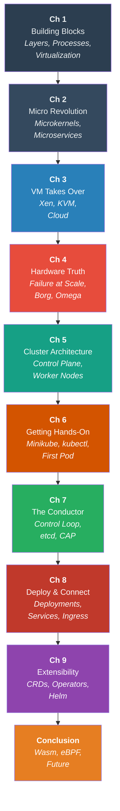

**Figure S.1:** Book roadmap. Each chapter builds on the previous, tracing 50 years of computing ideas — from foundational OS concepts through the cloud revolution to Kubernetes and its extensible future. This book is an *architectural and historical* exploration of cloud-native systems.

---

# Chapter 1: The Building Blocks of a Modern System

To truly understand Kubernetes, we can't just start with the technology of today. We need to travel back to the 1960s and 70s, a time when the foundational ideas that make Kubernetes possible were first born. These aren't just dusty old concepts; they are the bedrock upon which all modern computing is built. Let's explore the three most important ones: the discipline of layers, the invention of the process, and the rules of virtualization.

---

### 1. The Idea of Layers: Building Reliable Software Like a Cake

To understand what motivated Dijkstra, you need to picture what computing looked like in the late 1950s and early 1960s. Computers were the size of rooms — literally. The IBM 704 occupied an entire air-conditioned floor and cost millions of dollars. Only governments, militaries, and the largest corporations could afford them.

Programming these machines was a raw, almost physical act. You didn't type code — you punched holes in cards. A program was a deck of paper cards, each representing one instruction. Drop the deck, and you might spend hours re-sorting thousands of cards to restore your program. Make a mistake, and you sat in line — sometimes overnight — waiting for your batch to be fed through the machine, only to get back a printout showing you had a typo on line 47.

And yet, armies of programmers were writing increasingly ambitious software on these machines. The most complex project of the era was **SAGE** (Semi-Automatic Ground Environment), the U.S. Air Force's system for tracking Soviet bombers. By the time it was finished, SAGE contained over **500,000 lines of code** — an almost incomprehensible number for the time — and required 700 programmers, making it the largest software project in history up to that point.

The code was a mess. Programmers routinely used a technique called **`GOTO`** — a command that could jump execution to any arbitrary line in the program. Need to handle an error? `GOTO` line 1,847. Need a loop? `GOTO` line 302. Over time, a program's logic became impossible to follow. This was what critics called **"spaghetti code"**: pull one strand and the whole plate moves. A small bug could send you on a wild goose chase through thousands of lines of unrelated code, because *everything was connected to everything else*, and no one could draw a map of it.

The crisis came to a head in 1968. NATO — the Western military alliance — was so alarmed by the state of the software industry that it organized an emergency conference in Garmisch, Germany, specifically to address what they named the **"Software Crisis."** Fifty of the world's top computer scientists gathered and reached a stark conclusion: the way software was being built was fundamentally broken. Projects routinely ran over budget, over schedule, and delivered products riddled with errors. The conference produced a report calling for software engineering to become a true *engineering discipline* — something with structure, rigor, and mathematical foundations — not the improvised craft it had become.

One of the people who had been sounding this alarm longest and loudest was **Edsger W. Dijkstra**, a Dutch mathematician and computer scientist with a precise, almost surgical mind. He believed that if you couldn't *prove* a program was correct through pure logical reasoning, you didn't truly understand it. He found the `GOTO` style of programming philosophically unacceptable: how can you reason about a program whose execution can teleport to any line at any moment?

That same year, Dijkstra published a short, devastating letter in the *Communications of the ACM* titled **"Go To Statement Considered Harmful."** It was one of the most influential — and controversial — documents in computing history: a polite but completely uncompromising argument that `GOTO` was the root of all software's structural problems and should be abolished. The programming community erupted in debate. Some agreed. Many were furious. His response? He kept building.

Working on a system called the **"THE Multiprogramming System"** (named after his university, *Technische Hogeschool Eindhoven*), Dijkstra and his team built the alternative: **layered architecture**.

In 1968, **Edsger W. Dijkstra** introduced the solution: **layered architecture**.

His idea was simple but profound: structure the operating system like a layer cake. Each layer has a specific job, and it can only communicate with the layer directly beneath it.

Working on a system called the "THE Multiprogramming System," Dijkstra and his team defined a strict hierarchy:

*   **Layer 0: Processor Allocation:** The most fundamental layer. Its job was to decide which program got to use the computer's brain (the CPU) and for how long.
*   **Layer 1: Memory Management:** This layer was responsible for allocating memory to programs.
*   **Layer 2: Console I/O:** Handled communication between the running programs and the system operator.
*   **Layer 3: I/O Buffering:** Managed the flow of information to devices like printers and tape drives.
*   **Layer 4: User Programs:** Where the actual applications that users ran would live.
*   **Layer 5: The Operator:** The user.

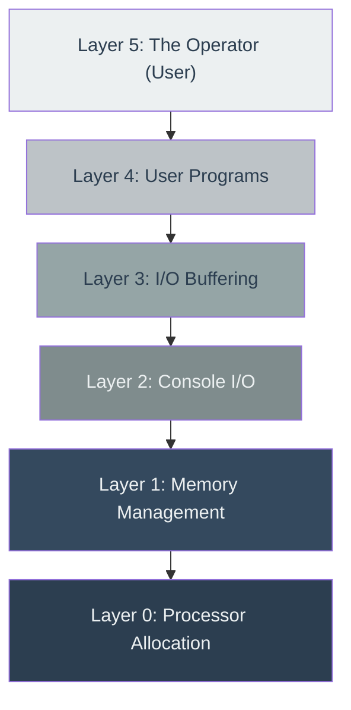

**Figure 1.1:** Dijkstra's THE Multiprogramming System layer stack. Each layer depends only on the layer directly below it — the arrow represents unidirectional dependency.

The golden rule was **unidirectional dependency**. Layer 4 could ask for services from Layer 3, but it had no idea that Layer 2, 1, or 0 even existed. This structure brought enormous benefits:

*   **Testability:** You could test Layer 0 until you were 100% sure it was perfect. Then, while testing Layer 1, you could completely trust that Layer 0 was working correctly. This made it possible to prove, step-by-step, that the entire system was correct.
*   **Modularity:** Each layer could be worked on and understood independently, without needing to understand the entire system's complexity.

#### **How Kubernetes Uses Layers**

This 50-year-old idea is at the very heart of Kubernetes's flexibility. Kubernetes uses a set of interfaces (contracts) that function as layers, separating the *what* from the *how*.

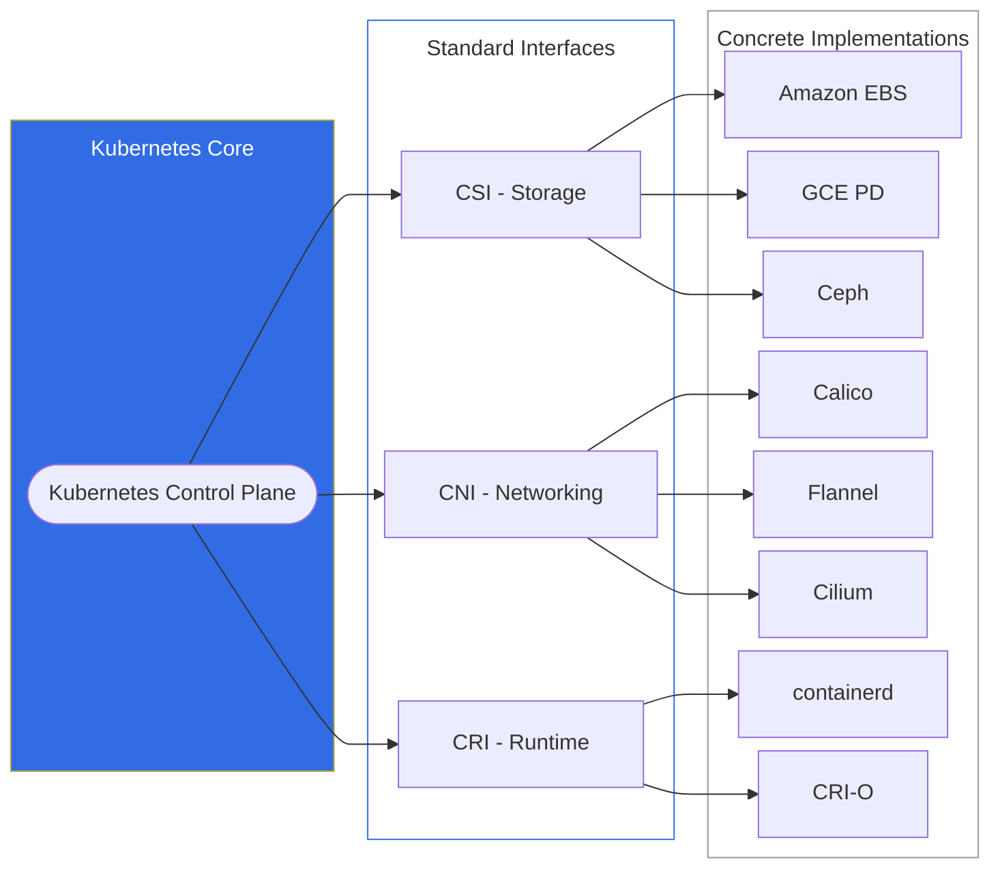

**Figure 1.2:** Kubernetes interface layers. The control plane communicates through standard interfaces (CSI, CNI, CRI), which decouple it from concrete implementations — separating the *what* from the *how*.

*   **Container Storage Interface (CSI):** When an application in Kubernetes needs to store data, it just asks for "a piece of storage." It doesn't know or care if that storage is a super-fast SSD on the server, a network drive, or a cloud volume from Amazon or Google. The CSI layer handles the details.
*   **Container Network Interface (CNI):** Every workload (Pod) in Kubernetes needs an IP address to communicate. Kubernetes doesn't handle this directly. It passes the job to the CNI layer. This allows different networking solutions (like Calico, Flannel, or Cilium) to plug into Kubernetes seamlessly.
*   **Container Runtime Interface (CRI):** Kubernetes is often called a "container orchestrator," but it doesn't actually run containers itself. It tells the CRI layer, "Please start a container with this image." The CRI layer then uses a **container runtime** (like `containerd` or `CRI-O`) to do the actual work.

Because of this layered design, Kubernetes is incredibly adaptable. You can swap out the storage, networking, or runtime components without changing Kubernetes itself.

---

### 2. The Idea of the Process: Giving Programs Their Own Worlds

In 1974, the **Unix** operating system introduced concepts that were so powerful, we still use them every day. The most important was the **process**—a program in motion, given its own private space to run, isolated from other processes.

This idea of isolation has evolved over the years. An early, primitive form of containerization was a Unix command called `chroot`, which stands for "change root." It allowed a user to lock a process inside a specific directory, creating a "jail." The process inside the jail couldn't see or access any files outside of its designated folder. It was a good start, but it wasn't truly secure.

Modern Linux containers take this idea to a whole new level using two powerful technologies:

1.  **Namespaces:** This is the magic that creates a container's "private world." A namespace wraps a process in a layer of isolation, making it believe it has the entire machine to itself. There are several types:
    *   **PID Namespace:** The process inside the container sees itself as Process ID #1, the most important process on any Linux system. It's completely unaware that on the actual machine, its real ID might be #34,502.
    *   **Mount Namespace:** The container gets its own private file system. It can't see the host machine's files.
    *   **Network Namespace:** The container gets its own virtual network card and IP address, separate from the host.

2.  **Control Groups (cgroups):** This is the resource management side of containers. While namespaces give a container its own world, `cgroups` ensures it doesn't get too greedy. It's like putting a process on a budget. You can tell a container, "You are only allowed to use 1 CPU core and 2GB of RAM." This prevents a single buggy or malicious container from crashing the entire server by consuming all its resources.

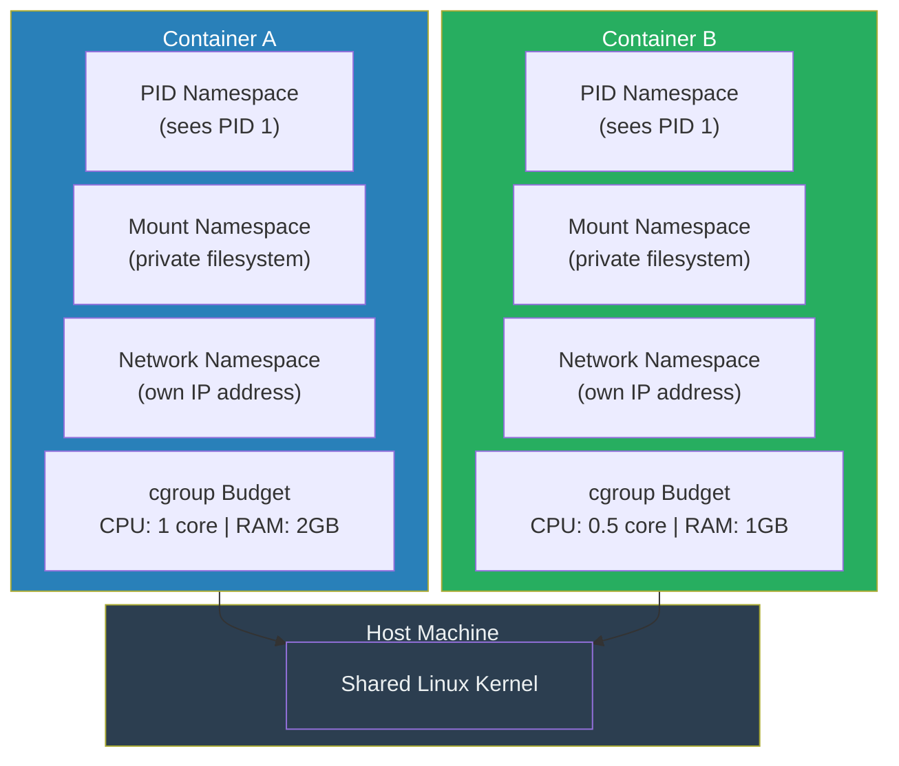

**Figure 1.3:** Container anatomy. Each container gets isolated namespaces (PID, Mount, Network) and a cgroup resource budget, while sharing the host's Linux kernel.

So, a **container** is essentially a standard Linux process that has been given its own private, virtualized world using **namespaces**, and put on a resource budget using **cgroups**.

This is why Kubernetes can start containers in milliseconds—because it's not booting a whole new operating system; it's just creating a new, isolated process.

---

### 3. The Idea of Virtualization: Defining the "Pretend Computer"

In the same year that Unix was formally introduced, two computer scientists, **Gerald Popek and Robert Goldberg**, published a paper that created the official definition of a **Virtual Machine (VM)**. A VM is a complete, simulated computer running as software on a physical host machine.

They laid out three strict rules that a true VM must follow:

1.  **Equivalence (It behaves identically):** A program running inside a VM should produce the exact same results as if it were running on real hardware. The program shouldn't be able to tell that it's in a simulation.
2.  **Efficiency (It runs fast):** The vast majority of the program's instructions must run directly on the host CPU. If the VM had to slowly translate every single instruction, it would be a "simulator," not a hypervisor, and would be too slow for practical use.
3.  **Resource Control (It's safely sandboxed):** The VM must be completely trapped in its sandbox. It must have no way to access any memory or resources that it wasn't explicitly given by the host.

#### **Containers vs. Virtual Machines**

When you look at these rules, you realize that standard Linux containers are *not* true virtual machines. They break the first rule, **Equivalence**.

A container shares the kernel (the core "brain") of its host operating system. This means you can't run a Windows container on a Linux machine, because the Windows application would try to make requests that the Linux kernel doesn't understand. The container's environment is not equivalent to bare-metal hardware.

However, by breaking this rule, containers gain a massive advantage: **Efficiency**. Because there is no simulation or translation layer, a program running in a container runs at almost the exact same speed as a program running on the host machine directly.

For years, this has been the fundamental trade-off:
*   **VMs:** Slower and heavier, but offer very strong security and isolation.
*   **Containers:** Blazingly fast and lightweight, but have weaker isolation because they share the host kernel.

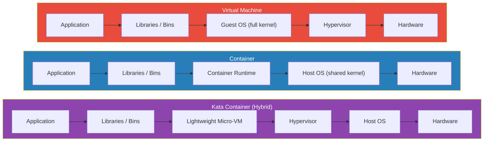

**Figure 1.4:** Side-by-side comparison of VMs, Containers, and Kata Containers. VMs include a full guest OS and hypervisor; containers share the host kernel for speed; Kata Containers combine both — wrapping containers in a lightweight micro-VM for strong isolation with near-container performance.

Excitingly, this distinction is now blurring. Modern technologies like **Kata Containers** are combining the best of both worlds. They wrap a standard container inside a highly optimized, lightweight VM. This provides the strong, hardware-enforced security of a VM while keeping much of the speed and flexibility of a container. And Kubernetes, true to its layered design, is evolving to manage both traditional containers and these new "sandboxed containers" seamlessly.

---
## References

*   Dijkstra, E. W. (1968). The Structure of the 'THE'-Multiprogramming System. *Communications of the ACM, 11(5)*, 341-346.
*   Popek, G. J., & Goldberg, R. P. (1974). Formal Requirements for Virtualizable Third Generation Architectures. *Communications of the ACM, 17(7)*, 412-421.
*   [Introduction to Container Technology and Its Basic Principles](https://www.alibabacloud.com/blog/601759)

---

# Chapter 2: The "Micro" Revolution

The ideas of layers and processes from the 60s and 70s gave us a solid foundation for computing. But by the 1980s and 90s, systems built on these ideas were starting to get... bloated. Operating systems were becoming huge, complex beasts. This led to a counter-movement, a new philosophy of "less is more" that would directly pave the way for the microservice architecture that Kubernetes manages today.

---

### 1. The Problem with Monoliths

The dominant design for operating systems like Unix was **monolithic**. This means that almost all of the system's important code was bundled together into one large, privileged program called the **kernel**. The kernel handled everything: scheduling programs, managing memory, accessing files, networking, and controlling hardware devices.

While powerful, this design had two major drawbacks that became more painful as systems grew more complex:

1.  **Poor Reliability:** Because everything ran together in the same privileged space (often called "kernel space"), a bug in one small, non-essential component could bring down the entire system. Imagine your computer getting the "Blue Screen of Death" simply because your printer driver had a bug. The faulty driver could write over critical memory belonging to the core operating system, causing a total system crash, or "kernel panic."

2.  **Low Flexibility:** In a monolithic system, all the components are tightly interwoven. You couldn't easily swap out one piece for another. If you wanted to upgrade the networking system or fix a bug in the file system, you often had to recompile the entire kernel and reboot the machine. This made development slow and updates risky.

---

### 2. The Microkernel Philosophy: Less is More

In the mid-1990s, a German computer scientist named **Jochen Liedtke** championed a radical solution to the monolith problem: the **microkernel**.

He argued that the kernel had become a dumping ground for code that didn't need to be so privileged or powerful. His solution was based on the **"minimality principle"**: a concept is only allowed inside the microkernel if it's *absolutely impossible* for the system to function without it being there.

Under this philosophy, a microkernel does only three essential things:
1.  Manages **address spaces** (gives each program its own private memory).
2.  Manages **inter-process communication (IPC)** (allows programs to talk to each other).
3.  Manages **unique identifiers** (gives every program a name).

Everything else—device drivers, file systems, network stacks, user interfaces—is pushed out of the kernel and runs as a normal, unprivileged program in "user space." These programs are often called "servers."

This design brilliantly solved the problems of the monolith:

*   **Reliability:** In a microkernel system, that buggy printer driver is just another user-space program. If it crashes, it doesn't affect the core kernel. The system can simply restart the driver process, and the rest of the operating system (your network, your other applications) continues to run smoothly.
*   **Flexibility:** Since system services are just regular programs, you can stop, start, update, or replace them on the fly without ever rebooting the machine. You could, for example, switch from one networking stack to another by simply stopping one process and starting another.

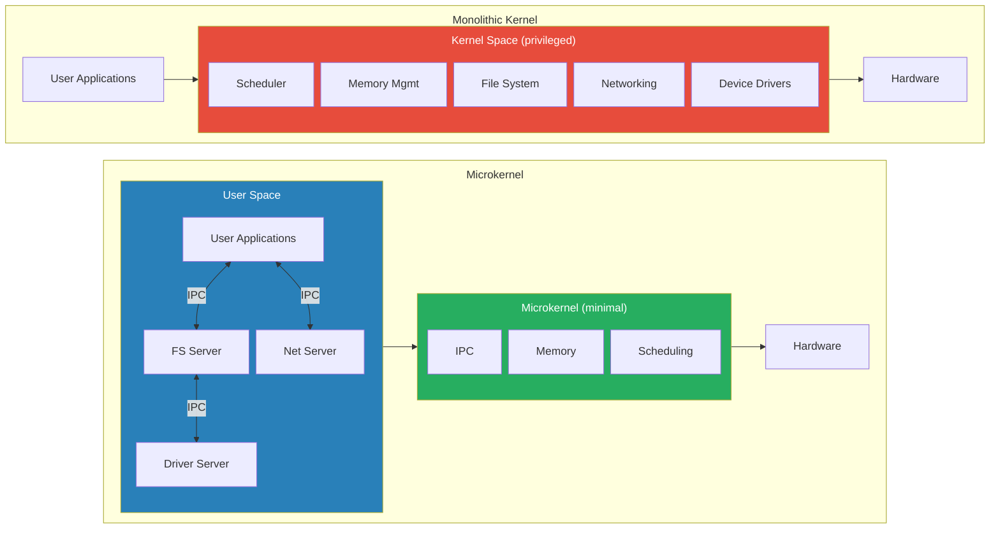

**Figure 2.1:** Monolithic kernel vs. microkernel. In the monolith, all services share privileged kernel space — one crash can bring everything down. In the microkernel, only minimal functions remain in kernel space; everything else runs as isolated user-space servers communicating via IPC.

Of course, the microkernel approach had its critics. The main argument against it was **performance**. In a monolith, when the application needs to write a file, it makes a single, fast "system call" to the kernel. In a microkernel, the application has to send a message (an IPC call) to the file system server, which might then send a message to the disk driver server. Critics argued this message-passing would be too slow. Liedtke's great achievement with his **L4 microkernel** was to prove them wrong. He engineered the IPC mechanism to be so incredibly fast that the performance penalty was almost negligible, proving that modularity and reliability didn't have to come at the cost of speed.

---

### 3. From Microkernels to Microservices: A Familiar Story

This entire debate from the 1990s about how to build an operating system is a perfect mirror of the modern debate about how to build a large application. The arguments for breaking up a monolithic OS are the *exact same* arguments for breaking up a monolithic application into **microservices**.

Consider a typical e-commerce website built as a **monolith**. The code for the product catalog, the user shopping cart, the billing system, and the customer reviews are all bundled into one giant application.

What happens when the billing module has a memory leak? It starts consuming more and more of the server's RAM until it uses it all up, crashing the entire application. Your customers can't even browse the product catalog anymore because a bug in the billing code took the whole site down.

The **microservices** approach solves this by applying the microkernel philosophy to application architecture. You break the application into small, independent services:
*   An `inventory-service`
*   A `billing-service`
*   A `reviews-service`
*   A `user-interface-service`

Each service runs in its own process, completely isolated from the others. They communicate with each other over the network. Now, if the `billing-service` crashes, the other services remain online.

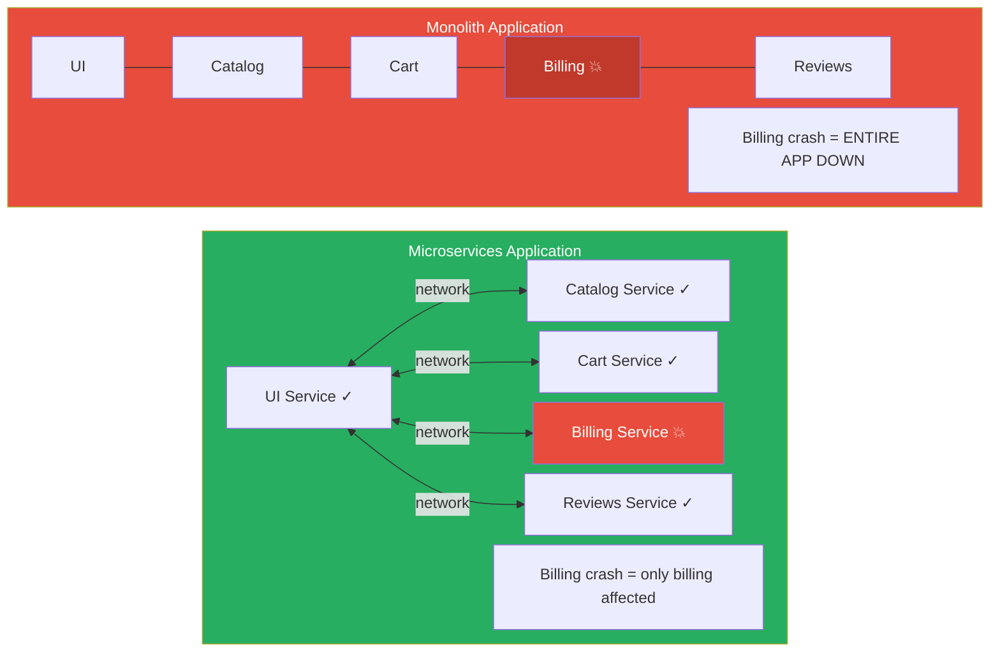

**Figure 2.2:** Monolith vs. microservices. In the monolith, a billing crash kills the entire application. In microservices, only the billing service is affected — all other services remain online. Customers can still browse products and read reviews; they just might not be able to complete a purchase until the service restarts.

---

### 4. Kubernetes: The Distributed Microkernel for the Cloud

This brings us to the key insight: **Kubernetes is the logical conclusion of the microkernel philosophy, applied across an entire data center.** It functions as a distributed operating system kernel for the cloud.

*   **The Kubernetes Control Plane is the "Kernel Space":** The core components of Kubernetes—the API Server, Scheduler, and Controller Manager—act as the distributed microkernel. They handle the minimal, essential tasks. They don't run your application's code. They simply manage the lifecycle of your application: scheduling it onto machines, keeping it running, and helping its pieces communicate.

*   **Your Application Pods are the "User Space":** Your actual applications—your web servers, databases, and microservices—run as isolated "user-space processes" called **Pods**. A Pod is completely oblivious to the hardware it's running on. It just knows that it has been given a certain amount of CPU and memory and an IP address, and it communicates with other Pods through the network channels that the Kubernetes "kernel" provides.

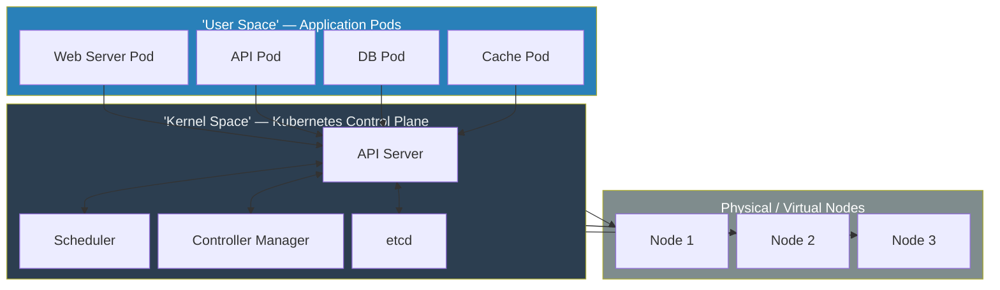

**Figure 2.3:** Kubernetes as a distributed microkernel. Application Pods run in "user space," the control plane acts as the minimal "kernel space" (scheduling, state, communication), and physical nodes provide the underlying hardware.

Jochen Liedtke's vision of a robust, flexible, and resilient system built from small, communicating, and independently restartable components has been fully realized, not on a single computer chip, but at the massive scale of the cloud. The "servers" of the microkernel era are the "microservices" of today, and Kubernetes is the minimal, powerful kernel that binds them all together.

---
## References

*   Liedtke, J. (1995). On µ-Kernel Construction. *ACM SIGOPS Operating Systems Review, 29(5)*, 237-250.
*   [The Microservices Resource Guide](https://martinfowler.com/microservices/) by Martin Fowler.

---

# Chapter 3: The Virtual Machine Takes Over

The microkernel debate of the 1990s gave us the philosophical blueprint for microservices, but another, more practical revolution was needed before Kubernetes could exist. In the early 2000s, data centers had a big problem: their servers were powerful, but they were mostly asleep. This chapter is about the breakthrough that woke them up and, in doing so, paved the way for the cloud.

---

### 1. The Problem of the Empty Server

Imagine owning a 50-passenger bus but only ever using it to drive yourself to work. This was the situation in most data centers in the early 2000s. Companies would buy a powerful server to run a single application, like a database or a web server. Even at peak times, the application might only use 10-15% of the server's CPU power. The rest of that expensive hardware sat idle, wasting electricity and taking up space.

| Resource | Utilization |
|---|---|
| Used Capacity | ~12% |
| Idle / Wasted | ~88% |

**Figure 3.1:** The server utilization problem. Most data center servers in the early 2000s used only 10–15% of their capacity, leaving the vast majority of expensive hardware idle.

Why? Because you couldn't safely run multiple applications on the same server. Their libraries might conflict, or one application might have a memory leak and crash the entire machine, taking the other applications down with it.

The obvious solution was **virtualization**—slicing up one physical server into multiple, isolated "virtual" servers. The problem was that the world's most popular server hardware, the x86 architecture from Intel and AMD, was notoriously difficult to virtualize. It simply wasn't designed with the strict rules of Popek and Goldberg (from Chapter 1) in mind. A new approach was needed.

---

### 2. Xen and the Art of Cooperation (Paravirtualization)

The first major breakthrough came from a team of researchers at Cambridge University in their 2003 paper, "Xen and the Art of Virtualization."

Before Xen, the main approach was **Full Virtualization**. This involved trying to trick a guest operating system (like Windows or Linux) into thinking it was running on real hardware. The hypervisor (the virtualization software) had to intercept every privileged command the guest OS issued and translate it. On x86 hardware, this was incredibly complex and, most importantly, very slow.

The Xen team had a brilliantly pragmatic idea: **instead of tricking the OS, let's modify it to make it cooperate.**

This approach was named **Paravirtualization**. The guest OS kernel was changed slightly to make it "virtualization-aware." It *knew* it was a guest running inside a virtual machine. Instead of issuing hardware commands that would be slow and difficult for the hypervisor to handle, the modified OS would make a direct, efficient function call to the Xen hypervisor, saying, "Hey, I need you to do this privileged task for me." These calls were named **hypercalls**, analogous to the "system calls" a regular program makes to its operating system.

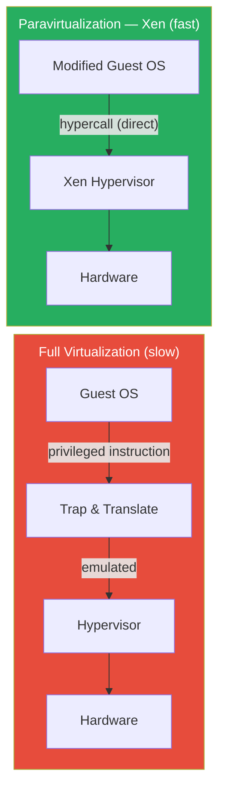

**Figure 3.2:** Full virtualization vs. paravirtualization. Full virtualization must trap and translate every privileged instruction (slow). Xen's paravirtualization uses direct hypercalls from a modified guest OS, achieving near-native speed.

The impact was enormous. Paravirtualization made it possible to run multiple operating systems on a single, standard x86 server with very little performance overhead. This wasn't just an academic exercise; it was the technology that enabled the birth of the public cloud. Amazon Web Services built its groundbreaking **Elastic Compute Cloud (EC2)** service on top of Xen. For the first time, developers could "rent" a virtual server by the hour via a simple API call. Computing power was becoming a utility, like electricity from a socket.

---

### 3. KVM and the Genius of Integration (Hardware Virtualization)

While Xen was changing the world with its clever software tricks, hardware manufacturers were catching up. Intel and AMD finally released new processors with hardware extensions for virtualization (named **Intel VT-x** and **AMD-V**). These new chips fixed the architectural flaws that made virtualization so hard, building the necessary functions directly into the silicon.

This hardware support opened the door for the next great leap, introduced in 2007 by Avi Kivity in his paper, "kvm: the Linux Virtual Machine Monitor."

Kivity's insight was beautiful in its simplicity: **Why build a hypervisor as a separate, complex piece of software when Linux is already a mature, stable, and incredibly feature-rich operating system?**

Instead of building a hypervisor that ran *underneath* the OS, KVM is a module that plugs *into* the Linux kernel, turning the kernel itself into a hypervisor. With KVM, a full virtual machine—running its own complete copy of Windows or another Linux OS—is treated by the host system as just another Linux **process**.

This meant the Linux kernel could use its already world-class scheduler to assign CPU time to VMs. It could use its existing memory management to allocate RAM. You could use standard Linux tools to monitor and manage VMs. For I/O and device emulation, KVM was paired with a user-space program called **QEMU**, but the core CPU and memory virtualization was now handled directly by the kernel at lightning speed, thanks to the new hardware assists.

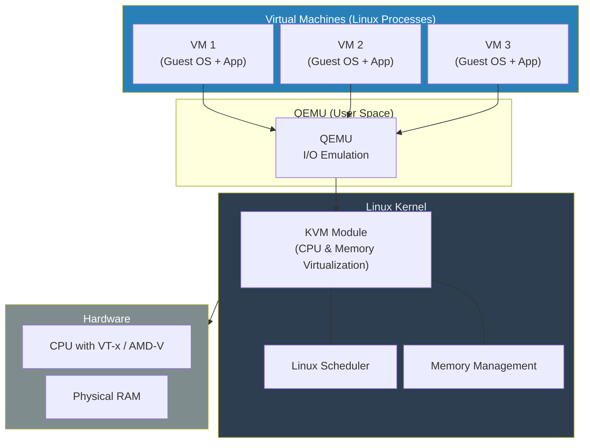

**Figure 3.3:** KVM architecture. VMs run as standard Linux processes. QEMU handles I/O emulation in user space, while the KVM module plugs into the Linux kernel for CPU and memory virtualization, leveraging hardware assists (VT-x/AMD-V).

The significance of KVM cannot be overstated. Suddenly, every server running Linux was also a high-performance hypervisor, right out of the box. Virtualization was no longer a specialized, expensive product; it was a standard, free feature of the world's most popular data center operating system.

---

### 4. Why This Matters for Kubernetes

The hypervisor revolution, led by Xen and KVM, set the stage for Kubernetes.

First, it created the **economic and technical prerequisite**. Kubernetes is a system that manages application lifecycles by requesting and releasing computing resources on demand. The cloud, built on top of this new virtualization technology, provided the perfect environment where "compute" was a generic commodity that could be provisioned through an API.

Second, the deep integration of KVM into Linux created a seamless path forward. Since Kubernetes is designed to run on Linux, it has native access to the powerful hypervisor living inside its own host operating system. This tight bond allows for the creation of amazing new technologies like:

*   **KubeVirt:** A project that allows you to run full, traditional Virtual Machines right alongside your containers, and manage them all using the same Kubernetes commands and tools.
*   **Kata Containers:** A technology that provides stronger isolation for your containers by running them inside their own lightweight, hardware-virtualized micro-VM.

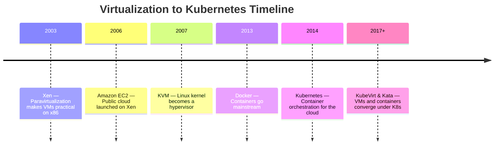

**Figure 3.4:** Key milestones from virtualization to Kubernetes. Each breakthrough built on the previous, culminating in a unified platform that manages both containers and VMs.

This means that with Kubernetes, you are no longer forced to choose between running old, legacy applications on VMs or new, cloud-native applications in containers. You can run them side-by-side on the same platform, managed by the same powerful, unified control plane.

---
## References

*   Barham, P., et al. (2003). Xen and the Art of Virtualization. *Proceedings of the nineteenth ACM symposium on Operating systems principles*, 164-177.
*   Kivity, A., et al. (2007). kvm: the Linux Virtual Machine Monitor. *Proceedings of the Linux Symposium*, 225-230.

---

# Chapter 4: The Hard Truth About Hardware

The 2000s were a time of incredible growth for internet companies, especially Google. But as they built data centers at a scale no one had ever seen before, they collided with a brutal reality—a reality that would fundamentally change how we think about software and directly lead to the creation of Kubernetes. The old rules of building reliable systems were about to be broken.

---

### 1. "Failure is Not an Anomaly; It is the Nominal State"

In 2008, Google engineer Jeff Dean gave a presentation that pulled back the curtain on the inner workings of Google's infrastructure. The numbers he shared were staggering and sent a shockwave through the industry. He revealed that for a typical cluster of around 1,800 servers, the failure rates in their first year of operation were not just common; they were constant:

*   **Individual Machine Failures:** Around **1,000** machines would crash, hang, or lose network connectivity. That's several machines failing *every single day*.
*   **Hard Drive Failures:** **Thousands** of disk failures were a certainty.
*   **Rack Failures:** About **20 times a year**, an entire rack of 40-80 machines would vanish from the network instantly due to a failure in its top-level switch or power supply.
*   **Power Distribution Failures:** At least **once a year**, a major power distribution unit would fail, taking **500 to 1,000 machines** offline simultaneously.

| Failure Type | Annual Count (per ~1,800 servers) |
|---|---|
| Machine Failures | ~1,000 |
| Disk Failures | ~4,000 |
| Rack-level Failures | ~20 |
| Power Distribution Failures | ~1 (affecting 500–1,000 machines) |

**Figure 4.1:** Jeff Dean's failure statistics for a typical Google cluster. Hardware failure is not an exception — it is the constant, nominal state at scale. (Note: a single power failure can affect 500–1,000 machines simultaneously.)

This data shattered the traditional industry approach to reliability. For decades, the goal was to achieve "High Availability" by buying expensive, 'gold-plated', and supposedly ultra-reliable hardware. The thinking was: if you spend enough money on the hardware, it won't fail.

Google's data proved this was a losing battle at scale. Even with 99.9% reliable hardware, when you have hundreds of thousands of components, the sheer number of them means something is *always* broken.

This led to a profound philosophical shift: **stop trying to prevent hardware failure and instead build intelligent software that expects, tolerates, and automatically recovers from it.**

This is the origin of the famous **"pets vs. cattle"** analogy:
*   **Pets:** Are servers you give unique names, like `web-01` or `db-master`. You carefully tend to them, patch them, and when they get "sick" (e.g., a failing component), you spend time and effort nursing them back to health. If a pet dies, it's a crisis.
*   **Cattle:** Are anonymous, numbered servers in a herd. When one gets sick, you don't try to fix it. You simply remove it from the herd and replace it with a new, healthy one. The loss of one is statistically irrelevant to the health of the herd.

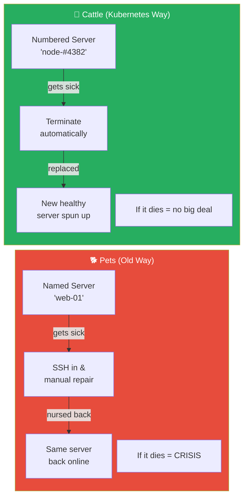

**Figure 4.2:** Pets vs. cattle. The "pets" model treats servers as unique, irreplaceable assets requiring manual care. The "cattle" model treats servers as interchangeable — sick ones are terminated and automatically replaced.

Kubernetes was designed from the ground up to be a system for managing cattle, not pets. This is the single most important "why" behind its existence.

---

### 2. Learning to Herd the Cattle: Borg and Omega

To manage this new philosophy at a massive scale, Google had to invent a new kind of software—the "cluster orchestrator." Their journey involved two major internal systems that were the direct predecessors to Kubernetes.

#### **Borg: The All-Powerful Monolith**

Borg was Google's first-generation cluster manager. It was a single, unified system that managed both long-running services (like Gmail and Search) and short-lived batch jobs. Its primary goal was efficiency—by packing applications from different teams onto the same servers, it could achieve incredibly high hardware utilization.

However, Borg was designed as a **monolith**. It had a single, all-powerful master process called the "BorgMaster." This one program held the state of the entire cluster in its memory and made every single scheduling decision. This architecture had significant drawbacks:
*   **It was a bottleneck:** As Google's clusters grew to tens of thousands of machines, the BorgMaster struggled to keep up.
*   **It was a single point of failure:** A bug in the BorgMaster's complex scheduling logic could crash the entire control plane for the cluster.
*   **It was difficult to change:** Because it was so critical and complex, developers were hesitant to add new features, slowing down the pace of innovation.

#### **Omega: A Smarter, Shared-State Architecture**

Omega was designed as the successor to Borg, aiming to fix its core architectural flaws. Its key innovation was the concept of **Shared State**.

Instead of keeping all the cluster's state inside the master's brain, Omega moved it to an independent, highly reliable distributed database (a transaction log based on the Paxos algorithm). This central log held the "truth" about the state of every machine and every job in the cluster.

This unlocked a powerful new capability: **multiple, parallel schedulers**. Different teams could now run their own specialized schedulers that all worked from the same shared state.
*   The web search team could run a scheduler optimized for low-latency services.
*   The MapReduce team could run a scheduler optimized for high-throughput batch jobs.

They all operated in parallel using a principle called **optimistic concurrency**. If two schedulers happened to try to claim the same machine at the same time, they would both submit their desired change to the shared state store. The store would accept the first one and reject the second. The "losing" scheduler would simply see the updated state, realize the machine was no longer available, and try again elsewhere. This made the system vastly more scalable and flexible than Borg.

#### **The Kubernetes Synthesis: The Best of All Worlds**

Kubernetes was created by Google engineers who had worked on both Borg and Omega. It represents the culmination of over a decade of lessons learned from running containerized workloads at an unimaginable scale.

*   From Omega, Kubernetes inherited the crucial **Shared State** model. In Kubernetes, this role is filled by `etcd`, a consistent, distributed key-value store that holds the "truth" for the cluster.
*   However, Kubernetes also learned from Omega's weaknesses. In Omega, trusted components could write directly to the state store. Kubernetes introduced a critical improvement: a central **API Server**.

In Kubernetes, *nothing* is allowed to touch `etcd` directly except for the API Server. Every single component—the scheduler, the node agents, the user—must read and write state by talking to this single, consistent, versioned REST API.

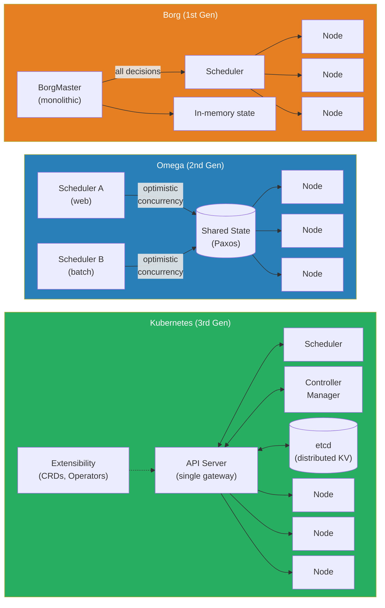

**Figure 4.3:** Evolution from Borg to Omega to Kubernetes. Borg used a monolithic master; Omega introduced shared state with parallel schedulers; Kubernetes added a central API Server gateway, etcd for distributed state, and full extensibility.

This API-centric design is Kubernetes's superpower. It provides a single point for authentication, validation, and policy enforcement. It makes the system incredibly extensible and is the reason a rich ecosystem of tools has been built around it. Anyone can write a custom controller that talks to the Kubernetes API, and it can extend the cluster's behavior just as if it were a built-in component. It was the perfect synthesis of Borg's goals and Omega's architecture, refined for the open-source world.

---
## References

*   [Building Software Systems at Google and Lessons Learned](https://perspectives.mvdirona.com/2008/06/jeff-dean-on-google-infrastructure/) (Based on Jeff Dean's 2008 presentation).
*   Verma, A., et al. (2015). Large-scale cluster management at Google with Borg. *Proceedings of the Tenth European Conference on Computer Systems*, 1-17.

---

# Chapter 5: The Cluster Architecture — Brain and Muscle

In the previous four chapters, we traced the intellectual lineage of Kubernetes: the layered discipline of Dijkstra, the isolation of Unix processes, the virtualization breakthroughs of Xen and KVM, and the hard-won lessons from Google's massive data centers. We now have all the context we need to understand *why* Kubernetes was built the way it was.

In this chapter, we put it all together and meet the machine itself. We are going to look at the **anatomy of a Kubernetes cluster** — which components exist, what each one does, and how they cooperate to keep your applications alive, even when the underlying hardware is falling apart around them.

---

When we talk about a "cluster," we simply mean a group of computers managed together as a single, unified entity. Playing the role of the distributed operating system we envisioned in Chapter 2, Kubernetes abstracts all those individual machines away. You no longer have to think about individual servers; you think about the cluster as one massive, powerful computer waiting for your instructions. Kubernetes handles the exhausting details of which physical machine actually executes the work.

---

### 1. The Two Roles: Brain and Muscle

Every Kubernetes cluster is divided into two distinct types of machines, each playing a completely different role.

**The Brain: The Control Plane**

This is the cluster's headquarters and decision-making center. The Control Plane delegates the heavy lifting; its true purpose is to watch over the entire cluster, make architectural decisions, and tirelessly reconcile the cluster's actual state with the desired state you declared.

**The Muscle: Worker Nodes**

These are the engines of the operation. Worker Nodes receive instructions from the Control Plane and execute them—pulling container images, starting the actual applications, and reporting back on their health.

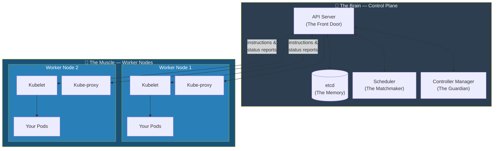

**Figure 5.1:** The Brain and Muscle of a Kubernetes cluster. The Control Plane makes all decisions. Worker Nodes carry them out. They communicate constantly through the API Server.

### 2. Inside the Brain: The Control Plane Components

A healthy Control Plane relies on four tightly integrated components, each with a highly specialized role.

The **API Server** acts as the cluster's ultimate front desk. Every guest, every department, and every delivery must go through this single entry point. Whether it is you typing a `kubectl` command, a node reporting its health, or a scheduler making a decision, all communication flows strictly through the API Server. This centralization is what makes consistent security, validation, and audit logging possible.

Behind that front desk sits **etcd**, the cluster's long-term memory. Think of it as the master ledger—a highly reliable, distributed database containing the definitive record of every reservation and room assignment. It is the absolute ground truth of the cluster, storing your desired state alongside the real-time observed state. And crucially, to prevent chaos, only the API Server is permitted to write to it.

When you ask the cluster to run a new application, the **Scheduler** steps in to play matchmaker. Imagine a human resources director looking at a new employee and surveying several branch offices. The Scheduler evaluates everyone's resource requirements, checks the available memory and CPU across all Worker Nodes, and makes the tactical decision of exactly where that new container should be placed.

Finally, the **Controller Manager** acts as the tireless guardian. Much like a security guard making endless rounds, it runs a suite of specialized controllers that constantly check if reality matches expectations. If a node fails, the Node Controller notices. If a pod crashes, the ReplicaSet Controller immediately steps in to spin up a replacement, ensuring your rolling updates happen with zero downtime.

### 3. Inside the Muscle: Worker Node Components

Out in the field, each Worker Node runs two crucial pieces of software.

The **Kubelet** is the node's foreman. It constantly watches the API Server for new assignments. When told to run a Pod, the Kubelet instructs the container runtime to pull the image and start the application. It then watches over that application, reporting its health back to headquarters. Without the Kubelet, the Control Plane's grand declarations would be nothing but text sitting in a database.

Standing beside the foreman is the **Kube-proxy**, the local network agent. As applications scale up and down, internal IP addresses change constantly. The Kube-proxy updates the networking rules on its specific node, ensuring that traffic looking for your web service is seamlessly load-balanced across wherever your healthy Pods happen to be running at that exact microsecond.

### 4. A Day in the Life of a Pod

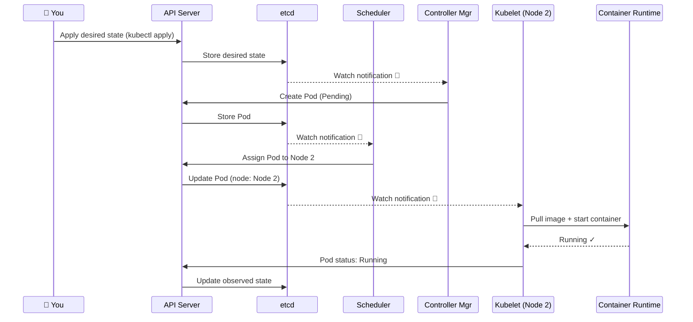

**Figure 5.2:** The complete lifecycle of a Pod. Six components cooperate through the API Server: you declare intent → Controller Manager creates the Pod object → Scheduler assigns it to a node → Kubelet brings it to life.

---

# Chapter 6: Getting Hands-On — Your First Kubernetes Cluster

The previous five chapters have built a rich mental model of what Kubernetes is and why it works the way it does. Now it's time to get our hands dirty. In this chapter, we will set up a real, working Kubernetes cluster on your own computer and run your very first application.

To communicate with these tools, you will need to open your computer's terminal—a text-based interface that lets you talk directly to your operating system. If you are on a Mac, you can press `Cmd + Space` and search for "Terminal." On Windows, search for "PowerShell." In the examples that follow, any line starting with a `$` represents a command you should type (though you skip typing the `$` itself).

### 1. The Tools We Need

**Minikube** creates a mini, single-machine Kubernetes cluster on your computer — a complete Kubernetes cluster in a bottle.

**kubectl** ("kyoob-control") is the command-line tool for talking to any Kubernetes cluster.

### 2. Installing the Tools

**Install kubectl:**
```bash
# macOS
$ brew install kubectl

# Windows
$ choco install kubernetes-cli

# Linux (Ubuntu/Debian)
$ sudo apt-get update && sudo apt-get install -y kubectl
```

Verify: `$ kubectl version --client` → should print a version number. ✅

**Install Minikube:**
```bash
# macOS
$ brew install minikube

# Windows
$ choco install minikube

# Linux
$ curl -LO https://storage.googleapis.com/minikube/releases/latest/minikube-linux-amd64
$ sudo install minikube-linux-amd64 /usr/local/bin/minikube
```

> **Note:** Minikube needs Docker Desktop (free at [docker.com](https://www.docker.com/products/docker-desktop/)) to run.

### 3. Starting Your First Cluster

```bash
$ minikube start
```

When you see `Done!`, verify with:
```bash
$ kubectl get nodes
```
```
NAME       STATUS   ROLES           AGE   VERSION
minikube   Ready    control-plane   45s   v1.28.3
```
`STATUS: Ready` means your cluster is healthy and waiting. ✅

### 4. Your First Pod — The Kubernetes Way (Declarative YAML)

Create `my-first-pod.yaml`:
```yaml
apiVersion: v1          # Which Kubernetes API version
kind: Pod               # What type of object
metadata:
  name: my-nginx        # Name of this Pod
  labels:
    app: web            # A tag we can use to find this Pod later
spec:
  containers:
  - name: nginx-container
    image: nginx        # The container image to run
    ports:
    - containerPort: 80 # Port the web server listens on
```

Apply it:
```bash
$ kubectl apply -f my-first-pod.yaml
```
```
pod/my-nginx created
```

Check it's running:
```bash
$ kubectl get pods
```
```
NAME       READY   STATUS    RESTARTS   AGE
my-nginx   1/1     Running   0          12s
```

### 5. Inspecting Your Pod

```bash
$ kubectl describe pod my-nginx
```

The **Events** section at the bottom is your best debugging tool — it shows the full lifecycle: scheduled → image pulled → container started.

Access your Pod from your browser:
```bash
$ kubectl port-forward pod/my-nginx 8080:80
```
Then open `http://localhost:8080` — you'll see the nginx welcome page. **You just ran a web server on Kubernetes!** 🎉

### 6. Cleaning Up

```bash
$ kubectl delete pod my-nginx
$ minikube stop        # Pause the cluster
$ minikube delete      # Delete it entirely
```

---

# Chapter 7: The Conductor Takes the Stage

When Kubernetes was released in 2014, it stood on the shoulders of giants, incorporating 50 years of lessons from computer science history. But its own unique genius—the thing that makes Kubernetes *feel* like magic—lies in how it manages the cluster day-to-day. It's not just about starting containers; it's about creating a living, breathing, self-healing system. This magic is built on two core concepts: the **Control Loop** and the cluster's brain, **etcd**.

---

### 1. The Genius of the Control Loop

The easiest way to understand how Kubernetes thinks is to look at the thermostat in your house. You don't tell the thermostat, "Turn the heat on now." You simply set a **desired state**: "I want this room to be 70 degrees."

The thermostat then enters an infinite loop:
1.  **Observe:** It checks the current temperature of the room (the **observed state**).
2.  **Compare:** It compares the current state to your desired state.
3.  **Act:** If there's a difference, it takes action to correct it (turning the heat or A/C on). If there's no difference, it does nothing.

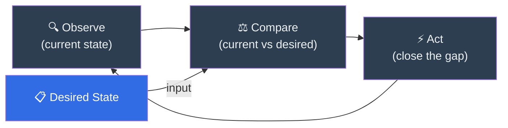

**Figure 5.1:** The Kubernetes control loop. Controllers continuously observe the current state, compare it to the desired state, and take action to reconcile any difference — then repeat forever.

This continuous feedback loop is the beating heart of Kubernetes. It is the engine of self-healing. To truly appreciate its power, we have to look back at the fragile methods that came before it.

#### **The Outdated Approach: Edge-Triggered (Imperative)**

Traditional system management tools were built on an **imperative**, **edge-triggered** model. Think of this like a doorbell: you press the button once (an "edge" or an event), and it rings exactly once. You give the system a direct command, like `docker run my-web-server`, and the system executes it. At that moment, it considers its job finished.

The fatal flaw of this design reveals itself five minutes later when the container crashes. The imperative system remains completely oblivious. Your application's reality has drifted from your original intention, and the system waits passively for a human operator to notice the failure and issue another manual command.

#### **The Kubernetes Way: Level-Triggered (Declarative)**

Kubernetes operates on a **declarative**, **level-triggered** model. This is like the thermostat's sensor. As long as the temperature is below 70 degrees (the "level"), the condition is active, and the heat stays on.

You don't give Kubernetes commands. Instead, you give it a **manifest** (usually a YAML file) that *declares* the state you want.

`replicas: 3`
`image: my-web-server`

You are telling Kubernetes, "My desired state is to have 3 replicas of my web server running."

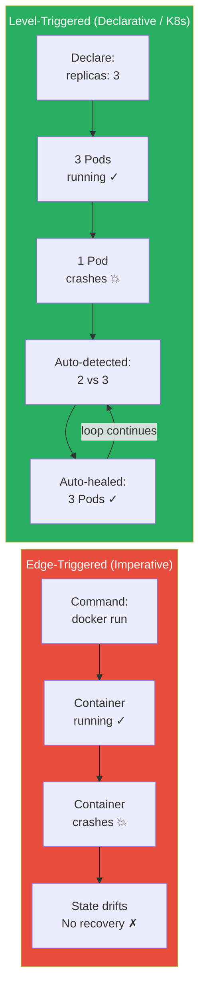

**Figure 5.2:** Edge-triggered (imperative) vs. level-triggered (declarative). Imperative systems execute a command once and forget — if the process crashes, no recovery occurs. Kubernetes's declarative model continuously monitors and auto-heals.

The core of Kubernetes is a set of processes called **controllers**. Each controller is responsible for a specific part of the system (e.g., there's a controller for managing replicas, another for managing nodes). Each controller runs an infinite **reconciliation loop**:

1.  **Observe** the current state (e.g., "How many 'my-web-server' Pods exist right now?").
2.  **Compare** it to the desired state stored in the cluster's database.
3.  **Act** to close the gap between observation and desire.

This loop is always running.
*   *Loop 1:* The controller sees 0 replicas and you want 3. It creates 3.
*   *Loop 100:* A server glitches and one replica dies. The controller now sees 2, but you still want 3. It creates 1 more.
*   *Loop 1000:* An admin accidentally starts an extra replica manually. The controller now sees 4, but you only want 3. It terminates one.

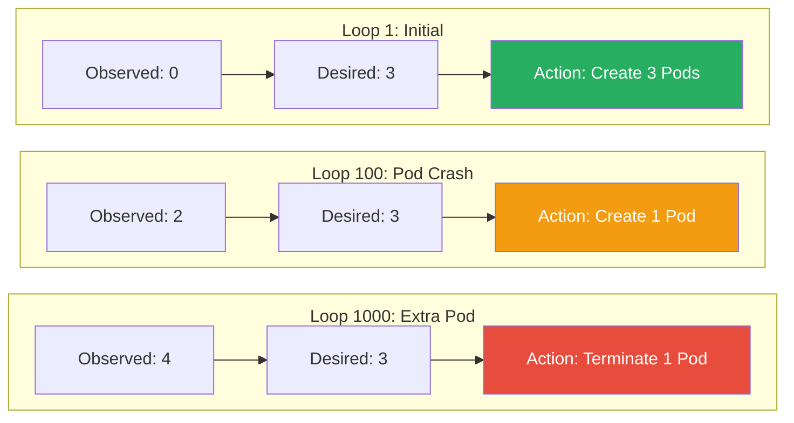

**Figure 5.3:** Reconciliation loop iterations. The controller continuously drives the observed state toward the desired state — creating Pods when there are too few, terminating when there are too many.

This is what makes Kubernetes **self-healing**. It is constantly working to make reality match your declaration. This powerful concept is borrowed from industrial **Control Theory**, a field of engineering that uses feedback loops to keep complex systems (like airplanes and chemical plants) stable. The Kubernetes controllers are always working to drive the "error" between the desired and observed state to zero.

---

### 2. Etcd: The Cluster's Single Source of Truth

For a declarative system to work, it needs one—and only one—unquestionably true source of information for the desired state. In Kubernetes, this is **etcd**.

Etcd is a consistent and highly-available distributed key-value store. Think of it as the central nervous system or "brain" of the entire cluster. It stores everything: the declarations you provide, the status of every Pod, the health of every node, and all the configuration data. It is the only stateful component in the otherwise stateless Kubernetes control plane.

The choice of etcd was deliberate because of how it answers a fundamental question in distributed systems known as the **CAP Theorem**.

#### **The CAP Theorem and Why Consistency Matters**

The CAP Theorem states that in a distributed database, you can only have two of the following three guarantees:
*   **Consistency (C):** Every read from the database returns the most recent, correct data.
*   **Availability (A):** The database will always respond to a request (though it might be with slightly stale data).
*   **Partition Tolerance (P):** The system can survive a network failure (a "partition") where groups of servers are temporarily unable to communicate with each other.

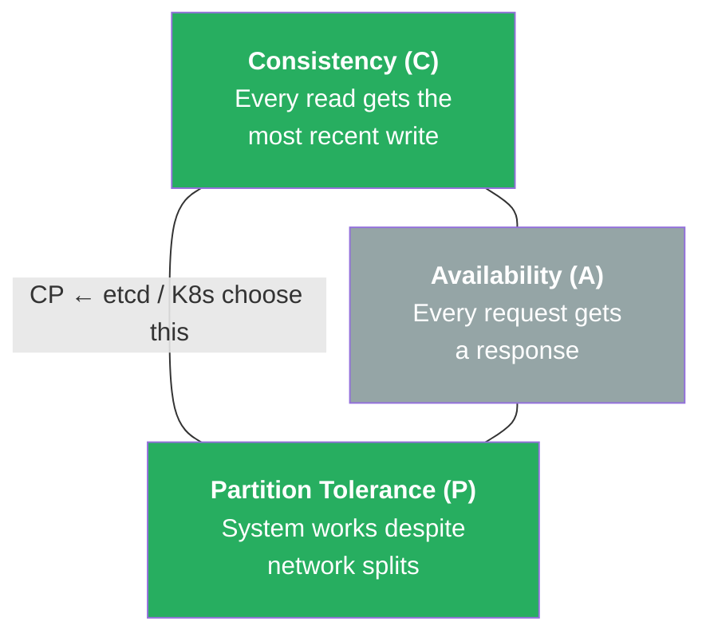

**Figure 5.4:** The CAP Theorem triangle. In a distributed system, you can only guarantee two of three properties. Kubernetes and etcd choose **Consistency + Partition Tolerance (CP)** — they would rather become briefly unavailable than serve stale or conflicting data.

Since network partitions are an unavoidable fact of life in any real-world distributed system, the real choice is between **Consistency** and **Availability** (CP vs. AP).

Kubernetes and etcd are a **CP system**. They choose **Consistency over Availability**.

Why? Imagine a scenario where the network splits. If Kubernetes chose Availability, one scheduler on one side of the split might try to start a Pod on Node A, while another scheduler on the other side starts the same Pod on Node B. Both would think they succeeded. This "split-brain" situation would lead to chaos and data corruption.

To prevent this, etcd guarantees consistency above all else. It uses the **Raft Consensus Algorithm** to ensure data integrity.
1.  The etcd servers in the cluster elect a single **leader**.
2.  All writes must go to this leader.
3.  A write is only considered successful after the leader has replicated it to a **majority** (a "quorum") of the servers.

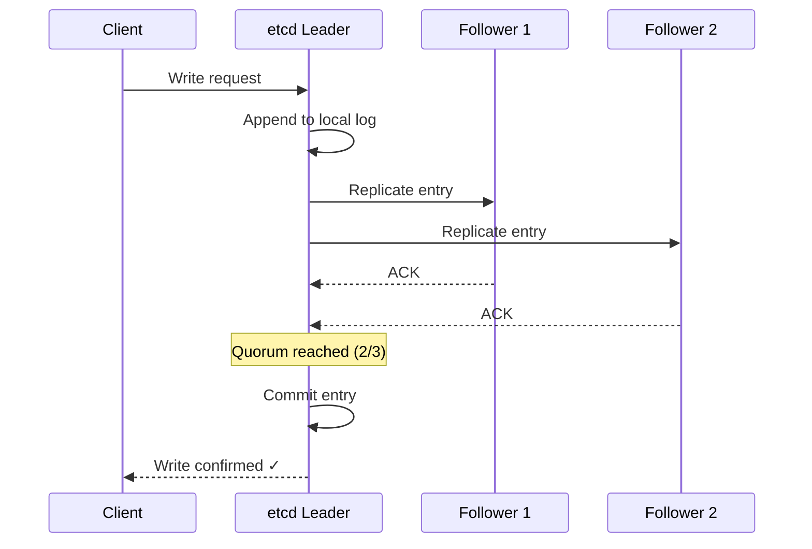

**Figure 5.5:** Raft consensus in etcd. A write is only confirmed after the leader replicates it to a majority (quorum) of followers, ensuring no data is lost even if a node fails.

If a network partition occurs and a quorum cannot be formed, the etcd cluster will temporarily refuse to accept any new writes. It would rather become briefly unavailable than risk accepting conflicting information that would corrupt the state of the cluster.

Finally, etcd provides a crucial **watch** feature. The Kubernetes controllers don't waste time constantly asking etcd, "Anything new? Anything new?" Instead, they place a "watch" on the parts of the database they care about. The moment a value changes (e.g., a user updates a desired state), etcd proactively notifies the relevant controller.

```mermaid
%%{init: {'sequence': {'actorMargin': 40, 'width': 150, 'height': 40, 'boxMargin': 8, 'noteMargin': 8, 'messageMargin': 30}}}%%
sequenceDiagram
    participant User
    participant API as API Server
    participant etcd
    participant Ctrl as Controller

    User->>API: Apply desired state (YAML)
    API->>etcd: Store desired state
    etcd-->>Ctrl: Watch notification 🔔
    Ctrl->>Ctrl: Compare desired vs observed
    Ctrl->>API: Take action (create/update/delete)
    API->>etcd: Update observed state
    Note over Ctrl: Loop continues...
```

**Figure 5.6:** The etcd watch and controller flow. When a user submits a desired state, it is stored in etcd. The watch mechanism notifies the relevant controller, which compares, acts, and updates state — completing the reconciliation loop.

This notification is the "tap on the shoulder" that kicks off the controller's reconciliation loop, making the entire system incredibly efficient and reactive.

---

### 3. The Worker Node: The Cluster's Muscle

Chapters 4 and 5 have done a thorough job explaining the "Brain" of the cluster — the Control Plane (API Server, Scheduler, Controller Manager, and etcd). But a conductor needs an orchestra. The Control Plane's decisions must be *executed* somewhere. This is the job of the **Worker Nodes** — the "Muscle" of the cluster.

A Worker Node is simply a server (physical or virtual) where application Pods are actually run. Every Worker Node has two essential agents installed on it: the **Kubelet** and the **Kube-proxy**.

#### **The Kubelet: The Node's Local Agent**

The Kubelet is the most important component on a Worker Node. It is the direct representative of the Control Plane on each machine — the node's "foreman."

Its job is simple but critical: it continuously watches the API Server for any Pod that has been **scheduled** to run on its node. Once it receives an instruction, the Kubelet translates it into action:

1. It calls the **Container Runtime Interface (CRI)** — the very same pluggable layer we discussed in Chapter 1 — instructing it to pull the container image and start the container.
2. It monitors the health of every running container, reporting their status back to the API Server (updating the "observed state" in etcd).
3. If a container crashes, the Kubelet detects this immediately and reports the discrepancy, giving the Controller Manager (from the Control Plane) the signal it needs to trigger a reconciliation loop.

Without the Kubelet, the Control Plane's declarations would be nothing but text in a database. The Kubelet is what brings them to life on real hardware.

#### **Kube-proxy: The Network Rules Agent**

The Kube-proxy is the second agent running on every Worker Node. Its role is to manage the **networking rules** that allow Pods to communicate with each other and with the outside world.

When you create a Kubernetes `Service` (a stable virtual IP address that sits in front of a group of Pods), kube-proxy is responsible for updating the network rules on its node so that traffic destined for that virtual IP is correctly forwarded to one of the healthy backing Pods — even as individual Pods are created and destroyed.

```mermaid
%%{init: {'flowchart': {'nodeSpacing': 10, 'rankSpacing': 25, 'padding': 20, 'subGraphTitleMargin': {'top': 10, 'bottom': 5}}}}%%
graph TB
    subgraph ControlPlane["Control Plane ('The Brain')"]
        API["API Server"]
        Sched["Scheduler"]
        CM["Controller Manager"]
        ETCD[("etcd")]
        API <--> Sched
        API <--> CM
        API <--> ETCD
    end

    subgraph WorkerNode["Worker Node ('The Muscle')"]
        Kubelet["Kubelet\n(Node Agent)"]
        KubeProxy["Kube-proxy\n(Network Rules)"]
        CRI["Container Runtime\n(via CRI)"]
        Pod1["Pod A"]
        Pod2["Pod B"]
        Kubelet --> CRI
        CRI --> Pod1 & Pod2
        KubeProxy --> Pod1 & Pod2
    end

    API <-->|"schedules & monitors"| Kubelet
    API <-->|"updates network rules"| KubeProxy

    style ControlPlane fill:#2c3e50,color:#ecf0f1
    style WorkerNode fill:#2980b9,color:#fff
    style Kubelet fill:#27ae60,color:#fff
    style KubeProxy fill:#8e44ad,color:#fff
```

**Figure 5.7:** Control Plane and Worker Node anatomy. The Control Plane (API Server, Scheduler, Controller Manager, etcd) makes decisions. The Worker Node executes them: the Kubelet runs Pods via the CRI, and Kube-proxy enforces network routing rules.

Together, the Control Plane and the Worker Nodes form a complete cluster. The Control Plane watches the world and issues instructions; the Worker Nodes receive those instructions through their agents and make them real. The self-healing magic of the control loop only works because the Kubelet faithfully reports what is *actually* happening on each machine, giving the controllers the real-time "observed state" they need to do their job.

---
## References

*   [How etcd works with and without Kubernetes](https://learnkube.com/etcd-kubernetes)
*   [Consistency Models: Strong vs Eventual in Kubernetes](https://hokstadconsulting.com/blog/consistency-models-strong-vs-eventual-in-kubernetes)
*   Brewer, E. (2000). Towards Robust Distributed Systems. *Proceedings of the Nineteenth Annual ACM Symposium on Principles of Distributed Computing*, 7.
*   [Kubernetes Components — Kubernetes Documentation](https://kubernetes.io/docs/concepts/overview/components/)

---

# Chapter 8: Deploying and Connecting — Real-World Kubernetes

In Chapter 6, we ran our first Pod. Bare Pods are great for learning, but in production, nobody runs them directly. This chapter introduces the four essential building blocks for deploying real applications:

1. **Deployments** — run your application reliably with automatic self-healing
2. **Services** — give your application a stable address
3. **Ingress** — route web traffic from the internet
4. **Storage** — persist data that survives container restarts

> Start your cluster first: `$ minikube start`

### 1. Deployments — Why Bare Pods Are Fragile

A bare Pod has no guardian. If it crashes, it's gone forever. A **Deployment** wraps your Pod in the reconciliation loop from Chapter 7 and watches over it forever.

```yaml
apiVersion: apps/v1
kind: Deployment
metadata:
  name: my-web-app
spec:
  replicas: 3               # Always want 3 copies running
  selector:
    matchLabels:
      app: web
  template:
    metadata:
      labels:
        app: web
    spec:
      containers:
      - name: nginx
        image: nginx:1.25
        ports:
        - containerPort: 80
        resources:
          requests:
            memory: "64Mi"
            cpu: "100m"     # 100 millicores = 0.1 CPU core
          limits:
            memory: "128Mi"
            cpu: "200m"
```

Apply and test self-healing:
```bash
$ kubectl apply -f my-deployment.yaml
$ kubectl delete pod <any-pod-name>   # Kill one
$ kubectl get pods                    # Watch the replacement appear
```

Rolling update with zero downtime:
```bash
$ kubectl set image deployment/my-web-app nginx=nginx:1.26
$ kubectl rollout status deployment/my-web-app
```

Rollback if needed:
```bash
$ kubectl rollout undo deployment/my-web-app
```

### 2. Services — A Stable Address

Pod IPs are temporary — every replaced Pod gets a new IP. A **Service** provides one stable virtual IP (ClusterIP) that load-balances across all backing Pods.

| Type | Reachable By | Use Case |
|---|---|---|
| **ClusterIP** | Pods inside the cluster | Internal microservice communication |
| **NodePort** | Anyone who can reach any node | Development / testing |
| **LoadBalancer** | The public internet | Production, cloud deployments |

```yaml
apiVersion: v1
kind: Service
metadata:
  name: my-web-service
spec:
  selector:
    app: web            # Routes traffic to Pods with this label
  ports:
  - protocol: TCP
    port: 80
    targetPort: 80
  type: ClusterIP
```

### 3. Ingress — One Entry Point for All Traffic

Instead of one LoadBalancer per application, **Ingress** routes all external traffic through a single entry point using hostname and path rules:

```yaml
apiVersion: networking.k8s.io/v1
kind: Ingress
metadata:
  name: my-ingress
spec:
  rules:
  - host: www.myapp.local
    http:
      paths:
      - path: /
        pathType: Prefix
        backend:
          service:
            name: my-web-service
            port:
              number: 80
```

### 4. Storage — Persisting Data

Containers are ephemeral — their filesystem is wiped on restart. **PersistentVolumes** and **PersistentVolumeClaims** connect containers to storage that lives outside and survives restarts.

```yaml
# Step 1: Claim storage (developer's job)
apiVersion: v1
kind: PersistentVolumeClaim
metadata:
  name: my-pvc
spec:
  accessModes:
  - ReadWriteOnce
  resources:
    requests:
      storage: 500Mi
---
# Step 2: Use it in a Pod
apiVersion: v1
kind: Pod
metadata:
  name: my-db-pod
spec:
  containers:
  - name: my-db
    image: postgres:16
    volumeMounts:
    - mountPath: /var/lib/postgresql/data
      name: db-storage
  volumes:
  - name: db-storage
    persistentVolumeClaim:
      claimName: my-pvc
```

Data written to `/var/lib/postgresql/data` now survives Pod restarts. ✅

---

# Chapter 9: Teaching Kubernetes New Tricks — Operators and the Extensible Platform

In Chapter 7, we saw how Kubernetes uses the control loop to keep your applications running: you declare a desired state, and controllers work tirelessly to make reality match. In Chapter 5, we learned about the Cluster Architecture and the API Server as the single gateway through which every interaction with the cluster must pass. These are powerful ideas. But they raise a natural question: what happens when Kubernetes doesn't know *how* to manage something?

Kubernetes knows how to keep three copies of a web server running. But it doesn't know how to run a database. It doesn't know how to manage a message queue, provision a TLS certificate, or orchestrate a machine learning pipeline. These tasks require specialized, domain-specific knowledge that no general-purpose system could ship with out of the box.

The answer to this problem is Kubernetes's most important innovation: **extensibility**. Kubernetes was designed not just to be a platform, but to be a **platform for building platforms**. This chapter is the story of how.

---

### 1. The Problem: Domain Knowledge That Kubernetes Doesn't Have

Let's make this concrete with a database example. Imagine you need to run a production MySQL cluster with one primary server and two read replicas.

A human database administrator (a "DBA") knows the exact sequence of steps required:
1.  Start the primary instance first and wait for it to be fully ready.
2.  Take a snapshot of the primary's data.
3.  Start Replica 1, point it at the primary, and load the snapshot so it can catch up.
4.  Only then, start Replica 2 and repeat the process.
5.  Configure daily backups of the primary's data.
6.  If the primary ever goes down, promote one of the replicas to become the new primary, reconfigure the other replica to follow the new primary, and alert the on-call engineer.

None of this is generic container orchestration. This is deep, operational expertise—the kind of knowledge that takes years for a human to learn. Kubernetes's built-in controllers don't know any of it. If you simply told Kubernetes "run 3 MySQL Pods," it would start all three simultaneously with no coordination, no replication, and no backup strategy. The result would be a mess, not a database cluster.

This is the old world of **Pets** from Chapter 4. Databases, message queues, and other stateful systems were traditionally treated as precious, hand-managed pets. A DBA would SSH into the server, run commands by hand, and keep a runbook of procedures. It worked, but it was slow, error-prone, and didn't scale. Every time you needed a new database cluster, you needed that same human expert to repeat those same manual steps.

The question became: *what if we could encode that human expert's knowledge into software and run it inside the Kubernetes control loop?*

---

### 2. Custom Resource Definitions (CRDs): Teaching Kubernetes New Words

Before we can teach Kubernetes new behavior, we first need to teach it new **vocabulary**.

Kubernetes ships with a set of built-in resource types that it understands: Pods, Services, Deployments, ConfigMaps, and so on. These are the "words" in its language. When you run `kubectl get pods`, you're asking Kubernetes about a resource type it was born knowing about.

**Custom Resource Definitions (CRDs)** let you define entirely new resource types. A CRD is essentially a schema—a blueprint—that tells the API Server, "There's a new kind of thing you need to know about. Here's what its fields look like."

For example, you could create a CRD called `MySQLCluster`. Once you register this CRD with the API Server, Kubernetes suddenly "knows" about MySQL clusters as a first-class concept. You can now interact with them using the exact same tools and commands you use for built-in resources:

*   `kubectl get mysqlclusters` — lists all your MySQL clusters.
*   `kubectl describe mysqlcluster my-production-db` — shows you the details.
*   `kubectl delete mysqlcluster my-staging-db` — removes one.

On its own, a CRD simply teaches the API Server a new word. Yet this is a profound conceptual leap. Returning to the microkernel philosophy from Chapter 2, if Kubernetes is a distributed operating system, CRDs act as its **device drivers**. They teach the core system about entirely new paradigms that did not exist when it was originally compiled. The API Server—the cluster's heavily guarded front door—can now safely authenticate and process a completely new type of structural request.

```mermaid
%%{init: {'sequence': {'actorMargin': 40, 'width': 150, 'height': 40, 'boxMargin': 8, 'noteMargin': 8, 'messageMargin': 30}}}%%
sequenceDiagram
    participant Admin
    participant API as API Server
    participant etcd

    Admin->>API: Register CRD (MySQLCluster schema)
    API->>etcd: Store CRD definition
    API-->>Admin: CRD registered ✓
    Note over API: API Server now understands "MySQLCluster"

    Admin->>API: Create MySQLCluster "my-prod-db"
    API->>API: Validate against CRD schema
    API->>etcd: Store custom resource
    API-->>Admin: MySQLCluster created ✓
    Note over Admin: kubectl get mysqlclusters now works!
```

**Figure 6.1:** CRD registration flow. An admin first registers the CRD schema, teaching the API Server a new resource type. Then custom resources of that type can be created, validated, and stored — just like built-in resources.

---

### 3. The Operator Pattern: Encoding Human Knowledge Into Software

A CRD gives Kubernetes new vocabulary. But vocabulary without understanding is useless. You need something that knows what to *do* with these new words. This is where the **Operator** pattern comes in.

An Operator is the combination of a **CRD** and a **Custom Controller**.

The Custom Controller is a piece of software that uses the exact same **reconciliation loop** from Chapter 5—Observe, Compare, Act—but for your custom resource instead of a built-in one.

Here's how it works in practice. You write a YAML manifest:

```yaml
apiVersion: databases.example.com/v1
kind: MySQLCluster
metadata:
  name: my-production-db
spec:
  replicas: 3
  backupSchedule: "daily"
```

You apply this to the cluster, and it gets stored in etcd as your **desired state**. The MySQL Operator's controller is watching for `MySQLCluster` resources, and etcd's watch feature (from Chapter 5) taps it on the shoulder: "Hey, someone wants a new MySQL cluster."

The controller's reconciliation loop now kicks in, but unlike a generic Kubernetes controller, it carries *domain-specific knowledge*. It knows the correct procedure:

1.  **First loop:** "I see 0 Pods, but the user wants 3 replicas. I'll start by creating the primary instance first."
2.  **Second loop:** "The primary is now healthy. Time to take a data snapshot and start Replica 1."
3.  **Third loop:** "Replica 1 is synced and healthy. Now I'll start Replica 2."
4.  **Fourth loop:** "All 3 replicas are running and in sync. The backup schedule says 'daily,' so I'll create a CronJob for nightly backups."
5.  **Every subsequent loop:** "All 3 replicas are healthy, replication lag is within acceptable bounds, and backups are succeeding. Desired state matches observed state. Nothing to do."

Now imagine a replica crashes. A generic Kubernetes controller would blindly restart a new Pod and hope for the best. But the Operator's controller is smarter. It knows to:
*   Check the replication lag of the remaining replica.
*   Initialize the new replacement Pod with a fresh data snapshot from the primary.
*   Wait for the new replica to fully sync before marking the cluster as healthy again.

```mermaid
%%{init: {'flowchart': {'nodeSpacing': 10, 'rankSpacing': 25, 'padding': 20, 'subGraphTitleMargin': {'top': 10, 'bottom': 5}}}}%%
graph TB
    Watch["Watch Trigger:<br/>MySQLCluster created"] --> Primary["Create Primary<br/>Instance"]
    Primary --> Snapshot["Take Data<br/>Snapshot"]
    Snapshot --> R1["Start Replica 1<br/>+ Sync"]
    R1 --> R2["Start Replica 2<br/>+ Sync"]
    R2 --> Backup["Create Backup<br/>CronJob"]
    Backup --> Steady["Steady State ✓<br/>(desired = observed)"]
    Steady -->|"continuous monitoring"| Steady

    Crash["Replica Crash 💥"] --> Resync["Check Replication Lag<br/>→ Fresh Snapshot<br/>→ Resync New Pod"]
    Resync --> Steady

    style Watch fill:#326ce5,color:#fff
    style Steady fill:#27ae60,color:#fff
    style Crash fill:#e74c3c,color:#fff
    style Resync fill:#f39c12,color:#fff
```

**Figure 6.2:** Operator reconciliation loop for a MySQL cluster. The operator follows domain-specific steps (primary first, then replicas, then backups). On a crash, it performs intelligent recovery — resyncing data rather than blindly restarting.

**This is the key insight:** an Operator captures the expertise of a human operator and runs it as software inside the control loop—24/7, tirelessly, at machine speed. The DBA's years of experience are now codified in a controller that never sleeps, never forgets a step, and can manage hundreds of database clusters simultaneously.

Remember the thermostat analogy from Chapter 5? A basic thermostat understands only temperature. An Operator is like a smart home system that understands temperature, humidity, air quality, the time of day, and seasonal weather patterns. It uses all of that knowledge to keep your home comfortable in ways a simple thermostat never could.

---

### 4. The Ecosystem: A Platform for Building Platforms

The Operator pattern didn't just solve one team's database problem. It unlocked an entire ecosystem.

Once the community realized that anyone could extend Kubernetes with domain-specific knowledge, an explosion of Operators appeared for virtually every kind of infrastructure:

*   **The Prometheus Operator** manages the popular Prometheus monitoring system. Instead of hand-configuring monitoring targets and alert rules, you declare them as custom resources, and the Operator wires everything together.
*   **cert-manager** automates TLS certificate provisioning and renewal. You declare that your website needs an HTTPS certificate, and the Operator talks to certificate authorities like Let's Encrypt, obtains the certificate, installs it, and automatically renews it before it expires.
*   **The etcd Operator** manages etcd clusters—the very database that Kubernetes itself depends on. There's something wonderfully recursive about this: Kubernetes uses an Operator to manage the system that stores Kubernetes's own state.

The tooling grew to match. Frameworks like **Operator SDK** and **Kubebuilder** made it far easier to build new Operators by providing scaffolding, code generators, and best practices. **OperatorHub** became a public marketplace where teams could share and discover Operators, much like an app store.

This is why companies like Red Hat built entire products (like OpenShift) on top of Kubernetes. They recognized that Kubernetes wasn't just a container runtime—it was an **extensible, API-driven platform**. You could model any piece of infrastructure as a custom resource and manage it through the control loop.

Connect this back to Chapter 2. Just as Liedtke's microkernel let you plug in new "user-space servers" for file systems, network stacks, and device drivers, Kubernetes lets you plug in new Operators for databases, message queues, ML pipelines, and anything else your organization needs. The microkernel philosophy, born in a 1990s research lab, has been realized at planetary scale.

---

### 5. Admission Webhooks: The Gatekeepers

CRDs extend *what* Kubernetes knows. Operators extend *how* it acts. But there's a third dimension of extensibility: extending *what rules it enforces*. This is the job of **Admission Webhooks**.

In Chapter 4, we described the API Server as the front door of the building—the single point through which every request must pass. Admission Webhooks are the **security guards** stationed at that front door. Before any request (create a Pod, update a Deployment, apply a CRD) is accepted and stored in etcd, it passes through a chain of admission controllers.

Kubernetes lets you insert your own custom logic into this chain via two types of webhooks:

**Validating Webhooks** act as ID checkers. They inspect an incoming request and decide whether to allow or reject it. They cannot change the request; they can only say "yes" or "no."

*   *Example:* You write a validating webhook that rejects any Pod that doesn't specify CPU and memory resource limits. This prevents developers from accidentally deploying a container that could consume all the resources on a node and starve other applications—a scenario called the "noisy neighbor" problem.
*   *Example:* A security team deploys a webhook that rejects any container image that hasn't been pulled from the company's approved private registry, preventing untrusted code from running in the cluster.

**Mutating Webhooks** act as badge issuers. They intercept an incoming request and automatically modify it before it proceeds. The user may not even realize the modification happened.

*   *Example:* The popular service mesh **Istio** uses a mutating webhook to automatically inject a "sidecar" proxy container into every new Pod. A developer deploys their application with one container, but by the time the Pod is actually created, it has two—the original application and the Istio proxy that handles networking, security, and observability. The developer never had to change a single line of their YAML.
*   *Example:* A platform team deploys a webhook that automatically adds standard labels (like `team: payments` or `environment: production`) to every resource, ensuring consistent metadata across the entire cluster without relying on individual developers to remember.

Together, Validating and Mutating Webhooks complete the extensibility picture. If we extend the "front door" analogy from Chapter 4: CRDs teach the building about new types of visitors. Operators know how to escort those visitors to where they need to go. And Admission Webhooks are the security guards who check IDs (validate) and hand out visitor badges (mutate) before anyone steps inside.

```mermaid
%%{init: {'flowchart': {'nodeSpacing': 10, 'rankSpacing': 25, 'padding': 20, 'subGraphTitleMargin': {'top': 10, 'bottom': 5}}}}%%
graph TB
    Req["API Request"] --> Auth["Authentication<br/>& Authorization"]
    Auth --> Mutating["Mutating<br/>Webhooks<br/>(modify request)"]
    Mutating --> Schema["Schema<br/>Validation"]
    Schema --> Validating["Validating<br/>Webhooks<br/>(accept/reject)"]
    Validating --> etcd["etcd<br/>(stored)"]

    style Req fill:#2c3e50,color:#ecf0f1
    style Auth fill:#8e44ad,color:#fff
    style Mutating fill:#2980b9,color:#fff
    style Schema fill:#7f8c8d,color:#fff
    style Validating fill:#e67e22,color:#fff
    style etcd fill:#27ae60,color:#fff
```

**Figure 6.3:** The admission webhook pipeline. Every API request passes through authentication, mutating webhooks (which can modify the request), schema validation, and validating webhooks (which can reject it) before being persisted to etcd.

---

### 6. Helm: Packaging and Sharing the Knowledge

Operators, CRDs, and Admission Webhooks are powerful tools for extending Kubernetes. But in practice, deploying a complex system like a monitoring stack or a database Operator involves dozens of interconnected YAML manifests: the CRD definitions, the Operator's Deployment, ServiceAccounts, RBAC permissions, ConfigMaps, webhook configurations, and more. Managing all of these files by hand is tedious and error-prone.

This is the problem that **Helm** solves. Helm is the **package manager for Kubernetes**.

If Kubernetes is a distributed operating system (as we established in Chapter 2), then Helm is its "app store" or package manager—analogous to `apt` on Debian Linux or `brew` on macOS. A **Helm Chart** is the equivalent of an installer package. It bundles all the YAML manifests, default configuration values, and dependency information needed to deploy a complete application into the cluster.

Here's why Helm matters:

*   **One-command installs:** Instead of manually applying dozens of YAML files in the right order, you can deploy an entire Prometheus monitoring stack—complete with its Operator, CRDs, Grafana dashboards, and alert rules—with a single command: `helm install prometheus prometheus-community/kube-prometheus-stack`.
*   **Configuration without code changes:** Helm Charts use a templating system with a `values.yaml` file. You can customize a deployment (change the number of replicas, enable specific features, set resource limits) by overriding values, without modifying the chart's templates directly.
*   **Upgrades and rollbacks:** Helm tracks the history of every deployment. If an upgrade introduces a problem, you can roll back to a previous working version with `helm rollback`. This solves the practical, day-to-day problem of "how do I update my Operator without breaking everything."
*   **Sharing and discovery:** Public chart repositories like **Artifact Hub** serve as a central marketplace where teams and vendors publish their Helm Charts. Need a Redis cluster? A Kafka deployment? An ingress controller? There's almost certainly a community-maintained chart ready to install.

Connect this back to the microkernel theme from Chapter 2. Just as Linux package managers (`apt`, `yum`) let you install new user-space programs—network servers, file system drivers, desktop applications—into a microkernel-style OS, Helm lets you install new capabilities into the Kubernetes platform. The combination of CRDs, Operators, and Helm Charts means that anyone can package up a piece of domain expertise and distribute it to the entire Kubernetes community. The platform doesn't just grow through core development; it grows through its ecosystem.

---

### The Full Picture

Let's step back and see how all the pieces fit together.

1.  **CRDs** extend the API Server's vocabulary, teaching Kubernetes about new concepts like `MySQLCluster` or `Certificate`.
2.  **Operators** (Custom Controllers) extend the control loop, encoding domain-specific knowledge about *how* to manage those new concepts.
3.  **Admission Webhooks** extend the API Server's enforcement, adding custom validation and mutation rules that act as gatekeepers for the entire cluster.
4.  **Helm** packages all of the above into distributable, versionable, configurable bundles that can be shared across the ecosystem.

```mermaid
%%{init: {'flowchart': {'nodeSpacing': 10, 'rankSpacing': 25, 'padding': 20, 'subGraphTitleMargin': {'top': 10, 'bottom': 5}}}}%%
graph TB
    Helm["🎯 Helm Charts<br/>Package & distribute all of the above"]
    Webhooks["🔒 Admission Webhooks<br/>Enforce custom rules (validate & mutate)"]
    Operators["⚙️ Operators (Custom Controllers)<br/>Encode domain knowledge into the control loop"]
    CRDs["📝 CRDs (Custom Resource Definitions)<br/>Teach Kubernetes new resource types"]
    Core["🏗️ Kubernetes Core<br/>Pods, Services, Deployments, API Server, etcd"]

    Helm --> Webhooks --> Operators --> CRDs --> Core

    style Core fill:#2c3e50,color:#ecf0f1
    style CRDs fill:#2980b9,color:#fff
    style Operators fill:#27ae60,color:#fff
    style Webhooks fill:#e67e22,color:#fff
    style Helm fill:#8e44ad,color:#fff
```

**Figure 6.4:** The full Kubernetes extensibility stack. Each layer builds on the one below — CRDs extend vocabulary, Operators extend behavior, Admission Webhooks extend enforcement, and Helm packages everything for distribution.

This layered extensibility is what transformed Kubernetes from a container orchestrator into something far more significant: a universal control plane. It's the reason Kubernetes won the orchestration wars—not because it did everything itself, but because it made it possible for everyone else to extend it with their own expertise.

---
## References

*   Dobies, J., & Wood, J. (2020). *Kubernetes Operators: Automating the Container Orchestration Platform*. O'Reilly Media.
*   [The Operator Pattern — Kubernetes Documentation](https://kubernetes.io/docs/concepts/extend-kubernetes/operator/)
*   [Custom Resources — Kubernetes Documentation](https://kubernetes.io/docs/concepts/extend-kubernetes/api-extension/custom-resources/)
*   [Dynamic Admission Control — Kubernetes Documentation](https://kubernetes.io/docs/reference/access-authn-authz/extensible-admission-controllers/)
*   [Helm Documentation](https://helm.sh/docs/)
*   [OperatorHub.io](https://operatorhub.io/)

---

# Conclusion and Future Trajectories

Our journey through the history of Kubernetes has taken us from the foundational principles of the 1960s to the massive, chaotic data centers of the 21st century. We've seen that Kubernetes wasn't a spontaneous invention but a brilliant synthesis of ideas, each building on the last. Now, we'll summarize this lineage and look ahead to the exciting future trajectories that continue this half-century cycle of innovation.

---

### 1. A 50-Year Journey to a Distributed Operating System

Kubernetes is best understood not as a single product, but as the culmination of a long scientific quest to manage complexity and create reliability out of unreliable parts. It inherited its core DNA from five distinct eras of computer science:

*   From **Dijkstra (1968)**, it learned the discipline of **Layers**. By separating the definition of a task (like networking or storage) from its implementation, Kubernetes gained its famous pluggable architecture (CNI, CSI, CRI), allowing it to adapt to any environment.

*   From **Ritchie & Thompson's Unix (1974)**, it inherited the concept of the **Process**—the isolated "atom" of computation. This idea evolved directly into the modern Linux container, the fundamental building block that Kubernetes orchestrates.

*   From **Popek & Goldberg (1974)**, it learned the formal rules of **Isolation** and what it means to create a truly secure virtual machine. This principle is now coming full circle with the rise of sandboxed containers that blend the security of VMs with the speed of containers.

*   From **Liedtke's Microkernel philosophy (1995)**, it adopted the architectural pattern of breaking down large, fragile monoliths into small, resilient, and independent services. The microkernel philosophy is the direct ancestor of the **Microservice** architecture that Kubernetes is designed to manage.

*   From **Google's operational experience (2008)**, it learned the most critical lesson of all: at scale, **Hardware Failure is the Norm**. This understanding is why Kubernetes was built as a self-healing control plane that assumes chaos and treats servers as disposable "cattle," not precious "pets."

*   From the **Operator pattern and CRDs**, it learned the final lesson: a platform is only as powerful as its ability to be **extended**. By letting anyone define new resource types (CRDs), encode domain expertise into custom controllers (Operators), enforce custom rules (Admission Webhooks), and package it all for distribution (Helm), Kubernetes opened itself up so that the entire community could teach it new tricks. This extensibility is what transformed it from a container orchestrator into a **platform for building platforms**.

```mermaid
%%{init: {'timeline': {'padding': 10}}}%%
timeline
    title 50 Years of Ideas Leading to Kubernetes
    1968 : Dijkstra — Layered architecture (THE system)
    1974 : Unix — Processes & isolation
    1974 : Popek & Goldberg — VM formalization
    1995 : Liedtke — Microkernel philosophy (L4)
    2003 : Xen — Paravirtualization
    2007 : KVM — Linux becomes a hypervisor
    2008 : Google — Borg & failure-as-normal
    2013 : Omega & Docker — Shared state + containers
    2014 : Kubernetes — Open-source orchestration
    2016+ : CRDs & Operators — Extensible platform
    Future : Wasm & eBPF — Next-gen efficiency
```

**Figure C.1:** The 50-year timeline of ideas that converged in Kubernetes. Each era contributed a foundational concept — from layered architecture to extensible platforms — forming the DNA of the modern distributed operating system.

By weaving these threads together, Kubernetes has become the de facto **Distributed Operating System of the 21st Century**. It provides a unified, abstract layer that makes a cluster of hundreds or thousands of unreliable computers look and feel like a single, resilient, and powerful machine. And crucially, it is a machine that anyone can extend—a living ecosystem that grows not just through core development, but through the collective expertise of its community.

---

### 2. The Cycle Continues: What's Next?

The evolution of computing is never finished. Just as Kubernetes was built on layers of abstraction, the next wave of innovation is finding ways to make those layers even thinner, faster, and more efficient. Two of the most exciting technologies shaping the future of Kubernetes are WebAssembly (Wasm) and eBPF.

#### **Wasm (WebAssembly): A New Kind of Sandbox**

For years, the container has been the smallest unit of deployment in Kubernetes. But what if we could go even smaller? This is the promise of **WebAssembly (Wasm)**.

Originally designed to run code in web browsers at near-native speed, Wasm is a portable, high-performance binary format that runs in a secure sandbox. Think of it this way:
*   The Java Virtual Machine (JVM) let you "Write Once, Run Anywhere" for Java code.
*   Docker let you "Package Once, Run Anywhere" for an entire application and its OS dependencies.
*   Wasm aims to let you "Compile Once, Run Anywhere" for almost *any* code (C, C++, Rust, Go) in a tiny, secure, and universal runtime.

**Why does this matter for Kubernetes?**
Wasm modules are incredibly lightweight and have near-instant startup times—often in microseconds, compared to the seconds it can take to start a container. This makes them a perfect fit for serverless computing and event-driven functions. The community is rapidly building tools to allow Kubernetes to orchestrate Wasm modules directly, potentially bypassing the need for a full container image and guest operating system for many workloads.

#### **eBPF: Making the Kernel Programmable**

If Wasm is about running user applications in a new way, **eBPF (Extended Berkeley Packet Filter)** is a revolutionary technology for changing how the operating system kernel itself behaves.

Traditionally, the Linux kernel is a monolithic, protected core. Changing its behavior requires recompiling it or loading risky kernel modules. eBPF provides a safe, verified way to run small, sandboxed programs *directly inside the kernel* at runtime. It's like having a tiny, lightweight virtual machine inside the kernel that can be used to safely "mod" the OS's functionality on the fly.

**Why does this matter for Kubernetes?**
eBPF is supercharging Kubernetes networking, security, and observability.
*   **High-Performance Networking:** Modern Kubernetes networking plugins like Cilium use eBPF to manage all network traffic between containers directly at the kernel level. This avoids complex and slower legacy tools like `iptables` and provides a massive boost in performance.
*   **Granular Security and Observability:** Because eBPF can see every system call and network packet going in and out of a container, it allows for incredibly deep visibility and fine-grained security enforcement with almost no performance overhead.

```mermaid
%%{init: {'flowchart': {'nodeSpacing': 10, 'rankSpacing': 25, 'padding': 20, 'subGraphTitleMargin': {'top': 10, 'bottom': 5}}}}%%
graph TB
    subgraph ControlPlane["Kubernetes Control Plane"]
        API["API Server"]
        Sched["Scheduler"]
        CM["Controller Manager"]
    end

    subgraph Workloads["Managed Workloads"]
        Containers["🐳 Containers<br/>(traditional)"]
        Wasm["⚡ Wasm Modules<br/>(microsecond startup)"]
    end

    subgraph Kernel["Linux Kernel"]
        eBPF["🔬 eBPF Programs"]
        Net["Networking<br/>(Cilium)"]
        Sec["Security<br/>(runtime enforcement)"]
        Obs["Observability<br/>(tracing & metrics)"]
        eBPF --> Net & Sec & Obs
    end

    ControlPlane --> Containers & Wasm
    Containers & Wasm --> Kernel

    style ControlPlane fill:#326ce5,color:#fff
    style Workloads fill:#2980b9,color:#fff
    style Kernel fill:#2c3e50,color:#ecf0f1
```

**Figure C.2:** The future Kubernetes stack. The control plane manages both traditional containers and lightweight Wasm modules. Inside the kernel, eBPF programs provide high-performance networking, security, and observability without the overhead of legacy tools.

### The Enduring Abstraction

The journey from Dijkstra's layers to Operators to eBPF's programmable kernel shows that while technology is always changing, the fundamental goals remain the same: managing complexity, abstracting away messy details, and creating reliable systems from unreliable parts. Kubernetes is the current pinnacle of this 50-year evolution, proving that while individual servers may fail, the abstract systems we build upon them can be designed to endure—and to grow, as anyone with domain expertise can extend the platform with new capabilities. The quest continues.

---
## References

*   [WebAssembly (Wasm) on Kubernetes: A New Era of Cloud-Native Application Development](https://www.cncf.io/blog/2023/10/18/wasm-on-kubernetes-a-new-era-of-cloud-native-application-development/)
*   [eBPF - An Introduction and Deep Dive, with a focus on Kubernetes](https://www.datadoghq.com/blog/ebpf-101/)
