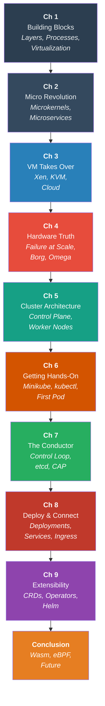

# The Architecture of Kubernetes: A Historical Journey into Cloud-Native Systems
# Summary of A book to be extended

- Authors: Alnour Alharin, Nevena Golubovic

## Acknowledgments
- To Tony Choe, who taught me how to utilize OKE to build massive architectures.
- To the Oracle Fusion Observability group, and especially the operations team led by Rob Mize, who gave me important practical lessons that helped me understand Kubernetes.

## Introduction: What is Kubernetes and Why Does It Exist?

Have you ever wondered how giant websites like Google, Netflix, or Amazon run millions of applications at the same time without breaking a sweat? The secret, in many cases, is a powerful tool called **Kubernetes**.

If you think of a data center full of computers (we call them **servers**) as a giant orchestra, Kubernetes is the conductor. It doesn't play an instrument itself, but it makes sure every musician (every application) knows when to play, how loudly, and what to do if they mess up. It makes the whole system work in harmony.

But Kubernetes didn't just appear out of nowhere. It's the result of nearly 50 years of amazing ideas in computer science. This book traces that architectural and historical journey — from the foundational OS concepts of the 1960s through the cloud revolution, to Kubernetes and its extensible future.

**Figure S.1:** Book roadmap. Each chapter builds on the previous, tracing 50 years of computing ideas — from foundational OS concepts through the cloud revolution to Kubernetes and its extensible future. This book is an *architectural and historical* exploration of cloud-native systems.

---

## Chapter 1: The Building Blocks (The 1960s-1970s)

Before we could have something like Kubernetes, computer scientists had to figure out the very basics of how to run programs and keep them from crashing into each other.

### The Idea of Layers: Building Software Like a Cake

Back in the 1960s, a very smart computer scientist named Edsger Dijkstra came up with a simple but powerful idea: build software in **layers**.

Imagine building a layer cake. You have to bake the bottom layer before you can put the next one on top, and you add the frosting last. You can't put the top layer on first!

Dijkstra said we should build computer operating systems the same way.
*   **Layer 0:** The most basic part, decides which program gets to use the computer's brain (the CPU).
*   **Layer 1:** Manages the computer's memory.
*   **Layer 2:** Handles talking to the user.
*   **And so on...**

The rule was simple: a higher layer can only use the services of the layer directly below it. This made systems much more stable. If something broke, you knew exactly where to look.

**How Kubernetes uses this:** Kubernetes is built on this layer principle. It has a layer for handling networking, a layer for storage, and a layer for running your programs (called **containers**). Each layer is separate and has a specific job, which makes the whole system reliable and easy to manage.

### The Idea of the Process: Your Program in Action

In the 1970s, the Unix operating system gave us two ideas that are still the foundation of almost everything we do with computers:

1.  **The Process:** A "process" is simply a program that is currently running. Unix made it so that each process had its own private space to work in, isolated from all the other processes.
2.  **Everything is a File:** Whether you were writing to a printer, the screen, or a hard drive, Unix let you treat it like a simple file.

This was a genius move. It made it easy to build complex things by connecting small, simple programs together.

**How Kubernetes uses this:** A **container** (which is what Kubernetes manages) is really just a modern, super-powered version of a Unix process. It’s a running program, but it's wrapped in extra layers of isolation. A container has its own little world: it thinks it's the only process running, has its own private file system, and its own network connection.

Kubernetes takes this a step further with the **Pod**. Think of a Pod as a small house where one or more related containers can live. They can easily talk to each other and share resources, just like two programs running on a single computer.

### The Idea of Virtualization: Pretend Computers

Also in the 1970s, scientists defined the rules for **virtualization**. This means creating a "pretend" computer (a **Virtual Machine** or **VM**) that runs inside a real, physical computer. It's like having a complete computer-within-a-computer.

Containers, on the other hand, are different. They don't pretend to be a whole computer. Instead, they share the "brain" (the **kernel**) of the host computer they run on. This makes them much lighter and faster than VMs.

*   **VMs:** Like separate houses. Heavy and fully isolated.
*   **Containers:** Like apartments in the same building. They share the building's foundation (the kernel) but have their own private space.

**How Kubernetes uses this:** Kubernetes was born to manage lightweight containers. But today, technology has advanced so much that Kubernetes can now manage both containers and full virtual machines, giving users the best of both worlds.

---

## Chapter 2: The "Micro" Revolution (The 1990s)

By the 1990s, operating systems had become huge and bloated. Everything was bundled into one giant piece of code called the **kernel**. If one small part of it crashed (like a printer driver), the whole computer could crash.

### From Big Kernels to Tiny Services

A new idea emerged: the **microkernel**. The idea was to make the kernel as tiny as possible. It would only do the absolute essential jobs. Everything else (drivers, file systems, networking) would be a separate, small program. If a driver crashed, you could just restart that one small program without rebooting the whole machine.

This is the exact same idea behind **microservices**.

In the old days, we built applications as one giant program (a **monolith**). The user interface, the payment system, the customer database—everything was in one big block. If the payment part had a bug and crashed, it could take the entire application down with it.

With microservices, you break that big application into many small, independent services. You have a service for payments, a service for user accounts, a service for product recommendations, etc. They all run separately and talk to each other.

**How Kubernetes uses this:** Kubernetes is the perfect tool for managing a microservices-based application. Each microservice runs in its own Pod. If the payment service crashes, Kubernetes notices immediately and restarts it. Meanwhile, the rest of your application (user accounts, etc.) keeps running without a problem.

In a way, **Kubernetes acts like a giant, distributed microkernel for your entire data center.** It handles the core jobs of scheduling and communication, allowing your microservices to run reliably.

---

## Chapter 3: The Virtual Machine Takes Over (The 2000s)

In the early 2000s, computer servers were getting very powerful, but most of them were sitting around doing nothing. It was like owning a giant 50-passenger bus just to drive yourself to work—a huge waste of resources.

The solution was **virtualization**, which finally became practical on normal servers. Tools like **Xen** and **KVM** allowed companies to slice up one big physical server into many smaller virtual machines (VMs).

This was the birth of the public cloud. Companies like Amazon Web Services (AWS) used this technology to let you "rent" a small slice of a computer over the internet. You no longer had to buy a whole physical server.

**How Kubernetes uses this:** This was a critical step for Kubernetes. Kubernetes needs to be able to get computing resources on demand. The virtualization revolution made computing power a commodity, like electricity. Kubernetes can simply ask the cloud provider, "Hey, I need a new virtual server to run some containers," and it gets one automatically.

---

## Chapter 4: The Hard Truth About Hardware (The 2000s-2010s)

By the late 2000s, companies like Google were running hundreds of thousands of servers. And they discovered a fundamental truth: **at a large enough scale, something is always broken.**

### Failure is Normal

Google shared some shocking statistics. In a typical year, in a group of just 1,000 servers, they would see:
*   Thousands of hard drive failures.
*   Hundreds of machine crashes.
*   Dozens of network rack failures (taking 40-80 machines offline at once).
*   Even rare events where a whole power unit would fail, killing 500-1,000 machines instantly.

The old way of thinking was to buy super-expensive, ultra-reliable hardware that would never fail. Google proved this was a losing battle. The new philosophy was: **stop trying to prevent failure, and instead build smart software that expects and handles failure automatically.**

This is the single most important reason **why Kubernetes exists**. It is a system designed from the ground up with the assumption that the computers it's running on are unreliable and will disappear at any moment.

This led to the famous "pets vs. cattle" analogy:
*   **Pets:** Servers you give names to (like `zeus` or `apollo`). When they get sick, you nurse them back to health. This is the old way.
*   **Cattle:** Servers you give numbers to. When one gets sick, you get rid of it and replace it with a new one. This is the Kubernetes way.

### Google's Internal Systems: Borg and Omega

To manage its massive fleet of servers, Google built its own internal systems.
*   **Borg** was their first attempt. It worked, but it had a single, all-powerful "master" computer that made all the decisions. As Google grew, this master became a bottleneck.
*   **Omega** was the next generation. It was smarter. Instead of one master, it had a shared "brain" (a reliable database) and allowed multiple scheduler "bosses" to work in parallel.

**How Kubernetes uses this:** Kubernetes is the public, open-source version of what Google learned from building Borg and Omega. It uses the "shared brain" concept from Omega (in a component called **etcd**) and has a flexible, extensible design that allows it to manage applications at an incredible scale.

---

## Chapter 5: The Cluster Architecture

With the historical foundations in place, this chapter introduces the anatomy of a Kubernetes cluster: the **Control Plane** (API Server, etcd, Scheduler, Controller Manager) and the **Worker Nodes** (Kubelet, Kube-proxy). A complete "day in the life of a Pod" sequence diagram shows all six components cooperating to bring a single Pod from declaration to running.

---

## Chapter 6: Getting Hands-On

The first practical chapter. Step-by-step installation of **Minikube** and **kubectl** on Mac, Windows, and Linux. Starting a local cluster, writing your first YAML Pod manifest, applying it, inspecting it with `kubectl describe`, forwarding a port to your browser, and cleaning up — all with expected terminal output shown and every field explained.

---

## Chapter 7: The Conductor Takes the Stage (2014-Present)

Kubernetes was released to the public in 2014. Its secret weapon is the **Control Loop** — the thermostat of your software. You declare what you want (Desired State), the cluster observes what it has (Observed State), and reconciles the gap. This chapter covers declarative vs. imperative models, the Raft consensus algorithm in etcd, the CAP Theorem, and the etcd Watch mechanism.

---

## Chapter 8: Deploying and Connecting

The second practical chapter. Real-world Kubernetes patterns: **Deployments** (self-healing, rolling updates, rollbacks), **Services** (ClusterIP / NodePort / LoadBalancer), **Ingress** (single-entry-point routing), and **Storage** (PersistentVolumes and PersistentVolumeClaims). Full YAML manifests and `kubectl` command sequences for each.

---

## Chapter 9: Teaching Kubernetes New Tricks — Operators and the Extensible Platform

Kubernetes knows how to run containers, but not *how to run a database*. This chapter covers the extensibility stack: **CRDs** teach Kubernetes new vocabulary, **Operators** encode domain-specific knowledge into the control loop, **Admission Webhooks** act as gatekeepers for every API request, and **Helm** packages it all into distributable, versionable charts.

---

## Conclusion: A 50-Year Journey

Kubernetes is not just a "container orchestrator." It's the result of a 50-year journey through the history of computer science.

*   From the **1960s**, it learned how to build reliable systems using **layers**.
*   From the **1970s**, it learned about **processes** and **isolation**, the building blocks of containers.
*   From the **1990s**, it learned the philosophy of **microservices**, breaking big problems into small, manageable pieces.
*   From the **2000s**, it learned from **Google** that hardware always fails and that software must be built to survive chaos.
*   From the **Operator pattern**, it learned that a platform is only as powerful as its ability to be **extended**—letting anyone encode domain expertise into software and share it with the world.

By bringing all these ideas together, Kubernetes has become the modern operating system for the cloud. It gives us a way to build resilient, scalable applications that can run anywhere, automatically healing themselves and managing complexity so that developers can focus on what really matters: writing great code. The journey continues with new ideas that make things even faster and more secure, but the foundation remains the same—a half-century of brilliant ideas, working in concert.
